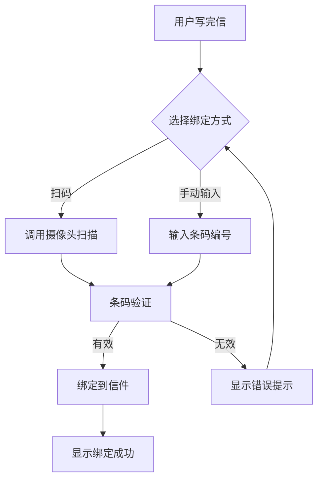
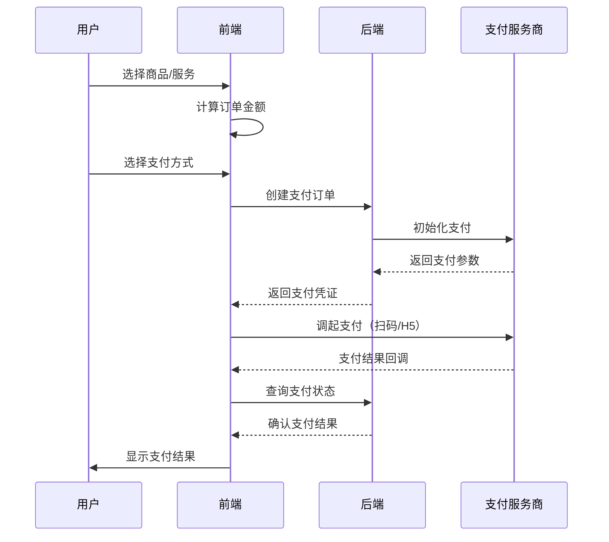

# OpenPenPal 精细化开发计划

> **计划制定日期**: 2025-08-21  
> **指导原则**: CLAUDE.md - Think before action, SOTA principles  
> **总体目标**: 从85%完成度提升至100%生产就绪  
> **预计周期**: 12-16周  

## 核心指导原则

遵循CLAUDE.md的核心哲学：
- **Think before action**: 深度分析后再实现
- **SOTA principles**: 追求最先进的技术实现
- **谨慎删除**: 充分理解代码目的和依赖
- **禁止硬编码**: 使用环境变量和数据库查询
- **持续优化**: 用户体验至上

---

## Phase 0: 开发环境准备和技术债务清理（第1周）

### 目标
建立稳固的开发基础，清理技术债务，为后续开发铺平道路。

### 详细任务

#### 0.1 开发环境标准化
```bash
# Git分支策略
main                    # 生产分支，只接受PR
├── develop            # 开发主分支
├── feature/barcode-binding-ui  # 功能分支
├── feature/payment-system-ui   # 功能分支
└── hotfix/*           # 紧急修复分支

# 提交规范
feat: 添加条码绑定UI组件
fix: 修复TypeScript类型错误
docs: 更新开发计划文档
refactor: 重构支付组件结构
test: 添加条码绑定单元测试
```

#### 0.2 技术债务清理
```typescript
// 1. 创建统一的数据表格组件
// components/ui/data-table.tsx
export interface DataTableProps<T> {
  data: T[]
  columns: ColumnDef<T>[]
  loading?: boolean
  pagination?: PaginationConfig
  onSort?: (column: string, direction: 'asc' | 'desc') => void
  onFilter?: (filters: FilterConfig) => void
}

// 2. 统一状态管理方案
// 决策：使用Zustand作为主要状态管理工具
// stores/unified-store-pattern.ts
export const createStore = <T>(name: string, initialState: T) => {
  return create<T & StoreActions>()(
    devtools(
      persist(
        (set, get) => ({
          ...initialState,
          // 标准化的action模式
        }),
        { name: `openpenpal-${name}` }
      )
    )
  )
}

// 3. 统一错误处理HOC
// components/error/with-error-boundary.tsx
export function withErrorBoundary<P extends object>(
  Component: React.ComponentType<P>,
  fallback?: React.ComponentType<{ error: Error }>
) {
  return (props: P) => (
    <ErrorBoundary fallback={fallback}>
      <Component {...props} />
    </ErrorBoundary>
  )
}
```

#### 0.3 测试基础设施
```json
// jest.config.js 配置优化
{
  "collectCoverageFrom": [
    "src/**/*.{ts,tsx}",
    "!src/**/*.d.ts",
    "!src/**/*.test.{ts,tsx}"
  ],
  "coverageThreshold": {
    "global": {
      "branches": 70,
      "functions": 70,
      "lines": 70,
      "statements": 70
    }
  }
}
```

### 验收标准
- [ ] 所有开发者使用统一的开发环境配置
- [ ] TypeScript严格模式无错误
- [ ] 测试覆盖率基线建立（>70%）
- [ ] 技术债务文档更新

---

## Phase 1: P0商业化阻塞功能 - 条码绑定UI（第2-3周）

### 目标
实现完整的条码绑定用户界面，解决信件投递的核心流程问题。

### 设计思考（Think before action）

#### 业务流程分析


### 详细实现计划

#### 1.1 组件架构设计
```typescript
// components/barcode/barcode-binding/index.tsx
export interface BarcodeBindingProps {
  letterId: string
  onSuccess: (barcode: BarcodeInfo) => void
  onCancel: () => void
}

// 主组件结构
BarcodeBinding/
├── index.tsx              // 主容器组件
├── BarcodeScanner.tsx     // 扫码组件（SOTA: 使用react-qr-reader）
├── BarcodeInput.tsx       // 手动输入组件
├── BarcodePreview.tsx     // 条码预览和确认
├── BindingStatus.tsx      // 绑定状态显示
├── hooks/
│   ├── useBarcodeScan.ts  // 扫码逻辑
│   └── useBarcodeValidation.ts // 验证逻辑
└── styles.module.css      // 样式文件
```

#### 1.2 状态管理设计
```typescript
// stores/barcode-store.ts
interface BarcodeStore {
  // 状态
  scanMode: 'camera' | 'manual'
  isScanning: boolean
  currentBarcode: string | null
  validationStatus: 'idle' | 'validating' | 'valid' | 'invalid'
  bindingStatus: 'idle' | 'binding' | 'success' | 'error'
  error: BarcodeError | null
  
  // Actions
  setScanMode: (mode: 'camera' | 'manual') => void
  startScanning: () => void
  stopScanning: () => void
  validateBarcode: (code: string) => Promise<BarcodeValidation>
  bindBarcodeToLetter: (letterId: string, barcode: string) => Promise<void>
  resetState: () => void
}

// 使用Zustand实现
export const useBarcodeStore = create<BarcodeStore>()(
  devtools(
    persist(
      (set, get) => ({
        // 实现细节...
      }),
      { name: 'barcode-binding' }
    )
  )
)
```

#### 1.3 核心组件实现
```typescript
// components/barcode/barcode-binding/BarcodeScanner.tsx
import { QrReader } from 'react-qr-reader'
import { useState, useCallback } from 'react'

export function BarcodeScanner({ onScan, onError }: BarcodeScannerProps) {
  const [facingMode, setFacingMode] = useState<'user' | 'environment'>('environment')
  
  const handleScan = useCallback((result: any) => {
    if (result) {
      // 验证扫描结果格式
      const barcodePattern = /^[A-Z0-9]{8}$/
      if (barcodePattern.test(result.text)) {
        onScan(result.text)
      } else {
        onError(new Error('无效的条码格式'))
      }
    }
  }, [onScan, onError])
  
  return (
    <div className="barcode-scanner">
      <QrReader
        constraints={{ facingMode }}
        onResult={handleScan}
        className="scanner-video"
        videoStyle={{ width: '100%' }}
      />
      <Button 
        onClick={() => setFacingMode(prev => 
          prev === 'user' ? 'environment' : 'user'
        )}
      >
        切换摄像头
      </Button>
    </div>
  )
}
```

#### 1.4 API集成
```typescript
// lib/api/barcode-service.ts
export class BarcodeService {
  // 验证条码（包含防伪检查）
  static async validateBarcode(code: string): Promise<BarcodeValidation> {
    const response = await apiClient.post('/api/v1/barcode/validate', {
      code,
      include_signature_check: true
    })
    return response.data
  }
  
  // 绑定条码到信件
  static async bindToLetter(letterId: string, barcodeId: string): Promise<BindingResult> {
    const response = await apiClient.post('/api/v1/letter/bind-barcode', {
      letter_id: letterId,
      barcode_id: barcodeId,
      timestamp: new Date().toISOString()
    })
    return response.data
  }
  
  // 获取条码状态
  static async getBarcodeStatus(code: string): Promise<BarcodeStatus> {
    const response = await apiClient.get(`/api/v1/barcode/${code}/status`)
    return response.data
  }
}
```

#### 1.5 用户体验优化
```typescript
// 1. 实时验证反馈
const useBarcodeValidation = (code: string) => {
  const [validation, setValidation] = useState<ValidationState>()
  
  useEffect(() => {
    if (!code || code.length !== 8) return
    
    const validateDebounced = debounce(async () => {
      setValidation({ status: 'validating' })
      try {
        const result = await BarcodeService.validateBarcode(code)
        setValidation({ status: 'valid', data: result })
      } catch (error) {
        setValidation({ status: 'invalid', error })
      }
    }, 500)
    
    validateDebounced()
  }, [code])
  
  return validation
}

// 2. 优雅的加载状态
<AnimatePresence>
  {isValidating && (
    <motion.div
      initial={{ opacity: 0 }}
      animate={{ opacity: 1 }}
      exit={{ opacity: 0 }}
    >
      <Spinner /> 正在验证条码...
    </motion.div>
  )}
</AnimatePresence>

// 3. 智能错误提示
const getErrorMessage = (error: BarcodeError): string => {
  switch (error.code) {
    case 'INVALID_FORMAT':
      return '条码格式错误，请输入8位字母数字组合'
    case 'ALREADY_BOUND':
      return '该条码已被使用，请使用新的条码'
    case 'SIGNATURE_INVALID':
      return '条码防伪验证失败，可能是伪造条码'
    default:
      return '条码验证失败，请重试'
  }
}
```

### 测试计划
```typescript
// __tests__/barcode-binding.test.tsx
describe('BarcodeBinding', () => {
  it('应该支持手动输入条码', async () => {
    // 测试实现
  })
  
  it('应该验证条码格式', async () => {
    // 测试实现
  })
  
  it('应该处理绑定成功流程', async () => {
    // 测试实现
  })
  
  it('应该优雅处理各种错误', async () => {
    // 测试实现
  })
})
```

### Git工作流
```bash
# 创建功能分支
git checkout -b feature/barcode-binding-ui

# 日常开发流程
git add .
git commit -m "feat: 添加条码扫描组件基础结构"
git commit -m "feat: 实现条码手动输入和实时验证"
git commit -m "feat: 完成条码绑定API集成"
git commit -m "test: 添加条码绑定组件单元测试"

# 提交PR前检查
npm run type-check
npm run test
npm run lint

# 创建PR
git push origin feature/barcode-binding-ui
```

### 验收标准
- [ ] 支持摄像头扫码（移动端优先）
- [ ] 支持手动输入8位条码
- [ ] 实时验证条码有效性
- [ ] SHA256防伪签名验证
- [ ] 优雅的错误处理和用户提示
- [ ] 响应式设计（移动端+PC端）
- [ ] 单元测试覆盖率>80%
- [ ] 无TypeScript错误

---

## Phase 2: P0商业化阻塞功能 - 支付系统UI（第4-6周）

### 目标
实现完整的支付流程UI，支持多种支付方式，确保商业化变现能力。

### 设计思考（Think before action）

#### 支付流程分析


### 详细实现计划

#### 2.1 支付组件架构
```typescript
// components/payment/
PaymentSystem/
├── PaymentMethodSelector.tsx   // 支付方式选择
├── PaymentConfirmation.tsx     // 支付确认
├── PaymentQRCode.tsx          // 二维码支付
├── PaymentResult.tsx          // 支付结果
├── PaymentHistory.tsx         // 支付历史
├── RefundApplication.tsx      // 退款申请
├── hooks/
│   ├── usePayment.ts         // 支付核心逻辑
│   ├── usePaymentStatus.ts   // 支付状态轮询
│   └── useRefund.ts          // 退款逻辑
└── utils/
    ├── payment-validator.ts   // 支付参数验证
    └── qrcode-generator.ts    // 二维码生成
```

#### 2.2 支付状态管理
```typescript
// stores/payment-store.ts
interface PaymentStore {
  // 订单信息
  currentOrder: Order | null
  paymentMethod: PaymentMethod | null
  
  // 支付状态
  paymentStatus: 'idle' | 'pending' | 'processing' | 'success' | 'failed'
  paymentResult: PaymentResult | null
  
  // 支付历史
  paymentHistory: Payment[]
  
  // Actions
  createOrder: (items: CartItem[]) => Promise<Order>
  selectPaymentMethod: (method: PaymentMethod) => void
  initiatePayment: () => Promise<PaymentSession>
  checkPaymentStatus: (orderId: string) => Promise<PaymentStatus>
  loadPaymentHistory: () => Promise<void>
  applyRefund: (orderId: string, reason: string) => Promise<RefundResult>
}
```

#### 2.3 支付方式选择器
```typescript
// components/payment/PaymentMethodSelector.tsx
const PAYMENT_METHODS = [
  { id: 'alipay', name: '支付宝', icon: AlipayIcon, recommended: true },
  { id: 'wechat', name: '微信支付', icon: WechatIcon },
  { id: 'unionpay', name: '银联', icon: UnionpayIcon },
  { id: 'paypal', name: 'PayPal', icon: PaypalIcon, international: true }
] as const

export function PaymentMethodSelector({ 
  amount, 
  onSelect 
}: PaymentMethodSelectorProps) {
  const [selected, setSelected] = useState<string>()
  
  return (
    <div className="payment-methods">
      <h3>选择支付方式</h3>
      <div className="method-grid">
        {PAYMENT_METHODS.map(method => (
          <motion.button
            key={method.id}
            className={cn(
              "method-card",
              selected === method.id && "selected",
              method.recommended && "recommended"
            )}
            onClick={() => {
              setSelected(method.id)
              onSelect(method)
            }}
            whileHover={{ scale: 1.02 }}
            whileTap={{ scale: 0.98 }}
          >
            <method.icon className="method-icon" />
            <span className="method-name">{method.name}</span>
            {method.recommended && (
              <Badge className="recommended-badge">推荐</Badge>
            )}
          </motion.button>
        ))}
      </div>
    </div>
  )
}
```

#### 2.4 支付确认和安全
```typescript
// components/payment/PaymentConfirmation.tsx
export function PaymentConfirmation({ 
  order, 
  paymentMethod,
  onConfirm 
}: PaymentConfirmationProps) {
  const [isProcessing, setIsProcessing] = useState(false)
  const [agreedToTerms, setAgreedToTerms] = useState(false)
  
  // 支付安全检查
  const performSecurityCheck = async () => {
    // 1. 验证订单有效性
    const isValid = await validateOrder(order.id)
    if (!isValid) throw new Error('订单已失效')
    
    // 2. 检查支付限额
    const limits = await checkPaymentLimits(order.amount)
    if (order.amount > limits.daily) {
      throw new Error('超出每日支付限额')
    }
    
    // 3. 风控检查
    const riskLevel = await assessPaymentRisk(order)
    if (riskLevel === 'high') {
      // 需要额外验证
      return { requiresVerification: true }
    }
    
    return { requiresVerification: false }
  }
  
  const handleConfirm = async () => {
    try {
      setIsProcessing(true)
      
      // 安全检查
      const security = await performSecurityCheck()
      if (security.requiresVerification) {
        // 显示额外验证UI
        return
      }
      
      // 创建支付会话
      const session = await PaymentService.createSession({
        order_id: order.id,
        payment_method: paymentMethod.id,
        return_url: `${window.location.origin}/payment/result`,
        webhook_url: process.env.NEXT_PUBLIC_PAYMENT_WEBHOOK_URL
      })
      
      // 调起支付
      await initiatePayment(session)
      
    } catch (error) {
      toast.error(error.message)
    } finally {
      setIsProcessing(false)
    }
  }
  
  return (
    <div className="payment-confirmation">
      {/* UI实现 */}
    </div>
  )
}
```

#### 2.5 支付状态轮询
```typescript
// hooks/usePaymentStatus.ts
export function usePaymentStatus(orderId: string) {
  const [status, setStatus] = useState<PaymentStatus>('pending')
  const [attempts, setAttempts] = useState(0)
  
  useEffect(() => {
    if (!orderId || status === 'success' || status === 'failed') return
    
    const checkStatus = async () => {
      try {
        const result = await PaymentService.checkStatus(orderId)
        setStatus(result.status)
        
        if (result.status === 'success') {
          // 支付成功处理
          confetti() // 撒花效果
          trackEvent('payment_success', { order_id: orderId })
        }
      } catch (error) {
        console.error('Status check failed:', error)
      }
      
      setAttempts(prev => prev + 1)
    }
    
    // 智能轮询策略
    const intervals = [1000, 2000, 3000, 5000, 10000] // 递增间隔
    const interval = intervals[Math.min(attempts, intervals.length - 1)]
    
    const timer = setTimeout(checkStatus, interval)
    
    return () => clearTimeout(timer)
  }, [orderId, status, attempts])
  
  return { status, attempts }
}
```

### 测试计划
```typescript
// __tests__/payment-system.test.tsx
describe('PaymentSystem', () => {
  describe('PaymentMethodSelector', () => {
    it('应该显示所有支付方式', () => {})
    it('应该高亮推荐支付方式', () => {})
    it('应该正确处理支付方式选择', () => {})
  })
  
  describe('PaymentConfirmation', () => {
    it('应该验证订单有效性', () => {})
    it('应该检查支付限额', () => {})
    it('应该处理风控验证', () => {})
  })
  
  describe('PaymentStatus', () => {
    it('应该正确轮询支付状态', () => {})
    it('应该使用递增轮询间隔', () => {})
    it('应该在成功后停止轮询', () => {})
  })
})
```

### 验收标准
- [ ] 支持至少3种主流支付方式
- [ ] 完整的支付确认流程
- [ ] 支付状态实时更新
- [ ] 支付成功/失败页面
- [ ] 退款申请功能
- [ ] 支付历史查询
- [ ] 安全验证机制
- [ ] 响应式设计

---

## Phase 3: P1用户体验关键功能 - 投递指导系统（第7-8周）

### 目标
为用户提供清晰的信件投递指导，提升投递成功率和用户满意度。

### 详细实现计划

#### 3.1 投递指导组件架构
```typescript
// components/delivery/
DeliveryGuide/
├── index.tsx                    // 主组件
├── DeliverySteps.tsx           // 步骤指引
├── LocationSelector.tsx        // 位置选择
├── DeliveryPointMap.tsx        // 投递点地图
├── EstimatedTime.tsx           // 预计时间
├── DeliveryInstructions.tsx   // 投递说明
└── CourierContact.tsx          // 信使联系
```

#### 3.2 智能投递推荐
```typescript
// 基于用户位置推荐最近投递点
export function useNearestDeliveryPoint() {
  const [location, setLocation] = useState<GeolocationCoordinates>()
  const [nearestPoints, setNearestPoints] = useState<DeliveryPoint[]>()
  
  useEffect(() => {
    // 获取用户位置
    navigator.geolocation.getCurrentPosition(
      position => {
        const { latitude, longitude } = position.coords
        setLocation({ latitude, longitude })
        
        // 查询附近投递点
        DeliveryService.findNearbyPoints({
          lat: latitude,
          lng: longitude,
          radius: 5000 // 5km
        }).then(setNearestPoints)
      },
      error => {
        // 降级方案：基于IP定位
        fallbackToIPLocation()
      }
    )
  }, [])
  
  return { location, nearestPoints }
}
```

### 验收标准
- [ ] 清晰的步骤指引
- [ ] 智能投递点推荐
- [ ] 实时预计送达时间
- [ ] 投递点地图展示
- [ ] 信使联系方式
- [ ] 多语言支持准备

---

## Phase 4: P1用户体验关键功能 - 移动端优化（第9-11周）

### 目标
优化移动端体验，确保核心功能在移动设备上的可用性和性能。

### 详细实现计划

#### 4.1 响应式改造
```typescript
// 使用CSS-in-JS实现响应式
const useResponsive = () => {
  const [device, setDevice] = useState<'mobile' | 'tablet' | 'desktop'>()
  
  useEffect(() => {
    const checkDevice = () => {
      const width = window.innerWidth
      if (width < 768) setDevice('mobile')
      else if (width < 1024) setDevice('tablet')
      else setDevice('desktop')
    }
    
    checkDevice()
    window.addEventListener('resize', checkDevice)
    return () => window.removeEventListener('resize', checkDevice)
  }, [])
  
  return device
}
```

#### 4.2 PWA实现
```javascript
// next.config.js
const withPWA = require('next-pwa')({
  dest: 'public',
  register: true,
  skipWaiting: true,
  disable: process.env.NODE_ENV === 'development'
})

module.exports = withPWA({
  // 其他配置
})
```

### 验收标准
- [ ] 所有页面移动端可用
- [ ] 触摸手势优化
- [ ] PWA基础功能
- [ ] 离线页面支持
- [ ] 性能优化（首屏<3s）

---

## Phase 5: P2增强功能 - 高级管理功能（第12-13周）

### 目标
为管理员提供高效的批量操作和数据分析能力。

### 详细实现计划

#### 5.1 批量操作框架
```typescript
// hooks/useBulkOperation.ts
export function useBulkOperation<T>() {
  const [selected, setSelected] = useState<Set<string>>(new Set())
  const [isProcessing, setIsProcessing] = useState(false)
  
  const selectAll = (items: T[]) => {
    setSelected(new Set(items.map(item => item.id)))
  }
  
  const deselectAll = () => {
    setSelected(new Set())
  }
  
  const performBulkAction = async (
    action: (ids: string[]) => Promise<void>
  ) => {
    setIsProcessing(true)
    try {
      await action(Array.from(selected))
      deselectAll()
      toast.success('批量操作成功')
    } catch (error) {
      toast.error('批量操作失败')
    } finally {
      setIsProcessing(false)
    }
  }
  
  return {
    selected,
    selectAll,
    deselectAll,
    performBulkAction,
    isProcessing
  }
}
```

### 验收标准
- [ ] 批量用户管理
- [ ] 批量数据导出
- [ ] 高级筛选功能
- [ ] 操作日志记录

---

## Phase 6: P2增强功能 - 监控仪表板（第14-15周）

### 目标
建立实时监控体系，提供业务洞察和系统健康状态。

### 详细实现计划

#### 6.1 实时数据展示
```typescript
// components/monitoring/Dashboard.tsx
export function MonitoringDashboard() {
  const metrics = useRealtimeMetrics()
  
  return (
    <div className="monitoring-dashboard">
      <MetricCard
        title="在线用户"
        value={metrics.onlineUsers}
        trend={metrics.usersTrend}
        icon={UsersIcon}
      />
      <MetricCard
        title="今日订单"
        value={metrics.todayOrders}
        trend={metrics.ordersTrend}
        icon={ShoppingCartIcon}
      />
      <SystemHealthIndicator health={metrics.systemHealth} />
      <RealtimeChart data={metrics.realtimeData} />
    </div>
  )
}
```

### 验收标准
- [ ] 实时数据更新
- [ ] 系统健康指标
- [ ] 告警配置功能
- [ ] 数据可视化图表

---

## Phase 7: 质量保证和性能优化（第16周）

### 目标
确保代码质量，优化性能，准备生产部署。

### 详细任务

#### 7.1 性能优化
```typescript
// 1. 代码分割
const PaymentSystem = lazy(() => import('./components/payment'))

// 2. 图片优化
import Image from 'next/image'

// 3. 缓存策略
const queryClient = new QueryClient({
  defaultOptions: {
    queries: {
      staleTime: 5 * 60 * 1000, // 5分钟
      cacheTime: 10 * 60 * 1000, // 10分钟
    }
  }
})
```

#### 7.2 测试完善
```bash
# 运行所有测试
npm run test

# 测试覆盖率报告
npm run test:coverage

# E2E测试
npm run test:e2e
```

### 验收标准
- [ ] 测试覆盖率>80%
- [ ] 性能评分>90
- [ ] 无安全漏洞
- [ ] 文档完整

---

## 风险管理和应急预案

### 技术风险
1. **第三方服务集成延迟**
   - 预案：先实现Mock版本，后续替换
   
2. **性能瓶颈**
   - 预案：渐进式优化，监控关键指标

3. **浏览器兼容性**
   - 预案：优先支持主流浏览器，渐进增强

### 进度风险
1. **功能复杂度低估**
   - 预案：敏捷迭代，MVP优先
   
2. **测试时间不足**
   - 预案：TDD开发，持续集成

---

## 成功指标

### 技术指标
- TypeScript编译0错误
- 测试覆盖率>80%
- Lighthouse性能评分>90
- 首屏加载时间<3秒

### 业务指标
- 条码绑定成功率>95%
- 支付转化率>70%
- 移动端用户占比>60%
- 用户满意度>4.5/5

---

## 总结

本计划遵循CLAUDE.md的核心原则，通过8个阶段的精细化开发，将OpenPenPal从85%完成度提升至100%生产就绪状态。每个阶段都有明确的目标、详细的实现方案和严格的验收标准。

**关键成功因素**：
1. **Think before action** - 每个功能都经过深度设计
2. **SOTA principles** - 采用最先进的技术方案
3. **持续优化** - 每个阶段都包含性能和体验优化
4. **质量保证** - 严格的测试和代码审查流程

预计16周完成全部开发任务，交付一个商业化就绪、用户体验优秀的生产级平台。

---

## 附录A: 每周进度跟踪模板

```markdown
# Week X Progress Report

## 完成任务
- [ ] 任务1描述
- [ ] 任务2描述

## 遇到问题
1. 问题描述及解决方案

## 下周计划
1. 计划任务1
2. 计划任务2

## 风险提示
- 风险描述及应对措施

## 关键指标
- 代码行数: X
- 测试覆盖率: X%
- TypeScript错误: X
```

---

## 附录B: 代码审查清单

### 功能性
- [ ] 功能是否完整实现PRD要求
- [ ] 边界条件是否处理
- [ ] 错误处理是否完善

### 代码质量
- [ ] 是否遵循CLAUDE.md原则
- [ ] 是否有硬编码数据
- [ ] 命名是否清晰规范
- [ ] 是否有适当的注释

### 性能
- [ ] 是否有不必要的重渲染
- [ ] 是否使用了适当的缓存
- [ ] 是否进行了代码分割

### 安全性
- [ ] 是否有XSS漏洞
- [ ] 是否有敏感信息泄露
- [ ] API调用是否安全

### 测试
- [ ] 单元测试是否充分
- [ ] 集成测试是否通过
- [ ] 是否有E2E测试

---

## 附录C: 紧急修复流程

```bash
# 1. 创建hotfix分支
git checkout -b hotfix/issue-description main

# 2. 修复问题
# ... 进行代码修改 ...

# 3. 测试验证
npm run test
npm run type-check

# 4. 提交修复
git add .
git commit -m "hotfix: 修复XXX问题"

# 5. 合并到main和develop
git checkout main
git merge hotfix/issue-description
git push origin main

git checkout develop
git merge hotfix/issue-description
git push origin develop

# 6. 删除hotfix分支
git branch -d hotfix/issue-description
```

---

*本计划为活文档，将根据实际开发进度和反馈持续更新优化。*