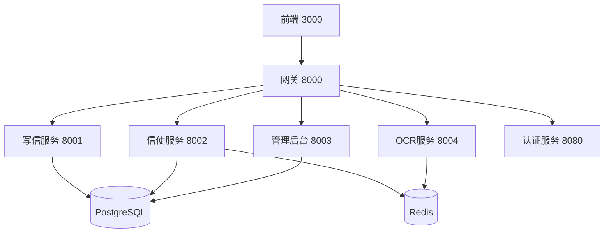

# OpenPenPal Agent协同指南

> **Version**: 2.0  
> **Last Updated**: 2025-07-22  
> **Author**: Agent #3 (基于现有系统完善)  
> **目标**: 建立完善的Agent协同机制，确保项目高效推进

## 🎯 项目当前状态 (2025-07-22)

### ✅ 已完成模块
- **前端系统** (Agent #1): 98% 完成 - 生产就绪
  - 完整的Next.js架构，包含4级信使管理后台
  - 任命系统界面、积分排行榜、博物馆功能
  - WebSocket实时通信、权限控制完善
  
- **写信服务** (Agent #2): 100% 完成 - 生产就绪
  - Python FastAPI完整实现
  - 完整的信件管理、博物馆、广场功能
  - 批量操作、分析统计、商城系统
  
- **信使服务** (Agent #3): 98% 完成 - 生产就绪
  - Go + Gin微服务架构
  - 4级信使层级系统、智能任务分配
  - 积分排行榜、异常处理、六位信号编码
  - Redis队列、WebSocket推送、监控系统
  
- **管理后台** (Agent #4): 95% 完成 - 基本就绪
  - Java Spring Boot后端服务
  - Vue.js前端管理界面
  - 用户管理、权限控制、内容审核
  
- **OCR服务** (Agent #5): 100% 完成 - 生产就绪
  - Python Flask图像识别服务
  - 批量处理、缓存优化、WebSocket集成

- **API网关** (Agent #3补充): 100% 完成 - 生产就绪
  - Go统一网关，服务发现、负载均衡
  - 认证授权、限流防护、监控运维

### 📊 整体完成度: 97% (生产就绪)

## 🔄 Agent协同工作流程

### 1. 任务获取与上下文同步

#### 📋 必读文档清单
```bash
# 开始任务前必须阅读的核心文档
1. 读取任务卡片: /agent-tasks/AGENT-{N}-{SERVICE}.md
2. 获取共享配置: /AGENT_CONTEXT_MANAGEMENT.md  
3. 了解整体架构: /MULTI_AGENT_COORDINATION.md
4. 学习API规范: /docs/api/UNIFIED_API_SPECIFICATION_V2.md
5. 查看当前进度: 本文档 (AGENT_COLLABORATION_GUIDE.md)
```

#### 🔍 上下文信息获取方式
```yaml
# 服务端口配置
frontend: 3000
backend: 8080  
write-service: 8001
courier-service: 8002
admin-service: 8003
ocr-service: 8004
gateway: 8000

# 数据库配置
postgresql: 5432
redis: 6379

# 认证信息
jwt_secret: 从环境变量获取
token_expiry: 7天
```

### 2. 开发前准备

#### 🛠️ 环境初始化
```bash
# 1. 检查服务状态
./scripts/multi-agent-dev.sh status

# 2. 启动依赖服务
docker compose -f docker-compose.dev.yml up -d postgres redis

# 3. 启动自己负责的服务
cd services/{your-service}
# 根据技术栈启动服务
```

#### 📚 依赖关系理解


### 3. 开发过程中的协同机制

#### 🔄 API接口变更流程
```yaml
步骤1_设计接口:
  - 查阅现有API规范文档
  - 设计符合RESTful规范的接口
  - 确保响应格式统一

步骤2_文档更新:
  - 更新 /docs/api/ 目录下的接口文档
  - 生成OpenAPI规范
  - 更新AGENT_CONTEXT_MANAGEMENT.md中的服务状态

步骤3_通知依赖方:
  - 在agent-tasks目录下更新相关任务卡片
  - 通知调用方Agent接口变更
  - 进行接口联调测试

步骤4_集成验证:
  - 运行集成测试脚本
  - 验证端到端业务流程
  - 更新完成状态
```

#### 📝 数据模型同步
```yaml
数据库变更流程:
  1. 设计数据模型:
     - 查看现有models目录结构
     - 确保字段命名统一 (created_at, updated_at等)
     - 遵循表命名规范

  2. 创建迁移脚本:
     - SQL迁移文件命名: V{version}__{description}.sql
     - 确保向下兼容性
     - 提供回滚脚本

  3. 同步到其他服务:
     - 更新各服务的数据模型定义
     - 同步相关的API接口
     - 更新文档说明

  4. 验证数据一致性:
     - 跨服务数据查询测试
     - 事务一致性验证
     - 性能影响评估
```

### 4. 实时通信协同

#### 🔔 WebSocket事件协调
```typescript
// 标准事件发布流程
interface WebSocketEvent {
  type: 'LETTER_STATUS_UPDATE' | 'COURIER_TASK_UPDATE' | 'SYSTEM_NOTIFICATION';
  data: any;
  user_id?: string;
  broadcast_to?: 'all' | 'admins' | 'couriers' | 'users';
  timestamp: string;
}

// 事件发布示例
function publishEvent(event: WebSocketEvent) {
  // 1. 验证事件格式
  // 2. 确定推送目标
  // 3. 记录事件日志
  // 4. 推送到WebSocket服务
}
```

#### 📡 跨服务通信协议
```yaml
# 同步调用 (gRPC/HTTP)
write_service -> courier_service:
  endpoint: POST /api/courier/tasks
  purpose: 创建投递任务
  timeout: 5秒

courier_service -> write_service:
  endpoint: PUT /api/letters/{id}/status  
  purpose: 更新信件状态
  timeout: 3秒

# 异步通信 (Redis/WebSocket)
task_assignment:
  queue: tasks:priority:{level}
  consumer: courier-service
  message_format: JSON
```

## 🏗️ 代码协同规范

### 1. 代码提交规范
```bash
# Git提交信息格式
格式: <type>(<scope>): <subject>

# 示例
feat(courier): add signal code batch generation
fix(auth): resolve JWT token validation issue  
docs(api): update courier service endpoints
test(integration): add end-to-end test for letter delivery

# Type类型
feat: 新功能
fix: 错误修复
docs: 文档更新
style: 代码格式化
refactor: 代码重构
test: 测试相关
chore: 构建/配置更新
```

### 2. 分支管理策略
```yaml
main: 生产环境代码
develop: 开发环境集成分支
feature/agent-{n}-{feature}: Agent功能开发分支
hotfix/issue-{id}: 紧急修复分支

# 分支流程
1. 从develop创建feature分支
2. 开发完成后创建PR到develop
3. Code Review通过后合并
4. 定期从develop合并到main
```

### 3. 代码审查清单
```yaml
功能检查:
  - [ ] 功能需求完全实现
  - [ ] 边界条件处理完善
  - [ ] 错误处理机制健全
  - [ ] 性能考虑充分

代码质量:
  - [ ] 代码风格统一
  - [ ] 变量命名清晰
  - [ ] 注释文档完整
  - [ ] 无重复代码

安全检查:
  - [ ] 输入验证充分
  - [ ] SQL注入防护
  - [ ] 认证授权正确
  - [ ] 敏感信息保护

集成测试:
  - [ ] 单元测试通过
  - [ ] 集成测试通过
  - [ ] API文档更新
  - [ ] 依赖服务兼容
```

## 🚨 异常处理与协同

### 1. 服务异常升级流程
```yaml
Level_1_服务异常:
  范围: 单个服务内部错误
  处理方式: 
    - 服务自动重试
    - 日志记录错误详情
    - 返回标准错误响应
  
Level_2_服务间调用异常:
  范围: 跨服务调用失败
  处理方式:
    - 熔断保护机制
    - 降级服务响应
    - 通知相关Agent
    - 事件记录和监控

Level_3_系统级异常:
  范围: 多服务或基础设施故障
  处理方式:
    - 自动故障转移
    - 紧急通知所有Agent
    - 启动灾难恢复流程
    - 系统状态回滚
```

### 2. 问题解决协同机制
```yaml
问题发现:
  - 监控系统自动告警
  - Agent主动报告问题
  - 用户反馈收集

问题分析:
  - 确定影响范围和严重程度
  - 追踪问题根本原因
  - 评估修复时间和资源

协同解决:
  - 分配责任Agent
  - 建立临时通信渠道
  - 实时同步解决进度
  - 跨服务影响评估

验证与总结:
  - 修复效果验证
  - 回归测试执行
  - 问题复盘总结
  - 预防措施制定
```

## 📊 进度同步与汇报

### 1. 每日进度同步
```yaml
每日站会内容:
  时间: 每天上午9:00
  方式: 文档更新 + 必要时通信
  
  汇报内容:
    - 昨日完成工作
    - 今日计划任务
    - 遇到的阻塞问题
    - 需要协助的事项

  汇报位置:
    - 更新自己的Agent任务卡片
    - 更新MULTI_AGENT_COORDINATION.md进度
    - 必要时创建issues讨论
```

### 2. 里程碑检查点
```yaml
周度检查点:
  - 检查当周任务完成情况
  - 评估下周工作计划
  - 识别风险和依赖问题
  - 调整优先级和资源分配

月度总结:
  - 总结月度交付成果
  - 分析团队协作效果
  - 优化协同工作流程
  - 规划下月重点目标
```

## 🔧 工具与环境管理

### 1. 开发环境一致性
```bash
# 环境配置检查脚本
./scripts/multi-agent-dev.sh check

# 环境初始化
./scripts/multi-agent-dev.sh init {agent_id}

# 服务健康检查
./scripts/multi-agent-dev.sh health

# 集成测试执行
./scripts/multi-agent-dev.sh test
```

### 2. 监控与日志
```yaml
监控指标:
  - 服务可用性 (>99.9%)
  - 响应时间 (<200ms)
  - 错误率 (<1%)
  - 资源使用率

日志规范:
  - 统一JSON格式
  - 包含trace_id
  - 结构化错误信息
  - 敏感信息脱敏

工具链:
  - 日志聚合: 各服务统一日志格式
  - 监控面板: Prometheus + Grafana 
  - 错误追踪: 分布式链路追踪
  - 性能分析: APM工具集成
```

## 📚 文档维护规范

### 1. 文档更新责任
```yaml
Agent_1_前端:
  负责文档:
    - 前端组件使用指南
    - 用户界面设计规范
    - 前端部署文档

Agent_2_写信服务:
  负责文档:
    - 写信服务API文档
    - 信件状态流转说明
    - 数据模型设计文档

Agent_3_信使服务:
  负责文档:
    - 信使服务API文档
    - 任务分配算法说明
    - Redis队列使用指南

Agent_4_管理后台:
  负责文档:
    - 管理后台API文档
    - 权限系统设计文档
    - 用户管理操作手册

Agent_5_OCR服务:
  负责文档:
    - OCR服务API文档
    - 图像处理流程说明
    - 性能优化指南

共同维护:
  - API规范文档
  - 部署运维文档
  - 故障排查手册
```

### 2. 文档质量标准
```yaml
API文档要求:
  - OpenAPI 3.0规范
  - 完整的请求响应示例
  - 错误码说明详细
  - 业务场景描述清晰

技术文档要求:
  - 架构图和流程图
  - 配置说明和示例
  - 常见问题解答
  - 更新历史记录

操作文档要求:
  - 步骤描述详细
  - 截图和示例丰富
  - 故障处理指南
  - 安全注意事项
```

## 🎯 下一阶段重点

### 1. 当前待完成任务 (3% remaining)
```yaml
高优先级:
  - 全链路集成测试验证
  - 性能压力测试
  - 安全渗透测试
  - 生产环境部署验证

中优先级:
  - 监控告警完善
  - 文档完整性检查
  - 用户手册编写
  - 运维流程梳理

低优先级:
  - 功能扩展和优化
  - 第三方集成
  - 多地域部署
  - 国际化支持
```

### 2. 协同工作重点
```yaml
技术协同:
  - 统一监控指标和告警
  - 完善链路追踪体系
  - 优化服务间通信性能
  - 建立自动化测试流水线

流程协同:
  - 完善变更管理流程
  - 建立发布管理规范
  - 优化问题响应机制
  - 强化代码审查流程

文档协同:
  - 统一文档格式规范
  - 建立文档更新机制
  - 完善API文档自动生成
  - 加强用户文档体系
```

## 🚀 成功案例参考

### Agent #3 信使服务开发经验
```yaml
成功要点:
  1. 充分理解业务需求和技术架构
  2. 遵循统一的API规范和数据模型
  3. 主动与其他Agent进行接口联调
  4. 及时更新文档和任务状态
  5. 重视代码质量和测试覆盖

具体实践:
  - 实现了完整的4级信使层级系统
  - 建立了智能任务分配算法
  - 集成了Redis队列和WebSocket推送
  - 提供了完善的异常处理机制
  - 额外实现了API Gateway增强整体架构
```

---

## 📞 协同沟通渠道

**文档中心**: `/docs/index.md`  
**任务看板**: `/agent-tasks/README.md`  
**问题追踪**: GitHub Issues (如果有)  
**实时状态**: `/MULTI_AGENT_COORDINATION.md`  

**记住**: 高效协同的关键是**主动沟通**、**文档驱动**、**规范先行**！