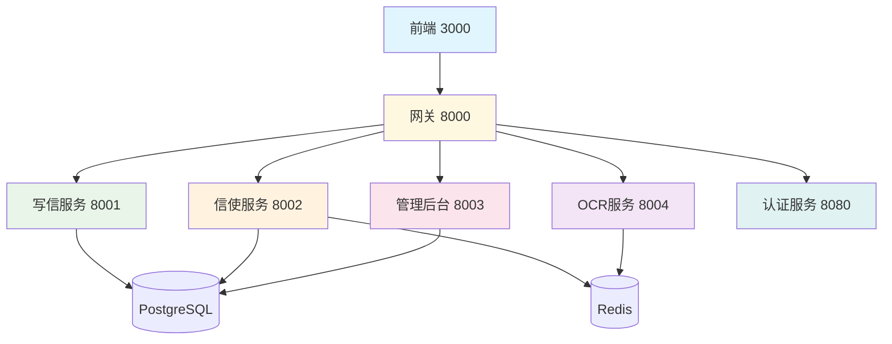

# OpenPenPal Agent上下文共享协议

> **Version**: 1.0  
> **Last Updated**: 2025-07-22  
> **Purpose**: 建立完善的Agent间上下文共享机制，确保协同开发高效有序

## 🎯 上下文共享目标

1. **信息透明**: 所有Agent都能获取项目全局状态
2. **依赖明确**: 清楚地知道服务间的依赖关系
3. **变更同步**: 变更能够及时通知到相关Agent
4. **冲突避免**: 防止并行开发中的冲突
5. **状态一致**: 保持各Agent对系统状态的一致理解

## 📋 核心上下文信息

### 1. 项目全局状态
```yaml
# /AGENT_CONTEXT_MANAGEMENT.md
project:
  name: OpenPenPal
  version: 2.0.0
  completion_rate: 97%
  deployment_status: production_ready
  
current_phase: 
  name: "集成测试与优化"
  priority: high
  deadline: "2025-07-30"
  
critical_path:
  - 全链路集成测试
  - 性能压力测试
  - 生产环境部署验证
```

### 2. 服务依赖图谱


### 3. 接口依赖关系
```yaml
# 服务间调用关系
write_service_dependencies:
  outgoing_calls:
    - target: courier_service
      endpoint: POST /api/courier/tasks
      purpose: 创建投递任务
      
  incoming_calls:
    - from: courier_service
      endpoint: PUT /api/letters/{id}/status
      purpose: 更新信件状态

courier_service_dependencies:
  outgoing_calls:
    - target: write_service  
      endpoint: PUT /api/letters/{id}/status
      purpose: 状态更新
    - target: websocket_service
      endpoint: publish event
      purpose: 实时通知
      
  incoming_calls:
    - from: write_service
      endpoint: POST /api/courier/tasks
      purpose: 任务创建
    - from: admin_service
      endpoint: PUT /api/courier/admin/*
      purpose: 管理操作
```

## 🔄 上下文同步机制

### 1. 实时状态同步

#### 📊 状态信息中心
```yaml
# /PROJECT_STATUS_CENTER.md
real_time_status:
  services:
    frontend: "✅ 运行正常 (3000)"
    write_service: "✅ 运行正常 (8001)" 
    courier_service: "✅ 运行正常 (8002)"
    admin_service: "✅ 运行正常 (8003)"
    ocr_service: "✅ 运行正常 (8004)"
    gateway: "✅ 运行正常 (8000)"
    
  databases:
    postgresql: "✅ 连接正常 (5432)"
    redis: "✅ 连接正常 (6379)"
    
  last_updated: "2025-07-22T15:30:00Z"
  updated_by: "Agent-3"
```

#### 🔔 变更通知机制
```yaml
change_notification_flow:
  step_1_detect_change:
    - API接口变更
    - 数据模型更新
    - 服务状态变化
    - 部署配置修改
    
  step_2_update_documents:
    - 自动更新相关文档
    - 标记变更内容
    - 记录变更时间和Agent
    
  step_3_notify_dependents:
    - 识别受影响的Agent
    - 发送变更通知
    - 更新任务卡片状态
    
  step_4_validate_integration:
    - 执行自动化测试
    - 验证服务间兼容性
    - 确认变更无冲突
```

### 2. 文档驱动的上下文共享

#### 📚 文档层次结构
```
/docs/
├── context/
│   ├── global_state.md         # 全局状态信息
│   ├── service_registry.md     # 服务注册表
│   ├── api_changes.md          # API变更历史
│   └── dependency_matrix.md    # 依赖关系矩阵
├── api/
│   ├── UNIFIED_API_SPECIFICATION_V2.md
│   └── service_interfaces/     # 各服务接口文档
├── architecture/
│   ├── system_overview.md      # 系统架构概览
│   └── data_flow.md           # 数据流向图
└── operations/
    ├── deployment_guide.md     # 部署指南
    └── troubleshooting.md      # 故障排查
```

#### 🔄 文档更新协议
```yaml
document_update_protocol:
  immediate_update_triggers:
    - API接口新增/修改/删除
    - 数据库结构变更
    - 服务端口/配置变更
    - 重要业务逻辑变更
    
  update_responsibility:
    - 变更发起Agent负责更新核心文档
    - 相关依赖Agent负责验证变更影响
    - 所有Agent负责更新自己的任务状态
    
  update_format:
    - 标记变更时间和Agent ID
    - 使用版本控制追踪历史
    - 添加变更原因和影响范围
    - 提供迁移指南(如需要)
```

### 3. 代码级别的上下文共享

#### 🏷️ 接口契约定义
```typescript
// /shared/interfaces/service_contracts.ts
export interface ServiceContract {
  service_name: string;
  version: string;
  endpoints: Endpoint[];
  events: Event[];
  dependencies: Dependency[];
}

export interface Endpoint {
  path: string;
  method: 'GET' | 'POST' | 'PUT' | 'DELETE';
  auth_required: boolean;
  rate_limit?: number;
  request_schema: JSONSchema;
  response_schema: JSONSchema;
  error_codes: number[];
}

// 实际契约示例
export const CourierServiceContract: ServiceContract = {
  service_name: "courier-service",
  version: "2.0.0",
  endpoints: [
    {
      path: "/api/courier/tasks",
      method: "GET",
      auth_required: true,
      request_schema: TaskListRequestSchema,
      response_schema: TaskListResponseSchema,
      error_codes: [400, 401, 403, 500]
    }
  ],
  events: [
    {
      type: "TASK_ASSIGNED",
      schema: TaskAssignedEventSchema
    }
  ],
  dependencies: [
    {
      service: "write-service",
      endpoints: ["/api/letters/{id}/status"]
    }
  ]
};
```

#### 🔗 依赖注入配置
```yaml
# /config/service_dependencies.yml
services:
  write_service:
    provides:
      - letters_management
      - status_updates
    requires:
      - user_authentication
      - file_storage
    optional_dependencies:
      - ocr_service
      - notification_service
      
  courier_service:
    provides:
      - task_management
      - courier_management
      - location_services
    requires:
      - user_authentication
      - letter_service
      - queue_service
    optional_dependencies:
      - mapping_service
      - notification_service
```

## 🚨 冲突检测与解决

### 1. 冲突类型识别
```yaml
conflict_types:
  api_conflicts:
    - 接口路径冲突
    - 数据格式不兼容
    - 认证方式差异
    
  data_conflicts:
    - 数据库结构冲突
    - 数据模型不一致
    - 外键约束冲突
    
  configuration_conflicts:
    - 端口占用冲突
    - 环境变量冲突  
    - 依赖版本冲突
    
  business_logic_conflicts:
    - 业务规则不一致
    - 状态流转冲突
    - 权限控制冲突
```

### 2. 冲突解决流程
```yaml
conflict_resolution_process:
  detection:
    - 自动化检测脚本
    - 集成测试失败
    - Agent主动报告
    
  analysis:
    - 确定冲突类型和范围
    - 评估解决方案选项
    - 分析对其他模块的影响
    
  resolution:
    - Agent协商解决方案
    - 更新相关文档和代码
    - 执行集成测试验证
    
  validation:
    - 全链路测试通过
    - 相关Agent确认无影响
    - 更新冲突解决记录
```

### 3. 冲突预防机制
```yaml
conflict_prevention:
  design_phase:
    - 接口设计评审
    - 数据模型协商
    - 依赖关系分析
    
  development_phase:
    - 定期依赖检查
    - 自动化兼容性测试
    - 变更影响评估
    
  integration_phase:
    - 持续集成流水线
    - 自动化冲突检测
    - 回滚机制准备
```

## 📊 上下文信息查询

### 1. 快速状态查询
```bash
# 查询脚本示例
./scripts/context-query.sh --service courier-service --info status
# 输出: ✅ courier-service运行正常 (Port 8002)

./scripts/context-query.sh --global --info completion
# 输出: 项目完成度: 97% | 状态: 生产就绪

./scripts/context-query.sh --dependencies --service write-service
# 输出: write-service依赖: courier-service, auth-service
```

### 2. 详细信息获取
```yaml
context_query_commands:
  service_status:
    command: "get_service_status <service_name>"
    output: "运行状态、端口、最后更新时间"
    
  api_info:
    command: "get_api_info <service_name>"
    output: "API版本、接口列表、变更历史"
    
  dependency_check:
    command: "check_dependencies <service_name>"
    output: "依赖服务状态、接口兼容性"
    
  global_status:
    command: "get_global_status"
    output: "项目进度、服务健康度、待解决问题"
```

### 3. 上下文信息API
```http
# 上下文信息查询API
GET /api/context/services
Authorization: Bearer <admin_token>

Response:
{
  "code": 0,
  "data": {
    "services": [
      {
        "name": "courier-service",
        "status": "running",
        "port": 8002,
        "version": "2.0.0",
        "last_health_check": "2025-07-22T15:30:00Z",
        "dependencies": ["write-service", "auth-service"]
      }
    ],
    "overall_health": "healthy"
  }
}

# 获取服务依赖图
GET /api/context/dependencies?service=courier-service

# 获取API变更历史
GET /api/context/api-changes?since=2025-07-20
```

## 🔧 工具与自动化

### 1. 上下文同步工具
```bash
#!/bin/bash
# /scripts/context-sync.sh

# 同步服务状态
sync_service_status() {
    echo "🔄 同步服务状态..."
    ./scripts/multi-agent-dev.sh status > /tmp/service_status.json
    update_context_document "service_status" "/tmp/service_status.json"
}

# 检查API兼容性
check_api_compatibility() {
    echo "🔍 检查API兼容性..."
    for service in write-service courier-service admin-service; do
        ./scripts/api-compatibility-check.sh $service
    done
}

# 更新依赖关系图
update_dependency_graph() {
    echo "📊 更新依赖关系图..."
    ./scripts/generate-dependency-graph.sh > docs/context/dependency_graph.md
}

# 全量上下文同步
full_sync() {
    sync_service_status
    check_api_compatibility
    update_dependency_graph
    echo "✅ 上下文同步完成"
}

case "$1" in
    "status") sync_service_status ;;
    "api") check_api_compatibility ;;
    "deps") update_dependency_graph ;;
    "full") full_sync ;;
    *) echo "Usage: $0 {status|api|deps|full}" ;;
esac
```

### 2. 自动化监控
```yaml
# 上下文监控配置
monitoring_config:
  check_interval: 300  # 5分钟
  
  monitors:
    service_health:
      - 检查所有服务健康状态
      - 更新服务注册表
      - 发送状态变更通知
      
    api_changes:
      - 检测API接口变更
      - 验证向后兼容性
      - 更新API文档
      
    dependency_status:
      - 检查服务依赖关系
      - 验证服务间通信
      - 更新依赖关系图
      
    integration_health:
      - 执行集成测试
      - 检查数据一致性
      - 验证业务流程
```

### 3. 通知机制
```yaml
notification_system:
  channels:
    - document_updates  # 文档更新通知
    - slack_integration # Slack集成(如果有)
    - email_alerts     # 邮件告警
    - webhook_calls    # Webhook回调
    
  notification_rules:
    critical_changes:
      - API接口删除或重大修改
      - 数据库结构变更
      - 服务不可用
      trigger: immediate
      
    important_changes:
      - 新API接口添加
      - 配置参数修改
      - 性能指标异常
      trigger: hourly_digest
      
    routine_updates:
      - 文档更新
      - 测试结果
      - 部署状态
      trigger: daily_summary
```

## 📋 最佳实践

### 1. Agent协作规范
```yaml
best_practices:
  communication:
    - 重大变更前先沟通确认
    - 及时更新任务状态和文档
    - 主动分享设计决策和原因
    
  documentation:
    - 保持文档的及时性和准确性
    - 使用标准化的文档格式
    - 添加足够的上下文信息
    
  testing:
    - 变更后及时执行集成测试
    - 共享测试用例和测试数据
    - 协同解决测试发现的问题
    
  deployment:
    - 遵循统一的部署流程
    - 协调部署时间避免冲突
    - 建立回滚应急预案
```

### 2. 上下文维护责任
```yaml
maintenance_responsibilities:
  all_agents:
    - 更新自己负责模块的状态
    - 及时报告发现的问题
    - 参与冲突解决讨论
    
  lead_agent:
    - 维护全局状态信息
    - 协调跨模块的变更
    - 决策重大架构变更
    
  specific_agents:
    Agent_1: 前端状态、用户体验、部署协调
    Agent_2: 写信服务状态、API文档、数据模型
    Agent_3: 信使服务状态、队列监控、性能优化
    Agent_4: 管理后台状态、权限模型、用户管理
    Agent_5: OCR服务状态、图像处理、性能监控
```

### 3. 效率提升技巧
```yaml
efficiency_tips:
  context_sharing:
    - 建立定期同步会议机制
    - 使用自动化工具减少手工维护
    - 建立标准化的问题报告模板
    
  information_access:
    - 建立统一的信息查询入口
    - 使用智能搜索快速定位信息
    - 建立FAQ解决常见问题
    
  collaboration:
    - 使用版本控制追踪变更历史
    - 建立代码审查和文档审查流程
    - 使用自动化测试保证质量
```

---

## 🎯 总结

高效的Agent协同需要：

1. **透明的信息共享** - 所有Agent都能获取准确的上下文信息
2. **实时的状态同步** - 变更能够及时传播到相关方
3. **标准化的协作流程** - 遵循统一的协作规范和最佳实践
4. **自动化的工具支持** - 减少手工维护，提高协作效率
5. **主动的沟通机制** - 重大变更前的沟通和协商

通过建立完善的上下文共享机制，我们能够确保OpenPenPal项目的高质量交付和团队协作效率。

---

**记住**: 成功的多Agent协同关键在于**信息透明**、**及时沟通**、**规范流程**！