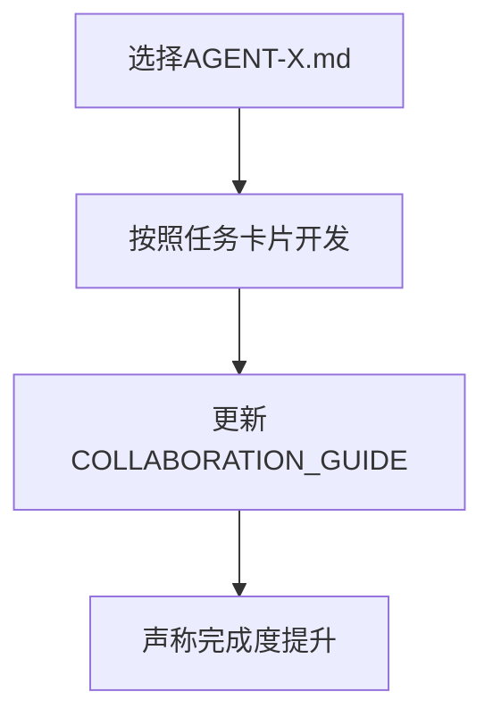
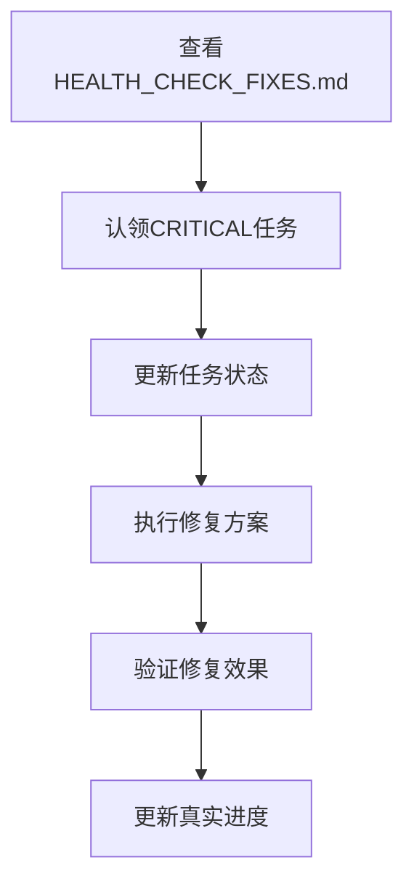

# 📋 Agent-Tasks目录文档迁移日志

> **迁移日期**: 2025-07-24  
> **迁移原因**: 清理过时文档，统一任务管理

---

## 🔄 迁移变更总结

### ✅ 已更新文档
| 文档 | 状态 | 变更内容 |
|------|------|----------|
| README.md | 🔄 重写 | 基于体检报告，重新定义项目状态和优先级 |
| HEALTH_CHECK_FIXES.md | ➕ 新增 | 从frontend/移动，作为主要任务指导 |
| HEALTH_CHECK_REPORT.md | ➕ 新增 | 从frontend/移动，项目真实状态参考 |

### ⚠️ 暂停使用的文档
以下文档存在冲突信息，暂停使用直到更新：

| 文档 | 问题 | 建议处理 |
|------|------|----------|
| AGENT-1-TEAM-LEAD.md | 声称65-70%完成，与体检冲突 | 需要基于实际代码重新评估 |
| AGENT-2-WRITE-SERVICE.md | 声称100%完成，过于乐观 | 需要验证实际实现状态 |
| AGENT-3-COURIER-SERVICE.md | 声称98%完成，与安全问题冲突 | 需要结合体检发现重新评估 |
| AGENT-4-ADMIN-SERVICE.md | 声称95%完成，但API无认证 | 需要安全修复后重新评估 |
| AGENT-5-OCR-SERVICE.md | 声称100%完成，需验证 | 检查实际功能完整性 |
| INTEGRATION-STATUS-SUMMARY.md | 声称所有模块100%完成 | 与体检报告严重冲突 |
| AGENT_COLLABORATION_GUIDE.md | 基于97%完成度的指导 | 需要与HEALTH_CHECK_FIXES对齐 |

### ✅ 继续使用的参考文档
| 文档 | 状态 | 用途 |
|------|------|------|
| AGENT_CONTEXT_MANAGEMENT.md | 🟢 有效 | 技术配置和共享信息 |
| AGENT_CONTEXT_SHARING_PROTOCOLS.md | 🟢 有效 | Agent协作协议 |
| FIX_SUMMARY_REPORT.md | 🟢 有效 | 历史修复记录 |
| SYSTEM_ANALYSIS_FEEDBACK.md | 🟢 有效 | 系统分析和建议 |
| USER_REGISTRATION_TEST_REPORT.md | 🟢 有效 | 用户注册功能测试结果 |
| test_user_login.sh | 🟢 有效 | 登录功能测试脚本 |
| test_user_registration_fixed.sh | 🟢 有效 | 注册功能测试脚本 |
| archive/ | 🟢 有效 | 历史版本备份 |

---

## 🎯 新的文档优先级

### 🔴 主要参考文档（优先使用）
1. **HEALTH_CHECK_FIXES.md** - 具体任务和修复方案
2. **HEALTH_CHECK_REPORT.md** - 项目真实状态评估
3. **README.md** - 任务中心和协作指南

### 🟡 技术参考文档（继续使用）
- AGENT_CONTEXT_MANAGEMENT.md - 技术配置
- AGENT_CONTEXT_SHARING_PROTOCOLS.md - 协作协议
- test_*.sh - 测试脚本

### 🟢 存档文档（保留备份）
- archive/ 目录 - 历史版本备份

---

## 📊 发现的主要冲突

### 1. 完成度数据严重不一致
```yaml
README.md (旧): 85% 完成
INTEGRATION-STATUS: 100% 完成
COLLABORATION_GUIDE: 97% 完成
HEALTH_CHECK实际: 70% 完成 + 严重安全问题
```

### 2. 项目状态评估冲突
```yaml
旧文档声称: "生产就绪"
体检发现: 
  - JWT使用默认密钥
  - 管理员API无认证
  - 硬编码密码
  - 用户ID生成不一致
```

### 3. 优先级指导冲突
```yaml
旧协作指南: 功能优化和性能提升
体检修复方案: 安全修复和稳定性优先
```

---

## 🔧 Agent工作流程变更

### 之前的流程


### 新的流程  


---

## ⚡ 快速迁移指南

### 对于继续工作的Agent
1. **停止使用旧任务卡片** - AGENT-*.md暂停使用
2. **切换到新任务系统** - 使用HEALTH_CHECK_FIXES.md
3. **重新评估进度** - 基于体检结果而非乐观估计
4. **认领新任务** - 从CRITICAL优先级开始

### 对于新Agent
1. **直接使用新系统** - 忽略旧文档
2. **从体检报告开始** - 了解项目真实状态
3. **按新优先级工作** - 安全修复优先

---

## 📋 清理检查清单

- [x] 更新README.md为基于现实的状态
- [x] 移动主要修复文档到agent-tasks
- [x] 标记冲突文档为暂停使用
- [x] 建立新的优先级框架
- [x] 创建迁移说明文档
- [ ] 等待Agent反馈后进一步调整
- [ ] 验证新流程有效性
- [ ] 更新剩余文档（如需要）

---

## 🔍 验证新系统效果

### 成功指标
- [ ] Agent可以清楚识别当前任务优先级
- [ ] 无冲突信息导致的混乱
- [ ] 任务认领和进度更新流程清晰
- [ ] 项目状态反映真实情况

### 如果遇到问题
1. 在对应任务中记录问题
2. 更新本迁移日志
3. 调整文档结构
4. 重新验证流程

---

**📅 下次审查**: 2025-01-31  
**🔄 审查内容**: 验证新系统有效性，调整不足之处

---

*💡 这次迁移的目标是让Agent能够基于项目真实状态工作，而非过于乐观的评估*