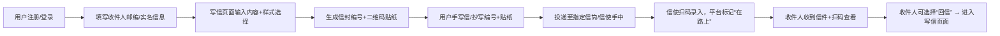
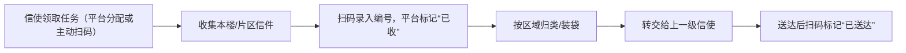
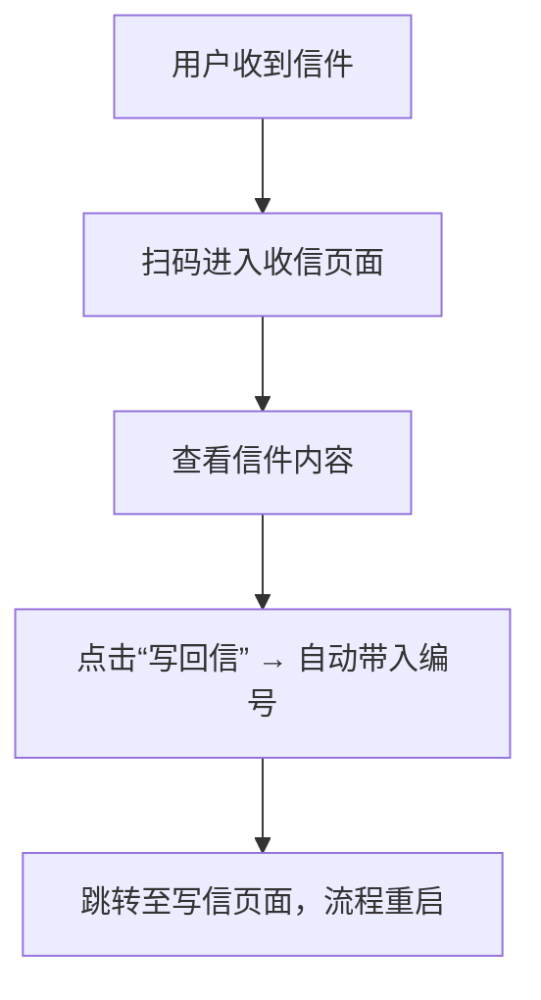
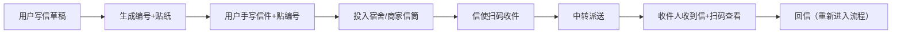

# **一、产品概述**

### **1.1 产品定位**

OpenPenPal 是一款以“实体信件 + 校园信使网络 + 数字跟踪平台”为核心的创新型慢节奏社交产品，旨在为全国高中与高校学生群体打造一个具有人情温度、文字厚度与真实触感的书信交流体验。平台通过自研编码系统与多级信使配送机制，实现不同校区间“高效、安全、可追踪”的书信投递，同时融合“漂流信”“写给未来”等创意玩法，重建人与人之间基于情感表达的深度连接。

在产品形态上，OpenPenPal 将数字系统（App / 小程序）与线下物理信封物流体系紧密结合，提供覆盖写信、收信、投递、回信全链路服务，是一套兼具物理温度与数字效率的创新通信系统。

---

### **1.2 产品愿景与核心价值**

#### 🧭 愿景：

在数字通信高度饱和的时代，OpenPenPal 希望通过“信”的媒介，唤醒人与人之间最本真的情感表达，重建校园社群的温度感知与精神连接，成为“下一个时代的精神邮局”。

#### 🌟 核心价值主张：

|核心价值|说明|
|---|---|
|✍️ 情感真实|强调表达的自由与隐私保护，支持匿名寄信与实名平台登记|
|📬 实体质感|强调“纸感”“墨迹”“邮戳”等视觉与触觉体验|
|🧳 校园连通|构建跨校园真实信件流转网络，实现区域性社交重构|
|🌿 节奏可控|回归慢节奏与仪式感，降低信息噪音，促进深度连接|
|📦 技术可控|用编号系统 + 信使结构实现信件的可追踪、安全送达|

---

### **1.3 产品形态**

|产品组成|形式说明|
|---|---|
|用户侧产品|微信小程序 + H5 页面（写信、查看信件、投递引导）|
|信使侧工具|扫码系统 + 投递记录页（用于扫码登记与任务跟踪）|
|平台侧后台|管理系统（信封编号、内容审核、信使数据分析）|
|实体物料|编码信封 + 编号贴纸 + 投递点设施 + 打包物流工具|

---

### **1.4 产品关键词（理念提炼）**

> 产品所有设计、交互与体验应围绕以下五大关键词展开：

- **✍️ 慢节奏**：打破社交的即时反馈机制，建立一种等待和回馈的期待感。
    
- **📚 文字质感**：信件内容更注重表达而非信息，强调感情、故事、深度。
    
- **✉️ 真实交流**：既允许匿名表达，也注重实名系统带来的信任机制。
    
- **🌿 自由呼吸**：反对密集信息流，用信件留白给人更多情绪表达空间。
    
- **📦 可递送的连接**：每一次信件送达，不止是内容，更是一段关系的触发。
    

# **二、用户与场景**

本节旨在界定 OpenPenPal 的目标用户群体，明确其行为特征与核心需求，并基于不同教育与地理场景设计差异化的应用模式与投递结构。

---

### **2.1 用户分类与核心画像**

#### 1）普通用户（寄信人 / 收信人）

|维度|内容|
|---|---|
|年龄阶段|高中生 / 本科生 / 少部分研究生|
|行为特征|情感丰富、渴望表达、接受慢社交|
|核心需求|写信便利、身份保护、回信期待、信件质感体验|
|使用场景|给朋友写信、匿名情绪表达、漂流信墙互动、写给未来的自己|

#### 2）信使用户（多级校园配送者）

|维度|内容|
|---|---|
|年龄阶段|高中生班干部 / 大学生社团骨干 / 志愿者|
|行为特征|有组织能力、责任感、希望被认可|
|核心需求|流程清晰、操作简单、数据可记录、可获得激励|
|使用场景|定时收发信件、扫码确认任务、查看积分排行、协调片区物流|

#### 3）商家 / 校园社团 / 官方合作方

|维度|内容|
|---|---|
|类型|校园便利店 / 书店 / 社团/班委 / 学校宣传部门|
|行为特征|拥有渠道资源，愿意推广产品以获取收益或声誉|
|核心需求|简单对接、销售返佣、品牌联名、活动落地权限|
|使用场景|销售信封、投递点布设、协助活动开展、用户引流与扫码转化|

---

### **2.2 用户核心需求分析**

|角色|功能需求|情感需求|操作预期|
|---|---|---|---|
|写信人|写信便捷、格式自由、样式多样、可下载贴纸|表达情绪、回信期待|流程简洁、引导清晰|
|收信人|查看信件、写回信、保留信件历史|被关注感、认同感、安全感|不暴露隐私、反馈明确|
|信使|任务接收与完成追踪、扫码记录、日志留存|认可激励、贡献可视化|操作高效、系统稳定|
|管理员|投递数据统计、违规内容筛查、信使调度|项目成长感、控制力|权限明确、系统支撑力强|

---

### **2.3 使用场景与情境地图**

OpenPenPal 根据不同用户群体的空间制度和通讯现实，划分出以下三种典型场景，每类场景下信使结构、投递方式、内容入口均有差异性设计。

#### 🎓 高校场景（宿舍制）

|特点|描述|
|---|---|
|空间单元|按楼栋/片区划分，适配校区大、宿舍分散|
|用户行为|可自由使用手机扫码、写信、扫码收信|
|信使结构|一级（楼栋）→ 二级（片区）→ 三级（校区）→ 四级（城市总代）|
|典型高校|贸大虹远、武大樱顶、复旦本部等|

#### 🏫 高中场景（班级制）

|特点|描述|
|---|---|
|空间单元|班级/年级/宿舍有限制|
|用户行为|部分地区不能使用手机，需线下写信结合平台录入|
|信使结构|一级（班级信使）→ 二级（年级）→ 三级（校团委）→ 四级（总代）|
|补充支持|通过社团协助 + 班主任/老师支持管理|

#### 🏪 城市加盟模式（大学城/文创商圈）

|特点|描述|
|---|---|
|空间单元|多校联合 + 地域性商家合作布点|
|用户行为|多校交叉写信/漂流信/城市活动参与|
|信使结构|商家 = 一级投递点/信封售卖点 + 区域配送者|
|应用拓展|可支持外部投稿、陌生信件投放、漂流地图联动|

# **三、产品功能总览**

本节从全局出发，梳理 OpenPenPal 所需的核心功能模块，并逐一说明各模块目标、关键功能要素、用户类型与当前开发状态。该部分是产品团队功能拆解与任务分工的基础依据。

---

### **3.1 功能结构图（模块总览）**

```
OpenPenPal
├── 📝 写信系统（用户端）
│   ├── 富文本写作
│   ├── 信封样式选择
│   ├── 编号/条码生成
│   └── 投递引导页
├── 📬 收信系统（用户端）
│   ├── 信件扫码查看
│   ├── 回信入口
│   └── 信件归档与展示
├── 🎒 信使系统（信使端）
│   ├── 任务领取与登记
│   ├── 投递扫码/状态更新
│   ├── 信件转交记录
│   └── 积分排行榜
├── 🧳 信件管理（用户中心）
│   ├── 写信记录
│   ├── 收信记录
│   ├── 未来信管理
│   └── 信件时间线视图
├── ✍️ 写作广场（社区模块）
│   ├── 分类浏览（随笔/诗歌/信件）
│   ├── 点赞评论收藏
│   └── 漂流信同步发布
├── 💌 漂流社交系统
│   ├── 匿名漂流信
│   ├── 情绪树洞
│   ├── 随机收信玩法
│   └── 城市漂流地图（预留）
├── 🛍 信封商城系统
│   ├── 实体信封/邮票文创销售
│   ├── 未来信功能购买
│   └── 积分兑换模块
├── 🏛 信件博物馆
│   ├── 精选数字典藏
│   ├── “写给未来”计划
│   └── 校园信件展览计划
├── 🔔 通知系统
│   ├── 信件送达通知
│   ├── 写作挑战提醒
│   └── 进度推送（克制发送）
├── 🛠 管理后台
│   ├── 信封编号管理
│   ├── 投递路径数据
│   ├── 内容审核模块
│   └── 信使绩效统计
```

---

### **3.2 功能清单与说明**

| 模块名称     | 子功能                       | 使用角色    | 状态  |
| -------- | ------------------------- | ------- | --- |
| 📝 写信系统  | 在线写作/手写信拍照上传，样式选择、生成贴纸二维码 | 用户      |     |
| 📬 收信系统  | 扫码查看、匿名回信、归档展示            | 用户      |     |
| 🎒 信使系统  | 投递任务、扫码确认、状态更新、积分排行       | 信使      |     |
| 🧳 我的信箱  | 寄出/收取/写作记录、未来信管理          | 用户      |     |
| ✍️ 写作广场  | 分类浏览、点赞收藏、公开信展示           | 用户      |     |
| 💌 慢社交模块 | 匿名漂流、树洞、陌生回信、地图漂流         | 用户      |     |
| 🛍 信封商城  | 实体信封、文创周边、未来信预约、积分兑换      | 用户      |     |
| 🏛 信件博物馆 | 精选典藏、“写给未来”计划、展览归档        | 用户      |     |
| 🔔 通知中心  | 到达通知、提醒推送、内容审核反馈          | 用户 / 信使 |     |
| 🛠 管理后台  | 编号生成、用户管理、内容审核、物流记录       | 管理员     |     |

---

### **3.3 模块间协同关系（简要）**

- 写信 → 自动生成编号 → 绑定信封条码 → 信使扫码 → 平台标记“在路上”
    
- 收信 → 用户扫码 → 平台展示信件 → 可选择回信 → 回信重新进入写信流程
    
- 信件漂流 → 写作广场发布内容 → 自动投放至漂流系统或树洞入口
    
- 信使操作 → 与后台编号系统连接 → 任务可追踪、可追责
    
- 商城 → 所有购买的信封含编号 → 与投递状态挂钩
    

# **四、核心流程与用户路径**

本节将从用户视角出发，系统性拆解 OpenPenPal 的核心使用路径。通过标准化操作流程与任务链路设计，确保用户从“写信”到“收信”之间的每一步都具备引导性、可追踪性与闭环性。同时，为信使、后台等角色提供流程逻辑支撑，支撑平台在实际运营中的低成本协同与信息流高效流转。

---

## **4.1 用户主线流程（基础闭环）**

用户作为平台的核心驱动者，其主要操作路径如下：



> 特点：流程闭环自然，符合“真实信件”行为逻辑，平台负责每一步状态记录与提醒。

---

## **4.2 信使工作流程**

信使是平台物理层级的连接节点，需承担“收—转—派”三类任务，其流程如下：



> 特点：每一层级操作均需扫码绑定，自动形成“信件追踪链”，支持平台责任认定与效率优化。

---

## **4.3 收信与回信流程**

收件人在收到信件后可进行扫码查看，并发起匿名或实名回信：



> 特点：编号自动带入确保原始关系链的延续，适合匿名写信+真实反馈场景，如漂流信、树洞回信等。

---

## **4.4 核心流程的辅助机制**

|辅助机制|功能描述|所属节点|
|---|---|---|
|📦 编号系统|唯一编码信封编号 + 条码可绑定|写信、信使、后台|
|🔔 推送系统|写信成功提醒、投递确认、收信提醒|写信、投递、收信|
|🧭 地图与投递点推荐|根据用户宿舍楼或地址推荐最近信筒/信使|投递页|
|🧾 投递状态系统|标记“未投递-已收-在路上-已送达”|信使流程|
|✉️ 信件归档视图|用户查看已寄/已收的信件时间线|我的信箱|

---

## **4.5 用户旅程全景图（简述）**

|阶段|用户心理|用户操作|系统支持|
|---|---|---|---|
|发现 → 引导|好奇/新奇|浏览宣传/写信入口|提供入口、IP活动引流|
|表达 → 创作|情绪激发|输入信件、选样式|模拟信纸/信封界面、保存草稿|
|投递 → 等待|投入、期待|编号绑定、投递|路径提示、平台状态更新|
|收信 → 反馈|惊喜/回馈|扫码查看、写回信|展示信纸动画、回信入口|
|留存 → 再创作|形成习惯|写更多信、参与写作挑战|提供奖励、展示历史|


# **五、信件与信封系统设计**

OpenPenPal 以“实体手写信”为内容核心，区别于即时数字通信。平台所有信件均需通过用户手写完成，再通过线下投递至信使网络，因此建立一套标准化、可追踪、又兼顾审美与仪式感的信封与编号系统至关重要。

---

## **5.1 编码系统：OpenPenPal Code**

### 📮 编码规则

每封信件需写明一个6位邮编（OpenPenpal Code），结构如下：

|位次|描述|示例|
|---|---|---|
|第1–2位|学校编号|PK = 北大|
|第3位|宿舍片区|5 = 第5片区|
|第4位|楼栋/楼层编号|F = F栋或4层|
|第5–6位|宿舍门牌号|3D = 3栋D室|

**总计编码空间：36⁶ = 21亿+，支持全国百万级地址结构化管理。**

### ✅ 编码特性

- 可人工识别 + 系统索引
    
- 邮编决定投递路径，精准送达
    
- 支持模糊定位与手写识别（兼容AI辅助识别）
    

---

## **5.2 条形码与编号贴纸系统**

每封信绑定唯一编号（如：`OPP-BJFU-01092`），通过平台自动生成二维码贴纸。该编号记录信件状态、投递路径、收发双方信息，但**不会记录信件正文内容**。

### 📦 编号贴纸作用

- 平台扫码绑定（寄出时）
    
- 信使扫码标记状态（“在路上”“已送达”）
    
- 用户扫码查看归档（收信后）
    

> ⚠️ 编号贴纸应贴在信封正面右下角，确保信使投递前可读码。

---

## **5.3 信封设计与信息区布局**

|信封区域|内容说明|
|---|---|
|收件人邮编栏|填写 OpenPenpal Code，如 PK5F3D|
|收件人姓名栏|必填，可使用昵称或真实姓名|
|编号贴纸区|平台生成二维码，贴纸区尺寸预留|
|备注区|可选填写“生日信”“漂流树洞”等备注|
|寄件说明|“请手写信件，不得含违规内容” + 平台声明|

### 📄 信封标准样式建议

- 规格：C6横式信封（114mm × 162mm）
    
- 材质：米白色高质感信纸、适合墨水笔书写
    
- 装饰：邮戳图案/贴纸、轻文艺设计风格
    

---

## **5.4 写信方式说明与平台辅助工具**

### ✍️ 实体信件 = 必须手写

平台**不支持在线信件自动投递**。所有写信内容需用户亲笔完成。

但为提升写作体验，平台提供以下辅助功能：

|工具|用途|
|---|---|
|📝 写作草稿器|提供文字编辑界面，支持调整格式、字数统计、保存草稿|
|📎 贴纸生成器|自动生成编号 + 下载二维码贴纸|
|📷 手写信上传归档（选填）|拍照上传已寄出信件的照片，平台记录|
|📄 誊写模版（预留）|生成标准信纸排版供打印后手写|

---

## **5.5 安全与可稽核机制**

|安全场景|平台机制|
|---|---|
|假信/替换信|每封信一编号，扫码可识别是否为原始信件|
|信件丢失/未送达|信使扫码形成完整链路日志，便于责任追溯|
|条码篡改|后台加密编号 + 签名校验防伪|
|投递异常|用户可扫码反馈，平台核查状态 + 信使调度|


# **六、信使网络与分级体系**

OpenPenPal 的物流体系依赖一套由志愿者、社团骨干与代理商构成的“分级信使网络”。该体系以校园物理结构为基础，划分层级职责，确保信件在全国范围内实现**结构化、可追踪、低成本、高频次**的递送。

---

## **6.1 信使分级模型（1~4级）**

|信使等级|空间位置|主要职责|典型角色示例|
|---|---|---|---|
|一级信使|宿舍楼栋 / 班级|收集本楼或班级投递点信件、扫码登记、初步派送|宿舍楼长、高中班干部|
|二级信使|片区 / 年级组|整合所属片区信件、打包装袋、分拣内外校件|校园社团骨干、年级联络员|
|三级信使|校区 / 学校级|管理全校信件出入站、中转对接、信封物资分发|校级组织负责人、信使运营官|
|四级信使|城市总代 / 区域中心|负责跨校中转、城市集群联动、合作商家统筹|区域合伙人、运营公司人员|

---

## **6.2 不同场景的分级适配**

|使用场景|结构模型|特殊机制|
|---|---|---|
|🎓 高校宿舍制|楼栋 → 片区 → 校区 → 城市总代|信使可使用扫码系统，任务自动调度|
|🏫 高中班级制|班级 → 年级组 → 校团委 → 区域总代|禁止用手机场景下通过纸质记录/人工中转|
|🏪 城市加盟制|商家投递点 → 区域配送员 → 对接人|支持一体化售卖、扫码发货、物流管理|

---

## **6.3 信使权限矩阵**

|功能模块|一级|二级|三级|四级|
|---|---|---|---|---|
|信件扫码登记|✅|✅|✅|✅|
|状态变更权限（“已收”→“在路上”等）|✅（本楼）|✅（片区）|✅（全校）|✅（全域）|
|信件归类与打包|❌|✅|✅|✅|
|接收下级信件|✅（从用户）|✅（从一级）|✅（从二级）|✅（多校）|
|转交上级信使|✅|✅|✅|❌|
|信封物资领取/分发|❌|✅|✅|✅|
|投递绩效可见|✅（个人）|✅（本片区）|✅（全校）|✅（全区域）|
|用户反馈响应权限|❌|可查看|✅|✅|

---

## **6.4 信使成长路径与晋升机制**

### 🪜 成长分级机制（等级 × 任务量 × 时长）

|信使等级|起始条件|晋升条件|特权与激励|
|---|---|---|---|
|1级（新手信使）|提交报名表 + 绑定微信号|累计投递10封信|可加入本楼微信群，解锁投递记录表|
|2级（稳定信使）|完成任务+连续7天投递|月任务完成率 >80%|解锁积分排行，参与片区协调|
|3级（片区队长）|管理≥3位1级信使|有组织经验 +平台审核|可参与片区信件分拣/活动承办|
|4级（校级信使）|校级推荐+平台备案|持续服务3个月以上|可授信封分发权，发起信使招募|
|特殊（总代/合伙人）|城市运营方签约或官方授权|管理≥2所高校|管理后台权限+区域提成+商家合作权|

---

## **6.5 激励机制与任务统计**

|激励类型|说明|
|---|---|
|💰 投递补贴|每封信固定补贴（如0.2–0.5元），月度核算|
|✉️ 信件积分|每完成一次派送任务 +1积分，积分可兑换文创商品|
|🧾 任务徽章|“最美信使”“当月先锋”等数字勋章+证书|
|🛍 商家合作返佣|四级信使代理区域商家，每售出一封信抽成|
|📢 活动组织权|校内优先承办活动、平台活动联合策划人名额|
|📜 推荐与认证|出具官方服务证明、简历认证推荐信等|

---

## **6.6 信使地图与任务系统（平台侧支持）**

平台将通过以下功能支持信使运营：

- 🧭 **地图式任务面板**：每个信使可在地图中看到自己负责片区、待投递信件数量、进度
    
- 📊 **个人绩效中心**：记录每一封信任务数据、时效、责任状态
    
- 🧠 **AI智能调度（规划中）**：根据投递轨迹优化路径安排、生成每日任务清单
    
- 📣 **片区广播与交接机制**：上线“任务转让”“请人代投”等操作入口
    

# **七、页面与交互设计规范**

OpenPenPal 的产品交互风格围绕“慢节奏 ✉️ 手写感 📚 留白感 🌿 情绪触动”四个核心体验目标展开。设计上避免工业化的信息密集与系统冷感，强调用户在写信与收信中的“参与感”“仪式感”和“柔软度”。

---

## **7.1 页面角色划分与结构逻辑**

|页面类型|使用角色|说明|
|---|---|---|
|用户端页面|写信人 / 收信人|面向普通用户，支持写信、查信、归档、个人成长等功能|
|信使端页面|各级信使|用于扫码任务登记、查看分拣路线、任务完成状态|
|商家/后台页面|管理员 / 合作商家 / 城市总代|用于数据管理、物资发放、内容审核与运营跟踪|

---

## **7.2 用户端核心页面说明**

### 📄 `/write` 写信页

|元素|说明|
|---|---|
|富文本输入框|用于草稿创作，字数建议 200–800 字|
|样式切换|3–5种信纸样式，模拟手账风格|
|下载贴纸|生成唯一编号 + 条码图片供打印粘贴|
|手写提示|强调“请将内容手抄至实体信纸上”|
|保存草稿|草稿自动保存在“我的信箱”中|

---

### 📬 `/deliver` 投递页

|元素|说明|
|---|---|
|投递点推荐|基于地理位置/宿舍编号推荐投递点（如：宿舍楼下漂流信筒）|
|投递引导图|展示“如何贴纸 + 如何投递 + 等待投递流程图”|
|状态提示|投递前 = 未绑定；投递后 = 信使扫码更新状态|

---

### 💌 `/read` 收信页

|元素|说明|
|---|---|
|信件外观模拟|使用信封撕开动效模拟拆信过程|
|正文展示|文字/图片上传版式，模拟信纸纹理|
|写回信按钮|自动带入原始编号，转至 `/write`|
|收藏/归档|支持保存信件，展示在“我的信箱”内按时间线排列|

---

### 🧳 `/mailbox` 我的信箱页

|区块|功能|
|---|---|
|已寄出|草稿、已生成编号、已绑定投递等状态查看|
|已收到|按时间倒序排列，支持筛选/回信|
|草稿箱|未生成贴纸前的临时信件保留区|
|未来信|定时触发、解锁后可查看或展示的信件|

---

## **7.3 信使端页面（/courier）**

|页面模块|功能说明|
|---|---|
|投递任务列表|今日需完成投递任务编号列表|
|扫码录入页|支持扫码录入/修改状态（如“在路上”“已送达”）|
|任务地图|展示区域任务点、已完成任务比率、红色预警延迟信件|
|我的积分页|查看累计积分、排名、徽章、成长等级等|

---

## **7.4 视觉风格建议**

### 🎨 色彩体系

|区块|推荐色调|说明|
|---|---|---|
|主色|米白、淡蓝、松绿、墨水黑|体现信纸与墨水质感|
|强调色|樱桃红、邮票蓝、黄铜棕|用于状态提示、信使等级标识|
|背景色|#fdfcf9 / #f3f6f5|保持留白、柔和、非信息轰炸|

### 🔤 字体建议

- 中文主文：思源宋体 / 思源黑体（排版文艺感 + 易读）
    
- 英文与标题：手写风格字体（如 Patrick Hand、Dancing Script）
    

---

### 🕊 动效设计亮点

|动作|动效建议|
|---|---|
|写信完成|信封折叠成形 → 鸽子起飞|
|投递成功|信封投入信筒 → 轻微晃动 → 状态变色|
|收信查看|模拟信封撕开 → “信纸”滑出|
|积分升级|信使徽章闪光 + 等级飞升提示动画|

---

## **7.5 页面留白与布局哲学**

OpenPenPal 拒绝“信息流”式密集堆砌，而应遵循以下布局原则：

- 每一屏仅聚焦一个核心动作（写、看、贴、等、回）
    
- 信件内容区域 ≥ 60% 占比，周边辅以纸感纹理
    
- 动作按钮排布边缘、避免干扰主体情绪
    
- 留白用于“等候”“漂流”“思考”意象空间
    

---

## **7.6 响应式与兼容性设计**

|类型|说明|
|---|---|
|优先支持|微信小程序 / 移动端H5 页面（适配宿舍/校园使用）|
|次级适配|PC端阅读归档（查看历史信件墙）|
|打印友好性|生成二维码贴纸页为标准 A6 模板，可直接打印|


# **八、系统与技术架构**

OpenPenPal 的产品架构融合“线下手写信物流”与“线上编号追踪系统”两套体系，构建出一套“轻数字+重感知”的混合型通信平台。其系统设计需同时保障：用户操作顺畅、信使任务稳定、编号逻辑严密、数据隐私合规。

---

## **8.1 总体架构图（逻辑视图）**

```
用户侧（微信小程序 / H5）       信使侧（任务系统）            后台管理平台（运营端）
      ↓                            ↓                              ↓
[ 写信页面/生成编号 ]       [ 扫码录入任务 ]                [ 信封编号管理 ]
[ 查看信件/写回信 ]         [ 状态更新“在路上”等 ]          [ 内容审核系统 ]
[ 我的信箱/归档 ]           [ 个人绩效记录 ]                [ 投递任务调度 ]
      ↓                            ↓                              ↓
            →→→ [ 编号系统 + 投递状态数据库 + 日志追踪服务 ] ←←←
                         ↓      ↑
                [ 内容照片归档服务器（可选） ]
```

---

## **8.2 客户端技术构成**

|模块|技术选型|功能|
|---|---|---|
|写信草稿器|Vue / React（微信小程序版）|支持文本编辑、草稿保存、样式选择|
|扫码功能|微信小程序 API / H5 JS SDK|扫描信封编号条码，绑定编号与身份|
|下载贴纸|二维码生成器（如 `qrcode.js`）|生成二维码图 + 编号自动标注|
|动效系统|Lottie/Web Animation API|实现信封折叠、飞鸽等视觉反馈|
|用户存档|IndexedDB / LocalStorage|实现离线写信、草稿保护功能|

---

## **8.3 后端核心模块**

### 🧩 编号生成系统

|功能|描述|
|---|---|
|唯一编号生成|OPP-BJFU-00001 形式，防重复冲突|
|加密签名|对编号做签名防伪处理，防伪 + 追责|
|编码与二维码映射|编号 → 二维码图像 + 扫码解析逻辑|

### 📦 投递状态管理系统

|状态字段|示例值|
|---|---|
|drafted（已生成未投递）|信封已创建，用户未投递|
|collected（已收取）|信使已扫码领取|
|in_transit（在路上）|转交途中|
|delivered（已送达）|用户已扫码确认收到|
|archived（归档）|平台存档完成|

### 🧭 投递任务调度系统

|功能|描述|
|---|---|
|信使分区分配|根据楼栋/片区/学校分配信使任务|
|状态追踪链|每次扫码更新状态链记录，生成日志|
|延迟监控|超时未送达自动报警并提醒信使层级负责人|

---

## **8.4 数据模型设计（主表结构）**

|表名|核心字段（示例）|说明|
|---|---|---|
|`User`|user_id, nickname, role, school_code|支持普通用户 / 信使 / 管理员三类身份|
|`LetterCode`|code_id, code_value, school_code, bound_user|对应信封编号、邮编、所属用户|
|`LetterStatus`|code_id, status, updated_by, timestamp|跟踪状态变更（已寄/已收/在路上/已达）|
|`CourierTask`|courier_id, zone, task_log|每日任务列表、完成记录|
|`Feedback`|code_id, user_id, type, content|用户反馈（丢失、延误、满意度等）|

---

## **8.5 安全性与隐私保护**

|安全维度|措施|
|---|---|
|用户隐私|平台不记录信件内容，仅编号与任务状态|
|匿名机制|可匿名寄信，实名信息仅平台可见，不对收信人公开|
|防伪机制|编号签名加密，防篡改防伪造|
|敏感词审核|信件草稿自动审核；信使反馈内容设有敏感检测字段|
|数据脱敏|所有日志导出均屏蔽用户真实身份字段，仅保留编号关联|

---

## **8.6 第三方与拓展接口**

|类型|对接方|用途|
|---|---|---|
|微信小程序开放平台|微信|登录、扫码、模板消息推送|
|快递公司 API（预留）|京东、顺丰等|未来拓展中转批量配送功能|
|打印服务接口（预留）|云打印平台|可对接打印贴纸服务/外卖小票式信封生成|
|商城支付模块|微信支付|信封购买、积分兑换系统支持|
|OCR 图像识别（选配）|腾讯云 / 阿里云|用户上传手写信件照片，辅助归档可查阅|


# **九、非功能性需求**

OpenPenPal 的系统稳定性、安全性与内容合规要求与其“实体信件 + 数字追踪”的复合产品特性密切相关。本节将明确平台在性能、隐私、安全、合规、兼容等方面的核心保障机制，以支撑其长期运行与用户信任基础。

---

## **9.1 性能要求**

|项目|要求值|说明|
|---|---|---|
|页面加载速度|≤2秒|微信小程序写信页、投递页等关键页面首次加载|
|编号生成延迟|≤1秒|用户点击“生成编号贴纸”后的响应时间|
|每日并发处理量|≥20,000封信编号生成|满足高峰时期的运营需求（如高考季、社团活动）|
|数据一致性|最终一致性 + 乐观更新|所有投递状态数据保证延迟不超10秒钟更新|

---

## **9.2 安全性与数据保护**

|安全维度|措施说明|
|---|---|
|信件私密性|实体信件不上传平台，平台仅记录编号与状态，不存储正文内容|
|可控公开机制|用户主动勾选才可上传手写信件照片并标记为“公开”|
|匿名保护机制|平台收发两端实名可见但默认对彼此匿名，仅编号绑定关联|
|编号防伪加密|所有编号使用加密签名方式生成，避免伪造与撞码|
|日志与异常回溯|每一次扫码、任务变更、编号状态更新均入链日志，便于后续追责|
|用户数据脱敏|用户身份数据仅平台内部可见，导出与运营日志默认脱敏处理|

---

## **9.3 用户隐私与权限控制**

### 📌 写信内容控制开关

|控制项|默认状态|用户可选项|
|---|---|---|
|内容是否公开|❌ 否|✅ 公开至信件博物馆|
|是否展示署名|✅ 匿名|✅ 展示昵称/笔名|
|是否允许评论|❌ 否|✅ 开启互动回信|

> 所有开关在“写信完成页”与“上传信件照片页”中提供显性勾选项，用户不主动选择将保持默认私密。

---

## **9.4 内容审核与平台合规性**

|风险类型|审核策略|技术实现|
|---|---|---|
|文本内容违规（如写作广场）|敏感词实时检测 + 人工二审|内容入库前同步调用内容安全 API|
|图片违规（如上传信件照片）|图像审核 + OCR 文本抽取审查|腾讯云内容安全 + 字符识别匹配机制|
|信封违规/假冒编号|编号对比验签 + 扫码校验|所有编号加签、不可伪造；后台每次扫码记录异常提示|

---

## **9.5 可用性与兼容性**

|类型|支持情况|说明|
|---|---|---|
|微信小程序|✅ 完全支持|核心交互入口、推荐主用路径|
|H5 浏览器|✅ 兼容 Chrome / Safari|写信页、收信页、信使任务页均可访问|
|PC 端页面|⬜ 规划中|用于“我的信箱”归档浏览、公开信墙展示等延伸功能|
|打印友好性|✅ 已适配|所有贴纸页为 A6 模板，支持普通打印机输出|

---

## **9.6 法律与伦理合规（中国大陆法规）**

|合规项|内容|
|---|---|
|《个人信息保护法》|实名信息仅平台内部存储，寄收信者互相匿名，用户可请求删除|
|《网络安全法》|核心数据存储在境内，运营日志 180 天可追溯|
|《未成年人保护法》|默认对14岁以下用户设为匿名写信 + 写作广场内容阅读限制|
|内容举报机制|用户可举报信件内容、假信编号、信使操作违规，平台设有人工处理组|

# **十、MVP定义与版本规划**

为确保 OpenPenPal 项目能在早期阶段验证核心价值、快速建立产品闭环、低成本测试市场需求，平台将采用“**最小可用产品（MVP）+版本迭代推进**”的策略，逐步扩展功能矩阵，优化用户体验，并匹配实际的信封物流网络能力。

---

## **10.1 MVP 核心功能定义**

OpenPenPal 的 MVP 聚焦于实现“**实体手写信的标准化投递闭环**”，确保用户可完成一次完整的写信→贴码→投递→收信→回信操作，同时支持信使执行扫码投递任务，平台可形成初步追踪能力。

### 🧭 MVP 闭环功能图



---

## **10.2 MVP 功能模块表**

|模块|子功能|状态|
|---|---|---|
|📝 写信草稿器|富文本编辑、贴纸生成、草稿保存|✅ 已实现|
|📦 编号系统|自动生成编号+二维码、扫码绑定机制|✅ 已实现|
|📬 投递任务|信使扫码任务、状态流转、日志记录|✅ 已实现|
|📖 收信系统|收信人扫码查看、回信功能|✅ 已实现|
|📊 数据后台|简单编号管理、信件状态列表|✅ 初版上线|
|🔐 用户实名系统|实名登记+匿名信件控制|✅ 接入微信授权|
|✉️ 手写上传|上传信件照片（可选归档）|✅ 预留入口|

---

## **10.3 MVP 验证指标（关键成功标准）**

|验证项|成功标准|指标用途|
|---|---|---|
|写信转化率|写信后生成编号贴纸的用户 ≥ 30%|验证动机真实|
|实体信投递率|写信后被信使扫码的信件 ≥ 60%|验证闭环构建成功|
|回信参与率|有效回信比例 ≥ 20%|验证交互吸引力|
|信使留存率|完成2次及以上任务的信使 ≥ 50%|验证执行可持续性|
|平均送达时长|从写信到扫码收信 ≤ 5天|验证线下物流效率|
|编号使用异常率|异常编号占比 ≤ 0.5%|验证编号系统稳定性|

---

## **10.4 版本迭代路径规划**

|版本号|功能内容|上线目的|
|---|---|---|
|`MVP`|写信、生成贴纸、扫码投递、扫码收信、写回信|完整实体闭环验证|
|`V1.1`|写作广场、公开信墙、积分系统、信使排行|激励内容创作与社区互动|
|`V1.2`|城市漂流地图、未来信时间锁、商城兑换|扩展漂流玩法与文创商业模型|
|`V2.0`|城市总代系统、商家协作模块、后台物流调度|支撑多校多地信件大规模运营|
|`V2.1+`|OCR手写识别、AI推荐信件、校园展览合作|打造内容价值与AI+手写结合生态|

---

## **10.5 MVP 运维建议**

- 建议在**1–3所高校**进行小范围灰度测试，验证：
    
    - 信使是否能稳定完成任务
        
    - 用户是否会写/等/回信
        
    - 信封物流是否易于组织
        
- 搭配“漂流树洞”IP活动，实现内容与物流共振
    
- 后台每日巡检编号状态流转，确保投递链闭环清晰
    
以下为第十一节《十一、运营策略与商业模型》的完整填充内容，涵盖信封分发、变现路径、用户增长与品牌传播。

---

# **十一、运营策略与商业模型**

OpenPenPal 作为融合**文化表达 + 校园物流 + 慢节奏社交**的新型平台，其运营模式需兼顾产品增长、用户活跃、物流可控与商业化路径构建。本节将明确平台的运营执行体系、合作机制与商业模型规划。

---

## **11.1 信封销售与流通机制**

### 📦 核心原则：

所有信件必须使用平台提供的编号信封，平台通过“**控制信封 = 控制入口**”策略形成有效闭环。

### 📍 信封获取方式：

|渠道|描述|运营策略|
|---|---|---|
|🏪 校园售卖点|文具店、小卖部、打印店|统一进货价 + 商家自主定价，返佣结算|
|🧳 信使分销|校内信使可领货分发|信封售出按件奖励积分/现金|
|🌐 线上商城|微信小程序直购|支持快递送达 / 校内团购 / 自提点|
|📦 校园社团|大批量活动合作|IP 联名信封、文化节定制合作|

### 💰 建议定价模型：

|产品|成本估算|建议零售价|利润分配|
|---|---|---|---|
|基础信封 + 编号贴纸|¥0.5–0.8|¥2.0–2.5|平台0.5 + 渠道商1.0 + 信使/总代0.5|

---

## **11.2 商业化路径规划**

|模块|商业化方式|盈利模式|
|---|---|---|
|实体信封|售卖编号信封包（含贴纸/装饰）|实体销售利润 + 批量进货差价|
|文创衍生品|信纸、香封、邮票贴纸、明信片|单品利润 + 联名合作分成|
|未来信服务|定时投递、纪念信、毕业信等|售卖时间锁模块 + 信封费用提升|
|城市加盟代理|区域总代分销信封/招募信使|授权制 / 提成制 / 运营服务分润|
|品牌联名|与高校社团、品牌、城市IP联名|定制信封+话题营销+投放合作|

---

## **11.3 用户增长与品牌传播策略**

### 🎯 阶段性目标分层：

|阶段|目标|主要动作|
|---|---|---|
|A. MVP试点期|建立标准化流程、形成成功案例|在1–3所高校跑通闭环|
|B. 校园扩散期|建立点状生态，形成口碑与用户圈层|信使机制+活动合作+社团联动|
|C. 城市合伙期|多校/区域协作与商业闭环打通|总代加盟+商家代理+活动IP化|
|D. 内容生态期|承接高质量信件内容与用户文化|打造信件博物馆+写作广场+展览合作|

---

### 📢 核心传播策略：

|策略|描述|
|---|---|
|🎒 信使口碑裂变|基于宿舍、班级、社团天然网络，信使+社交推荐形成传播链|
|✉️ 情绪型内容出圈|漂流信、树洞信、告别信、未来信等强情感内容易生成UGC传播|
|🧱 校园社团共建|与文学社、心理协会、广播站联合推出主题信件活动|
|📸 照片/信封晒图|鼓励用户晒出手写信封照片，形成“打卡”式传播机制|
|🏛 校内展览合作|与学校心理中心/艺术学院联合打造“信件博物馆”展览|

---

## **11.4 信使与总代的运营协同机制**

|角色|权益|职责|
|---|---|---|
|一级信使|投递补贴 + 成长等级|定点投递、扫码登记|
|三级信使|信封分发权限 + 奖励加成|片区调度、跨楼统筹|
|四级总代|城市信封总进货权 + 盈利分账|信使统筹、商家开发、活动运营|

> 注：平台可通过后台提供区域排行榜、投递热力图、活跃积分系统，支持信使活跃度提升与城市级孵化推进。


# **十二、运营数据追踪与后台支持**

OpenPenPal 的运营效率和信件安全依赖于完整可溯的数据链路。平台需通过后台系统实现信封流转追踪、用户行为分析、信使绩效记录、内容审核管理等功能，以支持规模化运营、区域复制与异常预警。

---

## **12.1 数据追踪指标设计**

平台应围绕“信件生命周期闭环 + 用户活跃漏斗 + 信使任务履约”三类核心数据设定追踪指标。

### 📦 信件生命周期指标

|阶段|追踪字段|说明|
|---|---|---|
|写信|编号生成数|总生成编号数量|
|投递|被扫码录入数|编号绑定 + 信使扫码记录|
|在途|状态为“在路上”的信件数量|用于延误检测|
|投递成功|状态为“已送达”的信件数量|成功闭环关键指标|
|回信|原编号被二次绑定为回信|用户深度交互标志|

### 📊 用户行为漏斗指标

|环节|指标|目标|
|---|---|---|
|写信页访问 → 编号生成|写信转化率|≥ 30%|
|编号生成 → 被扫码|投递转化率|≥ 60%|
|收到信 → 扫码查看|收信扫码率|≥ 70%|
|收到信 → 写回信|回信参与率|≥ 20%|

### 🎒 信使履约指标

|指标项|含义|用途|
|---|---|---|
|信使活跃数|近7日内至少扫码1次的信使数|判定信使网络是否健康|
|信件延误率|在路上状态 >5天未更新|风险识别与人工干预|
|投递准时率|从扫码领取到送达 ≤3天占比|评估配送效率|
|信使流失率|注册后15天内无扫码记录|指导运营培训与激励设计|

---

## **12.2 后台模块设计（功能视图）**

|模块名称|功能点|管理角色|
|---|---|---|
|🧾 编号系统|编号生成规则设置、使用统计、异常日志|系统管理员|
|📨 投递追踪|状态面板（草稿/在路上/已送达）、信件轨迹详情|运营人员|
|🧭 信使管理|信使注册审批、任务完成记录、积分排行|校区管理员|
|🔍 内容审核|上传照片/写作广场内容的敏感词审查|审核团队|
|📈 数据看板|每日活跃用户数、信件总量、投递转化率等图表|负责人|
|🏪 商家合作管理|进货记录、销量统计、返佣结算|渠道运营负责人|
|🏷 信封库存管理|信封库存出入库记录、分发历史|校级总代 / 四级信使|

---

## **12.3 可视化与辅助工具支持**

|工具类型|描述|应用场景|
|---|---|---|
|📊 数据可视化看板|图表展示关键指标（日活、转化率、信封出库）|周会、策略评估|
|📍 地图式任务热力图|展示校园信件流向、信使覆盖范围|区域运营规划|
|🧾 信件追踪记录表|每一封信从生成到送达的完整路径日志|用户投诉、问题回溯|
|🧭 信使任务榜单|实时更新活跃信使积分、城市/校区排行|激励机制结合可视化|
|🛠 任务预警面板|异常信件聚合（如延误、重复编号）|运营干预入口|

---

## **12.4 异常处理与用户支持**

|异常类型|系统响应|人工介入|
|---|---|---|
|编号重复绑定|弹窗警告+锁定编号|平台客服人工核查|
|信件延误（>5天）|自动任务转交下一信使|校区信使管理员人工介入|
|用户举报（假编号、内容不符）|工单登记+通知审核组|审核+处理反馈|
|商家伪售/未发货|商家信封绑定记录与销量比对|渠道核查与扣除返佣|


# **十三、FAQ 与风险预案**

本节旨在提前识别用户常见疑问与平台可能面临的关键性运营风险，提供标准回答话术与应急响应机制，支持客服体系建设、培训信使应答能力，并强化平台在突发情况下的处理能力与信任维持能力。

---

## **13.1 常见用户问题（FAQ）及标准回应**

|问题|场景|回答建议|
|---|---|---|
|Q1. 我的信件被投出后多久能送达？|用户写信后|通常在3–5天内完成校内或跨校投递，投递完成会收到平台提醒。|
|Q2. 如果我写的是匿名信，收件人能看到我是谁吗？|写信前|不会。平台仅记录实名用于追踪，收件人不会看到任何你的个人信息。|
|Q3. 我不想让我的信件公开，可以吗？|写信上传照片时|可以。默认所有内容均为私密，需你主动勾选“公开展示”才会上墙。|
|Q4. 我能用打印代写的信件吗？|写信阶段|不推荐。平台鼓励“亲笔手写”，打印内容虽不禁止，但影响信件温度与平台倡导文化。|
|Q5. 我的信件丢失了怎么办？|收信失败时|请提供编号，我们将查询信使路径记录，必要时补寄或平台补偿。|
|Q6. 我扫码后显示编号未注册？|用户扫码异常|编号可能未被绑定或伪造，请联系平台客服，并提供信封照片协助查验。|
|Q7. 如何成为信使？|校园用户|进入小程序“信使中心”，提交申请表，完成基础培训后即可投递信件。|

---

## **13.2 操作误区识别与防范机制**

|误区场景|风险|系统设计预防措施|
|---|---|---|
|用户忘记扫码绑定编号|无法追踪信件状态|写信页引导 + 提示绑定后再投递|
|用户使用旧编号重复投递|编号冲突|编号设为“一次性绑定不可复用”|
|信使错扫他人编号|投递错误|每位信使只能更新本人任务区域编号|
|编号贴纸脱落|失联风险|建议用户同步写编号于信封上 + 信使扫码前二次核查|

---

## **13.3 核心风险与预案机制**

### 🚧 风险一：信件丢失或误送

- **识别方式**：用户扫码异常 / 投递超期未达 / 收信人反馈未收到
    
- **应对流程**：
    
    - 信使日志追溯 → 查看状态链路 → 定位中断环节
        
    - 若为平台责任：可选择补偿信封、积分、人工道歉信等
        
    - 若为用户责任：提示规范操作与未来避免建议
        

### 🔐 风险二：用户上传内容违规（如攻击性照片、文字）

- **识别方式**：内容审核系统预警 / 用户举报
    
- **应对流程**：
    
    - 首次违规：平台人工审核 + 内容屏蔽 + 站内提醒
        
    - 严重违规或二次违规：账号限制功能、列入灰名单
        
    - 若为信使上传违规材料：冻结投递权限 + 汇报上级负责人
        

### 🧾 风险三：编号系统被仿冒 / 假信冒充信使

- **识别方式**：扫码显示“编号未注册”或校验失败
    
- **应对流程**：
    
    - 平台所有编号加密签名防伪，扫码即能识别真伪
        
    - 假编号标记后进入黑名单，系统每日筛查异常使用率
        
    - 如发现区域性冒用行为，暂停该片区编号发放权限并进行调查
        

### ⚠️ 风险四：商家代理行为不规范（乱定价/违规售卖）

- **识别方式**：用户举报 + 平台抽样核价
    
- **应对流程**：
    
    - 违规首次警告，二次取消代理资格
        
    - 所有信封均含编号追踪来源，便于确认供货源头
        
    - 平台对外公布统一指导零售价与返点机制
        

---

## **13.4 灾难级应急预案（平台级风险）**

|场景|处置机制|
|---|---|
|系统服务器宕机|提供“离线写信模式”，编号暂存，投递后补录入|
|数据被非法攻击|数据每日异地备份，编号系统与实名系统分表加密|
|投诉集中爆发|启动“异常信件临时响应小组”，人工介入 24h 内回复|
|信使罢投/缺位|平台支持“任务临时转交”，由上级信使接力调度|
