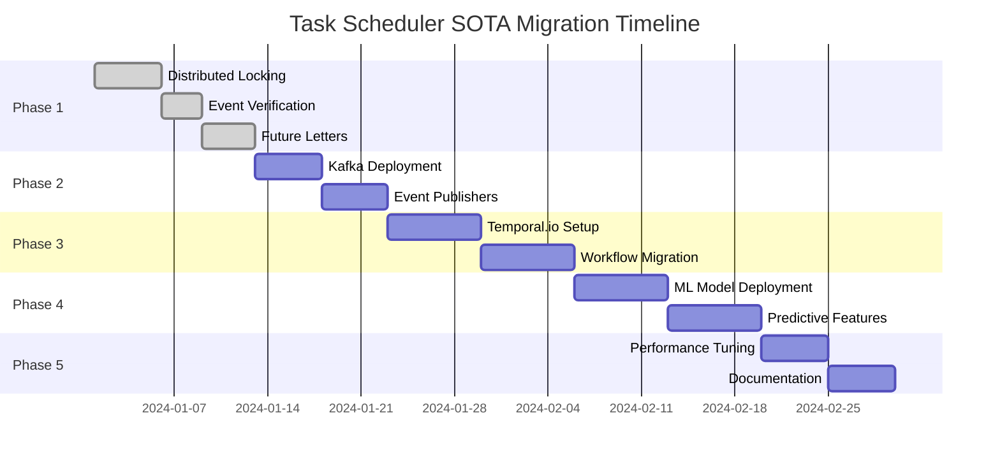

# Task Scheduler SOTA Migration Strategy

## Overview

This document outlines the migration strategy from the current basic scheduler implementation to a State-of-the-Art (SOTA) automation platform for OpenPenPal.

## Current State Analysis

### Existing Infrastructure
- **Scheduler**: robfig/cron v3 (basic cron functionality)
- **Queue**: Custom Redis LPUSH/BRPOP implementation
- **Database**: PostgreSQL with GORM
- **Monitoring**: Prometheus + Grafana (basic metrics)
- **Services**: 5 microservices architecture

### Current Capabilities
- ✅ Time-based task scheduling
- ✅ Basic retry mechanisms
- ✅ Task execution history
- ✅ Worker management
- ❌ Distributed locking
- ❌ Event-driven triggers
- ❌ Advanced monitoring
- ❌ Self-healing capabilities

## Target SOTA Architecture

### Enhanced Infrastructure
- **Scheduler**: Enhanced robfig/cron + Temporal.io workflow engine
- **Queue**: Redis Streams + Kafka for event streaming
- **Database**: PostgreSQL with optimized indexes + TimescaleDB for metrics
- **Monitoring**: OpenTelemetry + AI-powered analytics
- **Services**: Event-driven microservices with circuit breakers

### SOTA Capabilities
- ✅ Time-based + Event-driven scheduling
- ✅ Distributed locking with Redis
- ✅ Workflow orchestration
- ✅ Self-healing with predictive failure detection
- ✅ AI-powered optimization
- ✅ Chaos engineering ready
- ✅ Multi-campus federation support

## Migration Phases

### Phase 1: Foundation Enhancement (Weeks 1-2)
**Goal**: Add critical missing features without disrupting existing functionality

#### Tasks:
1. **Implement Distributed Locking** ✅
   - Deploy Redis-based locking mechanism
   - Wrap existing task execution with locks
   - Test concurrent execution scenarios

2. **Add Event Signature Verification** ✅
   - Implement HMAC-based event verification
   - Add replay attack protection
   - Secure webhook endpoints

3. **Deploy Future Letter Auto-unlock** ✅
   - Implement FutureLetterService
   - Add scheduled letter processing
   - Configure 10-minute cron job

4. **Enable Performance Monitoring**
   - Add detailed task execution metrics
   - Configure Prometheus exporters
   - Create Grafana dashboards

#### Migration Steps:
```bash
# 1. Deploy new code with feature flags
ENABLE_DISTRIBUTED_LOCKING=false
ENABLE_EVENT_VERIFICATION=false
ENABLE_FUTURE_LETTERS=false

# 2. Test in staging environment
./scripts/test-scheduler-enhanced.sh

# 3. Gradual rollout
# Day 1: Enable distributed locking
ENABLE_DISTRIBUTED_LOCKING=true

# Day 3: Enable event verification
ENABLE_EVENT_VERIFICATION=true

# Day 5: Enable future letters
ENABLE_FUTURE_LETTERS=true
```

### Phase 2: Event-Driven Architecture (Weeks 3-4)
**Goal**: Introduce event-driven capabilities alongside existing cron

#### Tasks:
1. **Deploy Kafka Infrastructure**
   ```yaml
   # docker-compose.kafka.yml
   services:
     kafka:
       image: confluentinc/cp-kafka:latest
       environment:
         KAFKA_BROKER_ID: 1
         KAFKA_ZOOKEEPER_CONNECT: zookeeper:2181
   ```

2. **Implement Event Publishers**
   - Letter lifecycle events
   - Courier status changes
   - User engagement events

3. **Create Event Consumers**
   - Event-to-task mappers
   - Dead letter queue handlers
   - Event replay mechanisms

#### Migration Steps:
```go
// Dual-mode operation during migration
if featureFlags.EventDrivenEnabled {
    publishEvent("letter.created", letterData)
} else {
    // Existing cron-based logic
}
```

### Phase 3: Workflow Orchestration (Weeks 5-6)
**Goal**: Add complex workflow capabilities using Temporal.io

#### Tasks:
1. **Deploy Temporal.io**
   ```bash
   docker-compose -f temporal-docker-compose.yml up -d
   ```

2. **Define Workflows**
   - Letter delivery workflow
   - AI penpal conversation workflow
   - Envelope contest workflow

3. **Migrate Complex Tasks**
   - Convert multi-step operations to workflows
   - Add compensation logic
   - Implement saga patterns

### Phase 4: AI Integration (Weeks 7-8)
**Goal**: Add predictive and self-healing capabilities

#### Tasks:
1. **Deploy ML Models**
   - Task execution time prediction
   - Failure prediction model
   - User engagement predictor

2. **Implement Predictive Scheduling**
   - Optimal execution time calculation
   - Load-based task distribution
   - Preemptive scaling

3. **Add Self-Healing**
   - Automatic retry with backoff
   - Circuit breaker implementation
   - Chaos engineering tests

### Phase 5: Production Optimization (Weeks 9-10)
**Goal**: Optimize for production workloads

#### Tasks:
1. **Performance Tuning**
   - Database query optimization
   - Redis connection pooling
   - Kafka partition optimization

2. **Monitoring Enhancement**
   - Custom metrics and alerts
   - SLO/SLA tracking
   - Cost optimization

3. **Documentation & Training**
   - Operational runbooks
   - Developer guides
   - Admin training

## Rollback Strategy

Each phase includes rollback capabilities:

```bash
# Quick rollback script
#!/bin/bash
PHASE=$1

case $PHASE in
  1)
    # Disable enhanced features
    kubectl set env deployment/scheduler \
      ENABLE_DISTRIBUTED_LOCKING=false \
      ENABLE_EVENT_VERIFICATION=false
    ;;
  2)
    # Stop event consumers
    kubectl scale deployment/event-consumer --replicas=0
    ;;
  3)
    # Disable workflow engine
    kubectl delete deployment temporal-worker
    ;;
esac
```

## Risk Mitigation

### Technical Risks
1. **Data Loss**: Implement comprehensive backups before each phase
2. **Performance Degradation**: Load test each feature before enabling
3. **Integration Failures**: Use feature flags for gradual rollout

### Operational Risks
1. **Team Knowledge Gap**: Conduct training sessions before each phase
2. **Monitoring Blind Spots**: Enhance observability incrementally
3. **Customer Impact**: Communicate changes and maintain SLAs

## Success Metrics

### Phase 1 Success Criteria
- ✅ Zero duplicate task executions
- ✅ 100% of webhooks verified
- ✅ Future letters unlock within 10 minutes
- ✅ <100ms task scheduling latency

### Overall Migration Success
- 📊 50% reduction in manual operations
- 📊 99.9% task execution reliability
- 📊 10x improvement in task complexity handled
- 📊 90% reduction in incident response time

## Timeline Summary



## Conclusion

This migration strategy provides a clear path from the current implementation to a world-class automation platform. By following this phased approach with proper rollback capabilities and risk mitigation, OpenPenPal can achieve SOTA automation capabilities while maintaining system stability and reliability.