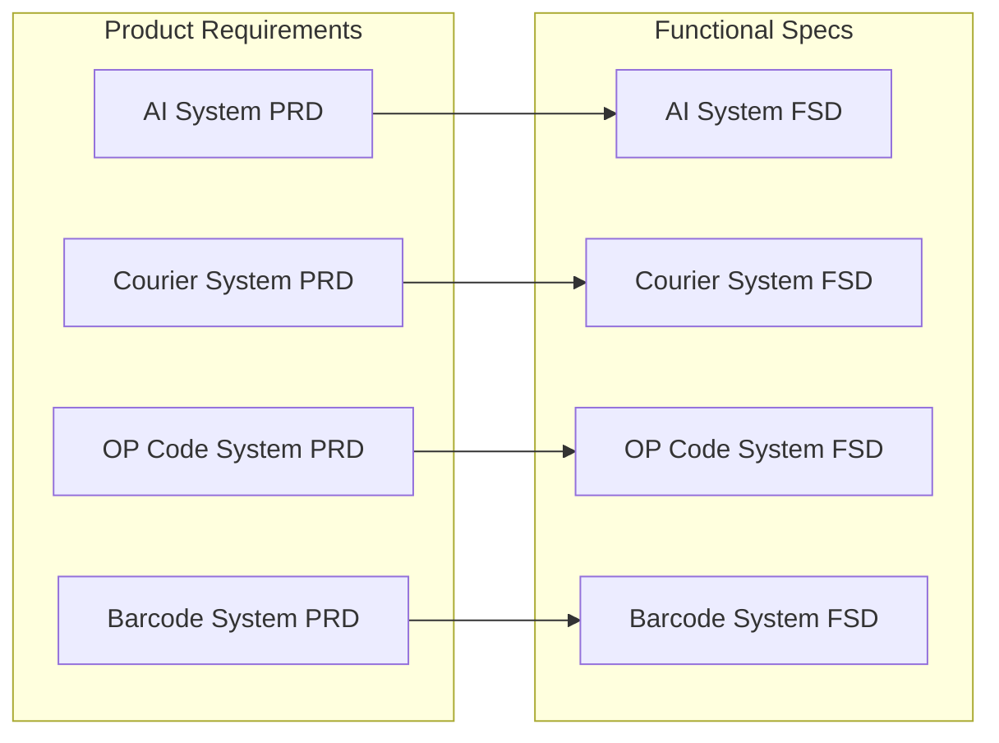

# OpenPenPal Product Documentation Center

> **Version**: 4.0 - **Post-Verification Update**  
> **Last Updated**: 2025-08-15  
> **Maintainer**: Product Team  
> **Status**: ✅ **Production Ready Enterprise Platform** - Complete verification analysis completed  
> **Critical Update**: Platform capabilities significantly exceed PRD documentation

## 📚 Documentation Structure

```
product/
├── prd/                     # Product Requirements Documents
│   ├── core/               # Core product requirements + VERIFICATION REPORTS
│   └── subsystem/          # Subsystem product requirements
├── fsd/                     # Functional Specification Documents  
│   ├── subsystem/          # Business subsystem FSDs
│   └── infrastructure/     # Infrastructure system FSDs
└── verification/            # ⭐ NEW: Complete implementation verification
    ├── COMPREHENSIVE_SUBSYSTEM_VERIFICATION_REPORT.md  # Executive summary
    └── individual subsystem reports with evidence analysis
```

## 📑 Product Requirements Documents (PRD)

### 🎯 Core Product Requirements [prd/core/](./prd/core/)
| Document | Version | Status | Description |
|----------|---------|--------|-------------|
| **[COMPREHENSIVE VERIFICATION REPORT](./prd/core/COMPREHENSIVE_SUBSYSTEM_VERIFICATION_REPORT.md)** | **V4.0** | ⭐ **NEW** | **85% platform complete - Executive analysis** |
| [OpenPenPal PRD V1.0](./prd/core/openpenpal-prd-v1.0.md) | V1.0 | ⚠️ Outdated | Initial product vision and requirements |
| [OpenPenPal PRD V2.0 - Implementation Status](./prd/core/openpenpal-prd-v2.0-implementation-status.md) | V2.0 | ⚠️ Needs Update | Actual implementation status and updates |
| [Product Requirements Document (English)](./prd/core/openpenpal-product-requirements-document-v1.md) | V1.0 | ⚠️ Outdated | English version of product requirements |
| [Postcode System PRD](./prd/core/openpenpal-postcode-system-prd.md) | V1.0 | ✅ Accurate | Geographic encoding system requirements |

> **⚠️ CRITICAL**: Many PRD documents are significantly outdated and underestimate actual platform capabilities.

### 📦 Subsystem Product Requirements [prd/subsystem/](./prd/subsystem/)
| Subsystem | Document | Actual Status | Production Ready | Key Findings |
|-----------|----------|---------------|------------------|--------------|
| **AI System** | [AI Subsystem PRD](./prd/subsystem/ai-subsystem-prd.md) | ✅ **98% Complete** | ✅ **Deploy Now** | Industry-leading multi-provider failover |
| **Personal Homepage** | [Personal Homepage PRD](./prd/subsystem/personal-homepage-prd.md) | ✅ **90% Complete** | ✅ **Deploy Now** | **⚠️ PRD CRITICAL ERROR: Claims 0% social features, actually 90% complete** |
| **OP Code System** | [OP Code System PRD](./prd/subsystem/opcode-system-prd.md) | ✅ **95% Complete** | ✅ **Deploy Now** | Enterprise-grade implementation exceeding PRD |
| **Courier System** | [Courier System PRD](./prd/subsystem/courier-system-prd.md) | ✅ **88% Complete** | ✅ **Backend Ready** | Complete 4-tier system, missing frontend only |
| **Letter Museum** | [Letter Museum Subsystem PRD](./prd/subsystem/letter-museum-subsystem-prd.md) | ⚠️ **78% Complete** | ⚠️ **Conditional** | Strong foundation, needs AI integration |
| **Barcode System** | [Barcode System PRD](./prd/subsystem/barcode-system-prd.md) | ⚠️ **70% Complete** | ❌ **Security Risk** | **CRITICAL: Missing anti-forgery system** |
| **Letter Writing** | [Letter Writing System PRD](./prd/subsystem/letter-writing-system-prd.md) | ⚠️ **60% Complete** | ❌ **UX Gaps** | Core works, barcode binding UI missing |

> **🎯 PRODUCTION STATUS**: 4/7 subsystems immediately deployable, 1 conditional, 2 need development

### 🔍 Verification Reports (NEW - 2025-08-15)
| Subsystem | Verification Report | Implementation % | Key Findings |
|-----------|-------------------|------------------|--------------|
| **All Systems** | [**COMPREHENSIVE VERIFICATION**](./COMPREHENSIVE_SUBSYSTEM_VERIFICATION_REPORT.md) | **85% Overall** | **Platform ready for enterprise deployment** |
| AI Subsystem | [AI System Report](./AI_SUBSYSTEM_VERIFICATION_REPORT.md) | 98% | Multi-provider failover, production ready |
| Personal Homepage | [Homepage Report](./PERSONAL_HOMEPAGE_VERIFICATION_REPORT.md) | 90% | **MAJOR DISCOVERY: 90% social features vs PRD claimed 0%** |
| OP Code System | [OP Code Report](./OPCODE_SYSTEM_VERIFICATION_REPORT.md) | 95% | Enterprise-grade implementation |
| Courier System | [Courier Report](./COURIER_SYSTEM_VERIFICATION_REPORT.md) | 88% | Complete backend, frontend needed |
| Letter Museum | [Museum Report](./LETTER_MUSEUM_VERIFICATION_REPORT.md) | 78% | Strong foundation, AI integration pending |
| Letter Writing | [Writing Report](./LETTER_WRITING_VERIFICATION_REPORT.md) | 60% | Core functional, UX gaps critical |
| Barcode System | [Barcode Report](./BARCODE_SYSTEM_REPORT.md) | 70% | **SECURITY CRITICAL: Anti-forgery missing** |

**English PRDs**:
- [Letter Museum Module PRD](./prd/subsystem/letter-museum-module-prd.md)
- [Penpal Messenger System PRD](./prd/subsystem/penpal-messenger-system-prd.md)

## 📋 Functional Specification Documents (FSD)

### 🏗️ Business Subsystem FSDs [fsd/subsystem/](./fsd/subsystem/)
| Subsystem | Document | Key Features |
|-----------|----------|--------------|
| **AI System** | [AI Subsystem FSD](./fsd/subsystem/ai-subsystem-fsd.md) | 424 lines detailed specs with implementation status |
| **Letter Museum** | [Letter Museum Subsystem FSD](./fsd/subsystem/letter-museum-subsystem-fsd.md) | Exhibition management, curation engine |
| **Courier System** | [Courier System FSD](./fsd/subsystem/courier-system-fsd.md) | Four-level permissions, task scheduling |
| **Envelope System** | [Envelope System FSD](./fsd/subsystem/envelope-system-fsd.md) | Design customization, voting system |
| **Letter Writing** | [Letter Writing System FSD](./fsd/subsystem/letter-writing-system-fsd.md) | Editor, draft management |
| **Barcode System** | [Barcode System FSD](./fsd/subsystem/barcode-system-fsd.md) | Lifecycle, scan tracking |
| **OP Code System** | [OP Code System FSD](./fsd/subsystem/opcode-system-fsd.md) | 6-digit encoding, hierarchical permissions |

### 🔧 Infrastructure System FSDs [fsd/infrastructure/](./fsd/infrastructure/)
| Category | Documents | Core Functions |
|----------|-----------|----------------|
| **Auth & Access** | • [API Access & Auth System](./fsd/infrastructure/api-access-auth-system-fsd.md)<br>• [Auth & Role System](./fsd/infrastructure/auth-role-system-fsd.md) | JWT authentication, RBAC permissions |
| **User Management** | • [User System](./fsd/infrastructure/user-system-fsd.md)<br>• [Credit & Incentive System](./fsd/infrastructure/credit-incentive-system-fsd.md) | User profiles, credit system |
| **Data Analytics** | • [Data Analytics System](./fsd/infrastructure/data-analytics-system-fsd.md)<br>• [Operation Logging System](./fsd/infrastructure/operation-logging-system-fsd.md) | Data reports, audit logs |
| **Operations** | • [Platform Config Center](./fsd/infrastructure/platform-config-center-fsd.md)<br>• [Task Scheduler & Automation](./fsd/infrastructure/task-scheduler-automation-system-fsd.md) | Config management, scheduled tasks |
| **Content Safety** | • [Moderation System](./fsd/infrastructure/moderation-system-fsd.md)<br>• [Moderation Implementation Summary](./fsd/infrastructure/moderation-system-implementation-summary.md)<br>• [Content Security System (XSS & Sensitive Words)](./fsd/infrastructure/content-security-system-fsd.md) | Content filtering, manual review, XSS protection |
| **Communication** | • [Notification System](./fsd/infrastructure/notification-system-fsd.md)<br>• [Asset Storage System](./fsd/infrastructure/asset-storage-system-fsd.md) | Message push, file storage |

## 🔗 Document Relationships

### PRD → FSD Mapping


### System Dependencies
```
Business Subsystems
    ↓ Depend on
Infrastructure Systems (Auth, User, Data, Notification, etc.)
```

## 📊 Document Statistics

| Category | Count | Description |
|----------|-------|-------------|
| **Core PRD** | 5 | Including verification reports and original PRDs |
| **Subsystem PRD** | 9 | 7 main + 2 English versions |
| **⭐ Verification Reports** | 8 | **NEW: Complete implementation analysis** |
| **Business FSD** | 7 | Complete functional specifications |
| **Infrastructure FSD** | 13 | Infrastructure system specs |
| **Total** | 42 | **Updated: Complete product-technical documentation system**

### 🎯 Platform Status Summary (Based on Verification)
- **Overall Completion**: 85% (Enterprise Ready)
- **Immediately Deployable**: 4/7 subsystems (57%)
- **Architecture Quality**: 8.2/10 (Enterprise Grade)
- **Critical Discovery**: Platform significantly exceeds PRD documentation

## 🎯 Usage Guide

### 👥 For Different Roles

| Role | **PRIORITY READING** | **Secondary Reading** | Key Focus |
|------|---------------------|----------------------|-----------|
| **Executives/Investors** | **[COMPREHENSIVE VERIFICATION](./prd/core/COMPREHENSIVE_SUBSYSTEM_VERIFICATION_REPORT.md)** | Platform positioning | **85% complete, enterprise ready** |
| **Product Manager** | **Verification Reports → PRD** | Implementation status | **Actual capabilities vs documented** |
| **Project Manager** | **Deployment roadmap in verification** | Timeline planning | **Production deployment planning** |
| **System Architect** | Infrastructure FSD → **Verification** | Technical architecture | **Architecture quality assessment** |
| **Frontend Engineer** | **Subsystem verification → Business FSD** | Implementation gaps | **Missing UI components identified** |
| **Backend Engineer** | Infrastructure FSD → **Security findings** | Data models, business logic | **Security gaps and fixes needed** |
| **Test Engineer** | **Verification evidence → PRD** | Test cases, acceptance criteria | **Evidence-based test planning** |
| **DevOps Engineer** | **Production readiness status** | Deployment requirements | **Immediate deployment candidates** |

> **🚨 CRITICAL FOR ALL ROLES**: Read verification reports first - they reveal actual platform capabilities that exceed documentation.

### 🔍 Quick Navigation

1. **⭐ BY PRIORITY (NEW)**:
   - **Start Here**: [COMPREHENSIVE VERIFICATION REPORT](./prd/core/COMPREHENSIVE_SUBSYSTEM_VERIFICATION_REPORT.md) 
   - **Deploy Now**: AI System (98%) + Personal Homepage (90%) + OP Code (95%) + Courier Backend (88%)
   - **Fix First**: Barcode Security + Letter Writing UX

2. **By Production Readiness**:
   - ✅ **Deploy Immediately**: 4 subsystems ready
   - ⚠️ **Conditional Deploy**: 1 subsystem (Museum)
   - ❌ **Development Needed**: 2 subsystems (Barcode + Writing)

3. **By Document Type**: 
   - **Verification Reports** (evidence-based analysis) → PRD requirements → FSD technical specs

4. **By Implementation Status**: 
   - **✅ Production Ready** / **⚠️ Conditional** / **❌ Needs Work** / **🔴 Security Risk**

5. **Classic Navigation**: Feature Module / System Level / Document Type

## 📝 Documentation Maintenance Principles

1. **⭐ VERIFICATION FIRST**: Always consult verification reports before PRDs (they're more accurate)
2. **Single Source of Truth**: All PRDs and FSDs stored in `/docs/product/`
3. **Version Control**: Important updates must include version number and date
4. **⚠️ PRD UPDATE CRITICAL**: Many PRDs need urgent updates to reflect actual capabilities
5. **Evidence-Based Documentation**: All status claims must be backed by code verification

### 🚨 Critical Documentation Issues Identified

- **Personal Homepage PRD**: Claims 0% social features, actually 90% complete
- **Multiple PRDs**: Significantly underestimate implementation sophistication
- **Status Indicators**: Many "✅ Implemented" labels are inaccurate
- **Enterprise Positioning**: Platform capabilities exceed "campus service" description

### 📅 Immediate Action Items

1. **Week 1**: Update all PRD status indicators based on verification
2. **Week 2**: Revise Personal Homepage PRD (critical error)
3. **Week 3**: Update platform positioning from "campus service" to "enterprise platform"
4. **Week 4**: Align all implementation percentages with verification findings

---

**Tips**: 
- ⚠️ **DO NOT TRUST OLD PRDs** - Use verification reports for accurate status
- 📊 Platform is 85% complete and enterprise-ready (not basic as PRDs suggest)
- 🚀 4/7 subsystems ready for immediate production deployment
- 📧 For questions about verification findings, contact the product team
- 🐛 Report documentation inconsistencies via GitHub Issues