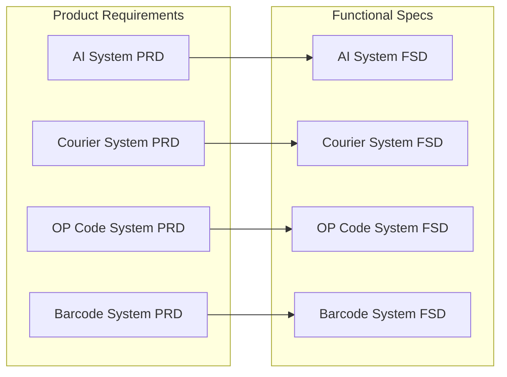

# OpenPenPal Product Documentation Center

> **Version**: 3.1  
> **Last Updated**: 2025-08-14  
> **Maintainer**: Product Team
> **Status**: Complete unified PRD/FSD documentation system with English filenames

## 📚 Documentation Structure

```
product/
├── prd/                     # Product Requirements Documents
│   ├── core/               # Core product requirements
│   └── subsystem/          # Subsystem product requirements
└── fsd/                     # Functional Specification Documents
    ├── subsystem/          # Business subsystem FSDs
    └── infrastructure/     # Infrastructure system FSDs
```

## 📑 Product Requirements Documents (PRD)

### 🎯 Core Product Requirements [prd/core/](./prd/core/)
| Document | Version | Description |
|----------|---------|-------------|
| [OpenPenPal PRD V1.0](./prd/core/openpenpal-prd-v1.0.md) | V1.0 | Initial product vision and requirements |
| [OpenPenPal PRD V2.0 - Implementation Status](./prd/core/openpenpal-prd-v2.0-implementation-status.md) | V2.0 | Actual implementation status and updates |
| [Product Requirements Document (English)](./prd/core/openpenpal-product-requirements-document-v1.md) | V1.0 | English version of product requirements |
| [Postcode System PRD](./prd/core/openpenpal-postcode-system-prd.md) | V1.0 | Geographic encoding system requirements |

### 📦 Subsystem Product Requirements [prd/subsystem/](./prd/subsystem/)
| Subsystem | Document | Status | Description |
|-----------|----------|--------|-------------|
| **AI System** | [AI Subsystem PRD](./prd/subsystem/ai-subsystem-prd.md) | ✅ Implemented | Smart matching with user-controlled delay, cloud letter companion with custom personas, reply assistant, inspiration |
| **Personal Homepage** | [Personal Homepage PRD](./prd/subsystem/personal-homepage-prd.md) | ⭐ New | User profile and archive system |
| **Letter Museum** | [Letter Museum Subsystem PRD](./prd/subsystem/letter-museum-subsystem-prd.md) | ✅ Implemented | Public letter display and curation |
| **Courier System** | [Courier System PRD](./prd/subsystem/courier-system-prd.md) | ✅ Implemented | Four-level courier hierarchy and delivery |
| **Letter Writing** | [Letter Writing System PRD](./prd/subsystem/letter-writing-system-prd.md) | ✅ Implemented | Letter creation and editing features |
| **Barcode System** | [Barcode System PRD](./prd/subsystem/barcode-system-prd.md) | ✅ Implemented | Letter tracking and logistics management |
| **OP Code System** | [OP Code System PRD](./prd/subsystem/opcode-system-prd.md) | ✅ Implemented | Geographic encoding system |

**English PRDs**:
- [Letter Museum Module PRD](./prd/subsystem/letter-museum-module-prd.md)
- [Penpal Messenger System PRD](./prd/subsystem/penpal-messenger-system-prd.md)

## 📋 Functional Specification Documents (FSD)

### 🏗️ Business Subsystem FSDs [fsd/subsystem/](./fsd/subsystem/)
| Subsystem | Document | Key Features |
|-----------|----------|--------------|
| **AI System** | [AI Subsystem FSD](./fsd/subsystem/ai-subsystem-fsd.md) | 424 lines detailed specs with implementation status |
| **Letter Museum** | [Letter Museum Subsystem FSD](./fsd/subsystem/letter-museum-subsystem-fsd.md) | Exhibition management, curation engine |
| **Courier System** | [Courier System FSD](./fsd/subsystem/courier-system-fsd.md) | Four-level permissions, task scheduling |
| **Envelope System** | [Envelope System FSD](./fsd/subsystem/envelope-system-fsd.md) | Design customization, voting system |
| **Letter Writing** | [Letter Writing System FSD](./fsd/subsystem/letter-writing-system-fsd.md) | Editor, draft management |
| **Barcode System** | [Barcode System FSD](./fsd/subsystem/barcode-system-fsd.md) | Lifecycle, scan tracking |
| **OP Code System** | [OP Code System FSD](./fsd/subsystem/opcode-system-fsd.md) | 6-digit encoding, hierarchical permissions |

### 🔧 Infrastructure System FSDs [fsd/infrastructure/](./fsd/infrastructure/)
| Category | Documents | Core Functions |
|----------|-----------|----------------|
| **Auth & Access** | • [API Access & Auth System](./fsd/infrastructure/api-access-auth-system-fsd.md)<br>• [Auth & Role System](./fsd/infrastructure/auth-role-system-fsd.md) | JWT authentication, RBAC permissions |
| **User Management** | • [User System](./fsd/infrastructure/user-system-fsd.md)<br>• [Credit & Incentive System](./fsd/infrastructure/credit-incentive-system-fsd.md) | User profiles, credit system |
| **Data Analytics** | • [Data Analytics System](./fsd/infrastructure/data-analytics-system-fsd.md)<br>• [Operation Logging System](./fsd/infrastructure/operation-logging-system-fsd.md) | Data reports, audit logs |
| **Operations** | • [Platform Config Center](./fsd/infrastructure/platform-config-center-fsd.md)<br>• [Task Scheduler & Automation](./fsd/infrastructure/task-scheduler-automation-system-fsd.md) | Config management, scheduled tasks |
| **Content Safety** | • [Moderation System](./fsd/infrastructure/moderation-system-fsd.md)<br>• [Moderation Implementation Summary](./fsd/infrastructure/moderation-system-implementation-summary.md)<br>• [Content Security System (XSS & Sensitive Words)](./fsd/infrastructure/content-security-system-fsd.md) | Content filtering, manual review, XSS protection |
| **Communication** | • [Notification System](./fsd/infrastructure/notification-system-fsd.md)<br>• [Asset Storage System](./fsd/infrastructure/asset-storage-system-fsd.md) | Message push, file storage |

## 🔗 Document Relationships

### PRD → FSD Mapping


### System Dependencies
```
Business Subsystems
    ↓ Depend on
Infrastructure Systems (Auth, User, Data, Notification, etc.)
```

## 📊 Document Statistics

| Category | Count | Description |
|----------|-------|-------------|
| **Core PRD** | 4 | Including V1.0, V2.0 and English version |
| **Subsystem PRD** | 9 | 7 main + 2 English versions |
| **Business FSD** | 7 | Complete functional specifications |
| **Infrastructure FSD** | 13 | Infrastructure system specs |
| **Total** | 33 | Complete product-technical documentation system |

## 🎯 Usage Guide

### 👥 For Different Roles

| Role | Recommended Reading | Focus Areas |
|------|-------------------|-------------|
| **Product Manager** | PRD docs → FSD overview | Product boundaries, feature definitions |
| **System Architect** | Infrastructure FSD → Core PRD | System dependencies, technical architecture |
| **Frontend Engineer** | Business FSD → Related PRD | API interfaces, interaction flows |
| **Backend Engineer** | Infrastructure FSD → Business FSD | Data models, business logic |
| **Test Engineer** | PRD → FSD detailed specs | Test cases, acceptance criteria |

### 🔍 Quick Navigation

1. **By Feature Module**: AI System / Courier System / Museum / OP Code System
2. **By Document Type**: PRD requirements / FSD technical specs
3. **By Implementation Status**: Implemented ✅ / Pending ⚠️ / New ⭐
4. **By System Level**: Business subsystems / Infrastructure systems

## 📝 Documentation Maintenance Principles

1. **Single Source of Truth**: All PRDs and FSDs stored in `/docs/product/`
2. **Version Control**: Important updates must include version number and date
3. **Status Synchronization**: PRD and FSD implementation status must stay aligned
4. **Regular Review**: Monthly check for document accuracy and completeness

---

**Tips**: 
- 🔄 Documents are regularly updated, please watch for version changes
- 📧 For questions, contact the product team
- 🐛 Report issues via GitHub Issues