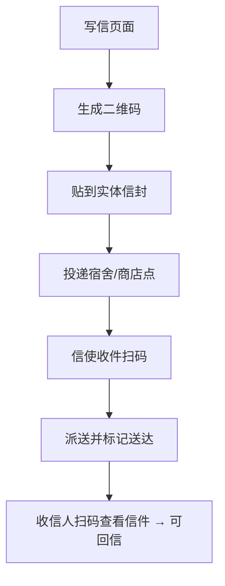

# 一、产品概述

## 1.1 产品名称

OpenPenPal

## 1.2 产品定位

一个融合线下实体信件与线上温柔社交的校园通信系统，通过信封、条码、编码、信使网络与内容社区，构建人与人之间“慢、真实、可感”的连接。

## 1.3 产品愿景

* 在数字时代复兴纸笔交流与仪式感
* 在校园中建立一个具备“人文气息”的新型连接方式
* 通过信使网络、编码体系和AI辅助，链接现实与虚拟的温度传递

---

# 二、核心系统模块

## 2.1 写信系统 ✍️

### 功能概述

* 用户在线写信，或生成二维码贴纸后进行手写 → 投递实体信件
* 支持匿名漂流、实名定向、公开发布、未来信定时
* 所有信封通过条码进入平台的物流追踪系统

### 核心功能

| 模块    | 描述                                                            |
| ----- | ------------------------------------------------------------- |
| 写信入口  | 文字输入、选择信纸样式、匿名/实名、生成编号 + 下载贴纸                                 |
| 条码绑定  | 生成唯一信封条码，首次扫码后绑定信件与地址信息，绑定后不可更改，支持稽核、防伪、状态追踪                  |
| 条码获取  | 条码通过以下方式获取：1）在线写信生成 PDF 下载；2）信封商城购买附赠；3）商店或信使处领取实体贴纸；4）平台单独销售 |
| 投递引导  | 展示宿舍投递点/商店合作点，可定位或搜索                                          |
| 回信机制  | 收件人扫码信封 → 平台展示信 → 可点击“回信”直接新建                                 |
| 写作广场  | 浏览公开信件、参与写作挑战、点赞收藏                                            |
| 未来信功能 | 设置“未来日期”，系统延迟展示或提醒收件人                                         |
| 漂流信机制 | 分为 AI 漂流（系统匹配 CODE 写入条码）与中转站漂流（由平台转发）两类，均支持匿名选项               |

### 特殊说明

* 实体信件必须使用 OpenPenPal 专属信封方可参加活动
* 条码具有唯一性，所有绑定行为平台留存记录，不可复用
* 所有信件线下物流路径通过条码追踪，全流程记录

---

## 2.2 信封系统 ✉️

### 功能概述

* 所有信件需使用 OpenPenPal 官方信封（售价2-4元）
* 每次活动必须使用信封系统内已备案的设计

### 信封设计管理

| 角色     | 权责描述                            |
| ------ | ------------------------------- |
| 四级信使   | 每轮城市级活动须发布一款统一信封设计              |
| 三级信使   | 若本校无专属信封则默认使用城市信封；负责管理校内信封设计与采纳 |
| 信使社区成员 | 可向三级信使投稿信封设计，被采纳者获200元奖励        |

### 获取方式

* 商城购买 → 配套信封+二维码贴纸
* 信使派送 → 分发至宿舍或线下活动现场
* 商店提取 → 合作点直接购买
* 单独购买 → 条码贴纸具备相同功能

---

## 2.3 信使系统 📦

### 功能概述

* 四级结构物流网络，宿舍 → 楼栋 → 校区 → 城市
* 信使同时为本地化社群运营核心角色

### 信使等级说明

| 等级   | 管理范围  | 权限                      |
| ---- | ----- | ----------------------- |
| 四级信使 | 城市    | 开通新学校、维护前2位编码、调度城市物流    |
| 三级信使 | 学校    | 维护校内编码（第3-4位）、组织校内信使与物流 |
| 二级信使 | 片区    | 审核宿舍点位、管理投递点、接收与分拣信件    |
| 一级信使 | 宿舍/楼栋 | 执行派送，扫码更新状态，可见完整地址编码    |

### 功能子模块

* 信使中心：任务领取、扫码登记、积分与等级成长
* 点位管理：宿舍/商店成为固定派送点后由二级信使审核
* 社群激励：信使拥有积分系统、徽章系统、活动组织权

---

## 2.4 编码系统 🧭（OpenPenPal Code）

### 功能概述

* 使用六位编码定位投递地址
* 支持标准化投递、权限调度与用户隐私分级

### 编码规则

| 位数   | 含义       | 示例 | 维护者     | 是否公开 |
| ---- | -------- | -- | ------- | ---- |
| 1-2位 | 学校码      | PK | 四级信使    | ✅    |
| 3-4位 | 宿舍片区/楼栋  | 5F | 三级信使    | ✅    |
| 5-6位 | 宿舍号/商店点位 | 3D | 二级信使/用户 | 条件公开 |

### 编码申请与管理

* 用户注册填写前4位（学校+片区）自动识别地址
* 若需设为投递点 → 申请后两位 → 二级信使审核通过自动绑定
* 若为公开商店/驿站点位，则六位全开放，信使可授权派送

### 隐私机制

* 宿舍类地址后两位默认私密，仅派送信使可见
* 用户可设置是否公开完整编码以接受熟人通信
* 所有编码记录平台可稽核，重复/占用自动提示

---

## 2.5 AI子系统 🤖

### 目标定位

* 做连接器、温柔策展人，而非内容主导者

### 功能模块

| 模块      | 描述                            |
| ------- | ----------------------------- |
| 自由笔友匹配  | 写匿名信 → AI根据内容风格匹配收件人，更新条码绑定信息 |
| AI笔友模拟器 | 用户可选择笔友人设，定期收到回信，模拟真实信件节奏     |
| 写作灵感卡片  | 每日推送写作题目/引导语，辅助写作启动           |
| 信件博物馆策展 | 双方授权后，AI自动归档入“展览主题”，形成专题展墙    |

### 节奏控制机制

* AI交互一律不即时，默认1天+延迟回信机制
* 匹配漂流信后不展示对方身份，仅展示编号与信件状态

---

# 三、关键流程图

## 写信 → 投递 → 回信

---

# 四、非功能需求

| 类别   | 要求                       |
| ---- | ------------------------ |
| 数据隐私 | 地址编码前4位可查，后2位默认隐藏，任务信使可见 |
| 条码安全 | 编号唯一、绑定后锁定、防篡改、防复用、平台稽核  |
| 性能要求 | 写信页 ≤ 2s，扫码响应 ≤ 0.5s     |
| 审核合规 | 内容审核机制、匿名写作频率限制、漂流内容筛选   |

---

# 五、关键指标（MVP）

| 指标      | 验收标准                  |
| ------- | --------------------- |
| 写信完成率   | 写信页面→贴纸生成 ≥ 30%       |
| 投递激活率   | 有扫码记录的信件占比 ≥ 60%      |
| 回信参与率   | 回信数量 ≥ 原始信件 20%       |
| 信使留存率   | 完成2次任务以上的信使 ≥ 50%     |
| AI匹配满意度 | AI漂流信匹配后收到点赞/回应 ≥ 40% |

---

# 六、版本规划

| 版本   | 功能内容                           |
| ---- | ------------------------------ |
| MVP  | 写信+信封系统+条码绑定+扫码投递+回信流程         |
| v1.1 | 写作广场+公开信+AI自由匹配+信使积分任务         |
| v1.2 | 商店点位合作+未来信+手写上传+信件博物馆展览+用户信箱优化 |

