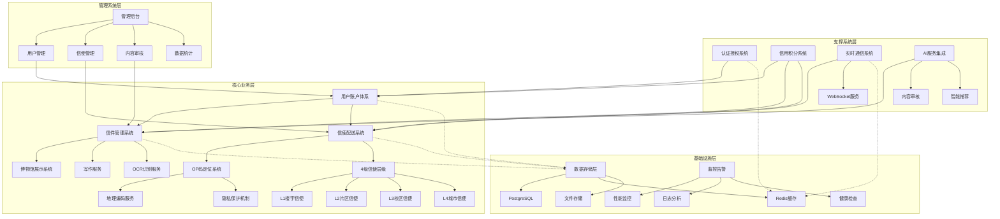
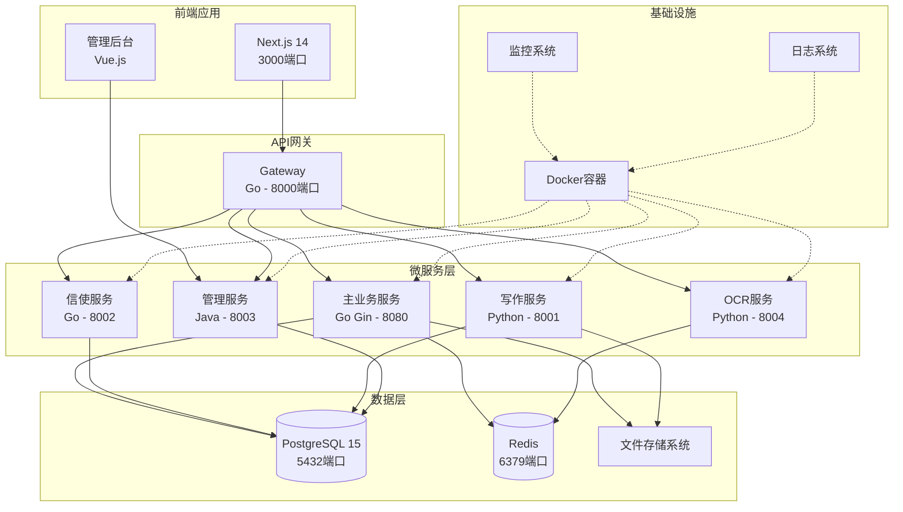
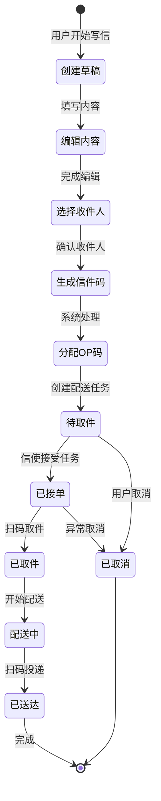
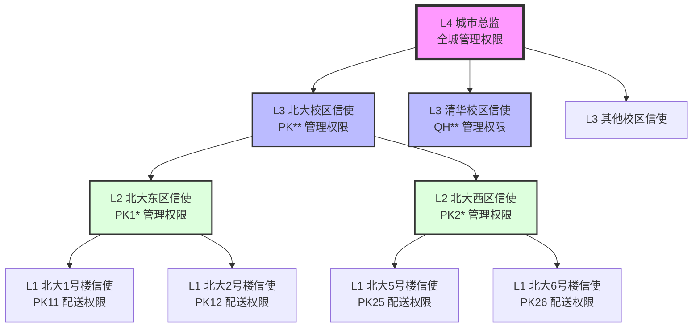
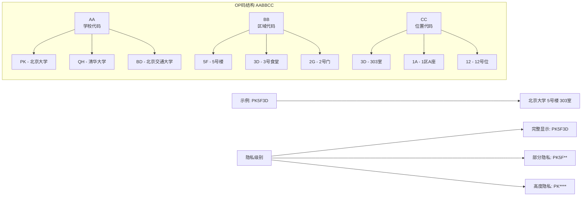
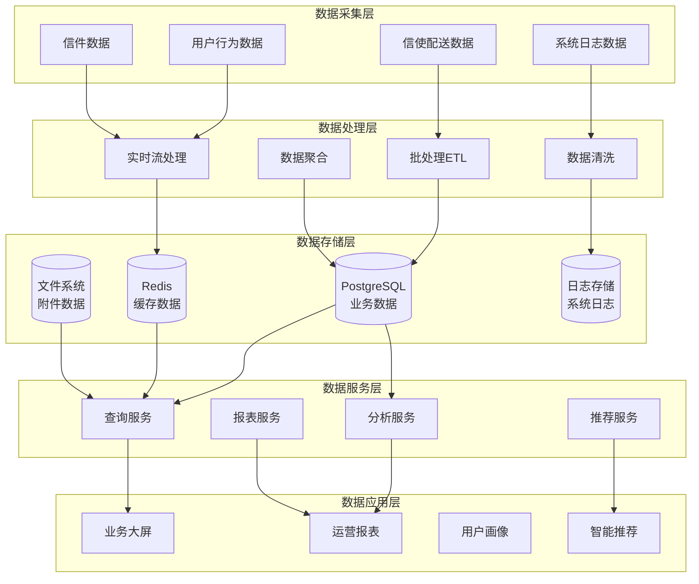
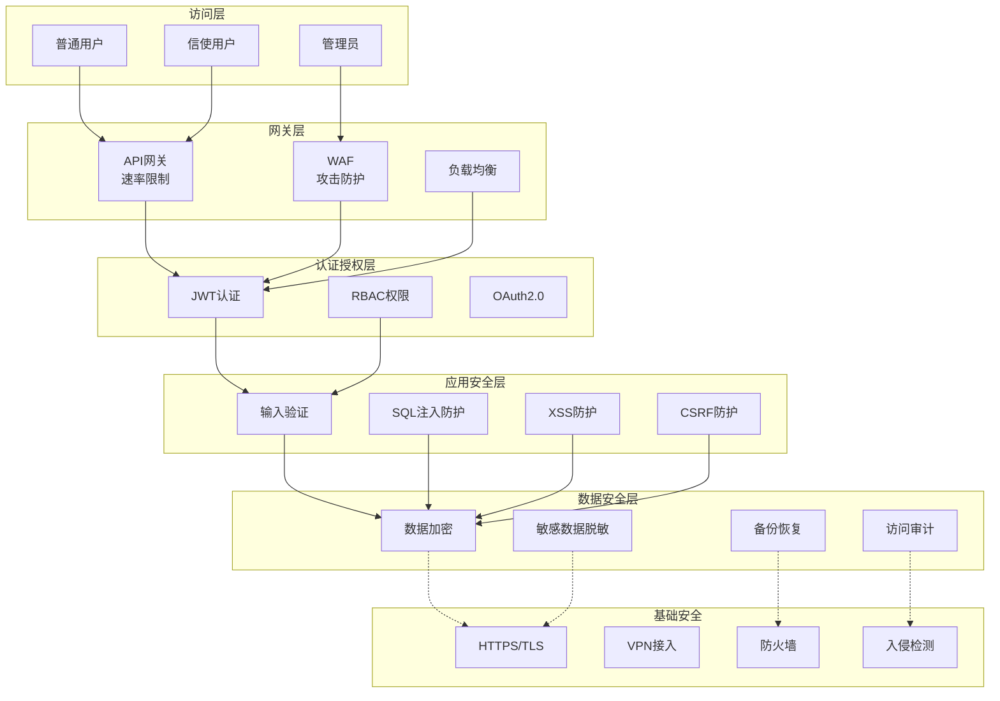
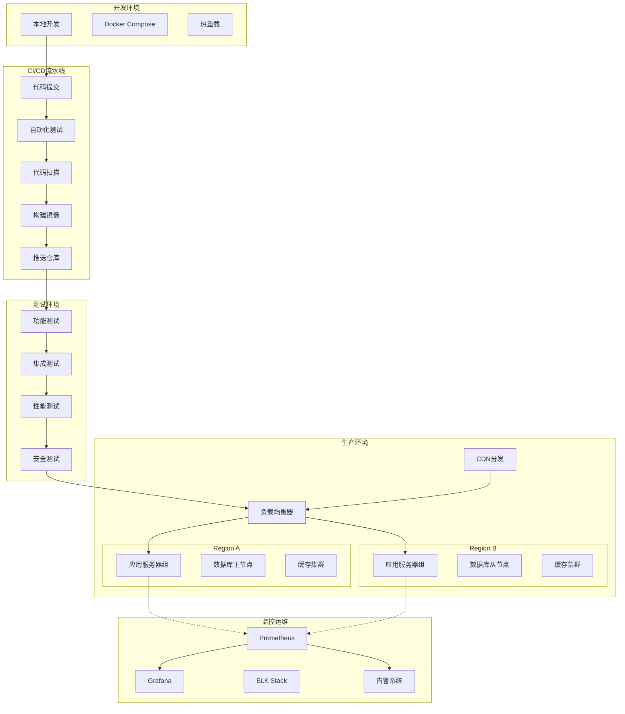
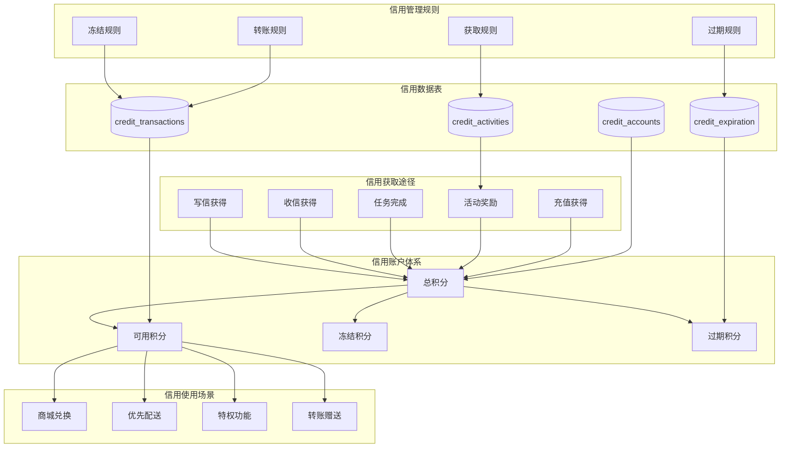
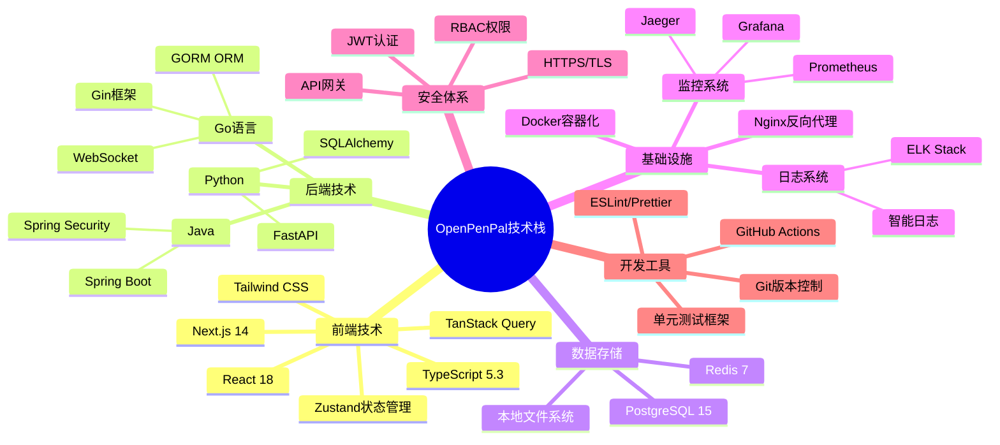

# OpenPenPal 架构图集

本文档包含 OpenPenPal 项目的各类架构图，使用 Mermaid 格式便于直接渲染。

## 1. 产品功能架构图

## 2. 系统架构图

## 3. 信件生命周期流程图

## 4. 4级信使权限层级图

## 5. OP码编码系统结构图

## 6. 数据流架构图

## 7. 安全架构图

## 8. 部署架构图

## 9. 信用系统架构图

## 10. 技术栈全景图

---

## 架构图使用说明

### 1. 查看方式
- **Markdown编辑器**: 支持Mermaid的编辑器可直接预览
- **在线工具**: 可使用 [Mermaid Live Editor](https://mermaid.live/)
- **VS Code**: 安装Mermaid插件即可预览
- **GitHub**: 直接支持Mermaid渲染

### 2. 导出格式
- **PNG/SVG**: 使用Mermaid工具导出
- **PDF**: 通过浏览器打印功能
- **PPT**: 导出图片后插入演示文档

### 3. 自定义修改
- 修改节点文字: 直接编辑方括号内的内容
- 修改连接关系: 调整箭头方向和类型
- 修改样式: 使用style语句自定义颜色和样式

### 4. 架构图类型说明
- **功能架构图**: 展示产品功能模块关系
- **系统架构图**: 展示技术组件关系
- **流程图**: 展示业务流程和状态转换
- **部署架构图**: 展示系统部署结构
- **数据流图**: 展示数据流转路径

---

*最后更新: 2025-08-21*  
*维护团队: OpenPenPal Architecture Team*