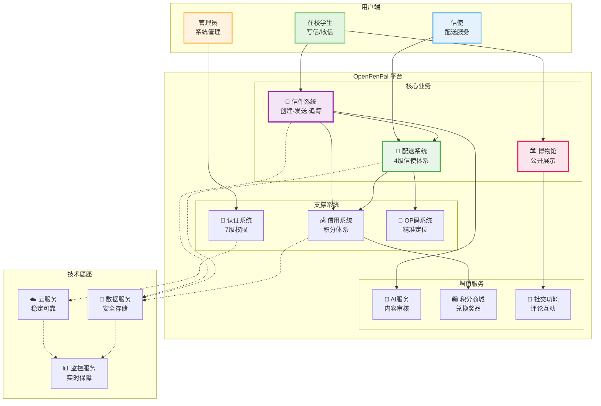
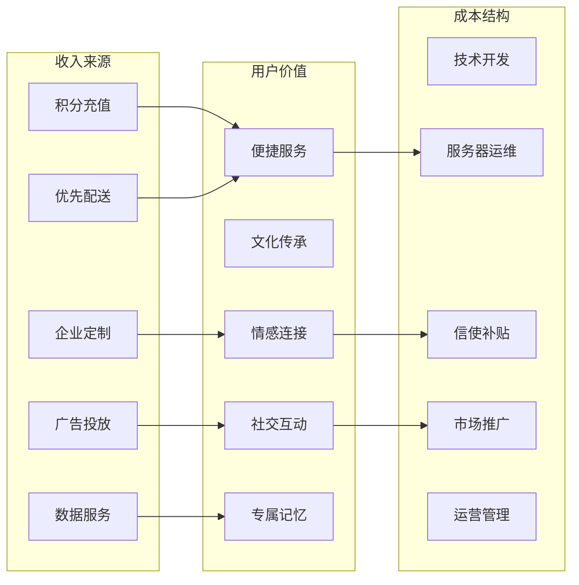
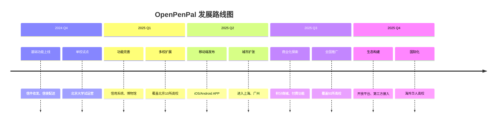

# OpenPenPal 业务架构总览

## 一图看懂 OpenPenPal

## 核心价值主张

### 🎯 产品定位
**OpenPenPal** - 让手写信在数字时代重获新生，通过科技赋能传统书信文化，在校园中构建有温度的人际连接网络。

### 💡 核心创新点

1. **实体信件 + 数字追踪**
   - 保留手写的温度和仪式感
   - 提供现代化的追踪和管理

2. **4级信使配送体系**
   - L1 楼宇信使：最后100米精准投递
   - L2 片区信使：区域调度管理
   - L3 校区信使：学校级别统筹
   - L4 城市总监：跨校协调管理

3. **OP码精准定位**
   - 6位编码覆盖到寝室级别
   - 隐私分级保护机制
   - 支持模糊查询和精确匹配

4. **信用积分激励**
   - 写信、收信获得积分
   - 积分商城兑换礼品
   - 优先配送等特权功能

### 📊 商业模式

### 🎭 用户画像

1. **写信者 - 小雅**
   - 20岁，大二学生
   - 喜欢手写日记和信件
   - 重视仪式感和情感表达
   - 使用场景：节日祝福、表白、友情信

2. **收信者 - 小明**
   - 21岁，大三学生
   - 期待惊喜和被关注
   - 喜欢收藏有意义的物品
   - 使用场景：收到祝福、回忆留存

3. **信使 - 小李**
   - 19岁，大一学生
   - 课余时间充裕
   - 希望赚取零花钱
   - 使用场景：接单配送、赚取积分

4. **管理员 - 张老师**
   - 35岁，学生处老师
   - 关注校园文化建设
   - 重视学生心理健康
   - 使用场景：活动组织、数据分析

### 🌟 业务发展路线

### 🏆 竞争优势

1. **先发优势**
   - 国内首个校园手写信数字化平台
   - 快速占领用户心智

2. **网络效应**
   - 用户越多，价值越大
   - 信使网络的规模效应

3. **情感壁垒**
   - 用户的信件记忆沉淀
   - 社交关系网络绑定

4. **技术领先**
   - 高效的配送算法
   - 完善的追踪系统
   - 智能的匹配机制

### 📈 关键指标

| 指标类型 | 具体指标 | 目标值 |
|---------|---------|--------|
| 用户指标 | MAU月活跃用户 | 10万+ |
| | 用户留存率(30天) | >40% |
| 业务指标 | 日均信件数 | 5000+ |
| | 配送成功率 | >98% |
| | 平均配送时长 | <24小时 |
| 财务指标 | 月收入 | 50万+ |
| | 毛利率 | >60% |
| 运营指标 | 活跃信使数 | 1000+ |
| | 信使满意度 | >4.5分 |

### 🤝 合作伙伴

- **高校合作**：学生处、团委、社团
- **技术合作**：云服务商、AI服务商
- **商业合作**：校园商户、品牌赞助商
- **物流合作**：校园快递点、配送团队

---

## 总结

OpenPenPal 通过创新的"实体+数字"模式，成功将传统书信文化与现代科技结合，打造了一个有温度、有效率、可持续的校园社交服务平台。我们相信，在快节奏的数字时代，慢下来的手写信将成为年轻人表达真挚情感的重要方式。

---

*让每一封信，都成为值得珍藏的记忆。*

*最后更新：2025-08-21*