# OpenPenPal 产品架构文档

## 📋 文档概述

**版本**: v3.1  
**更新时间**: 2025-08-22  
**维护团队**: OpenPenPal Architecture Team  
**文档状态**: Current Release Architecture  

本文档全面描述了 OpenPenPal（校园手写信平台）的完整产品架构，包括技术架构、业务架构、数据架构和部署架构。

---

## 🎯 产品定位与愿景

### 产品使命
OpenPenPal 致力于通过"实体手写信 + 数字跟踪平台"重建校园社群的温度感知与精神连接，让传统书信文化在数字时代焕发新的生命力。

### 核心价值主张
- **真实温度**：手写信件承载真挚情感
- **数字效率**：现代化配送和管理系统
- **社群连接**：构建校园人文交流网络
- **文化传承**：延续书信文化传统

### 目标用户群体
- **主要用户**：在校大学生（18-25岁）
- **扩展用户**：教职工、校友、访客
- **特殊角色**：信使（配送员）、管理员

---

## 🏗️ 整体架构图

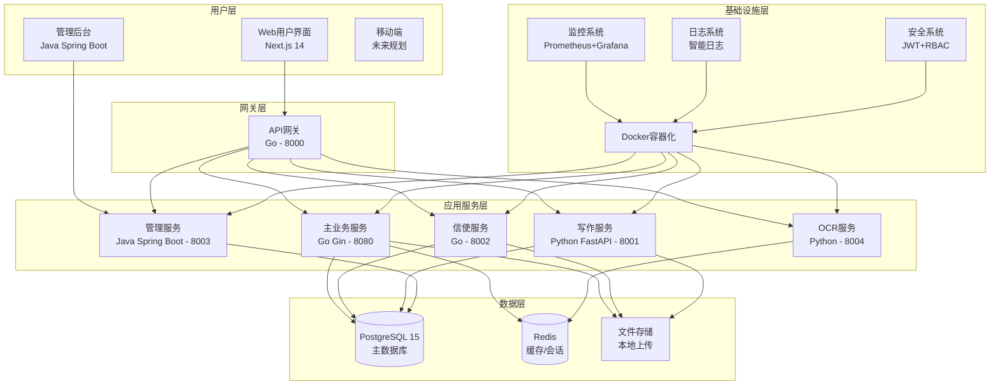

---

## 🔧 技术架构详述

### 前端架构 (Next.js 14)

**技术选型理由**:
- **Next.js 14**: 最新App Router，SEO优化，服务端渲染
- **TypeScript 5.3**: 类型安全，开发体验优化
- **Tailwind CSS**: 原子化CSS，快速开发
- **Zustand**: 轻量状态管理，性能优秀

**架构特点**:
```typescript
// 目录结构设计
frontend/src/
├── app/                    # Next.js 14 App Router
│   ├── (auth)/            # 认证页面组
│   │   ├── login/         # 登录页面
│   │   └── register/      # 注册页面
│   ├── (main)/            # 主应用页面组
│   │   ├── mailbox/       # 信箱
│   │   ├── courier/       # 信使中心
│   │   ├── museum/        # 博物馆
│   │   └── deliver/       # 投递中心
│   └── layout.tsx         # 根布局
├── components/            # 组件库
│   ├── ui/               # 基础UI组件
│   ├── providers/        # Context提供者
│   ├── error-boundary/   # 错误边界
│   └── courier/          # 信使专用组件
├── hooks/                # 自定义Hooks
├── lib/                  # 工具库
├── stores/               # 状态管理
└── types/                # TypeScript类型
```

**性能优化**:
- **React 优化工具**: `useDebouncedValue`, `useThrottledCallback`
- **虚拟滚动**: 大数据列表优化
- **智能缓存**: API响应缓存和状态缓存
- **代码分割**: 按路由和组件分割

### 后端主服务 (Go)

**技术栈**：
- Go 1.24.5
- Gin Web框架
- GORM ORM
- PostgreSQL 15
- Redis缓存
- JWT认证
- WebSocket实时通信

**核心模块**：
```
backend/internal/
├── config/             # 配置管理
├── handlers/           # 请求处理器 (50+个)
├── middleware/         # 中间件
├── models/            # 数据模型 (40+个)
├── services/          # 业务逻辑服务 (60+个)
├── websocket/         # WebSocket处理
└── platform/          # 平台级功能
    ├── security/      # 安全组件
    ├── testing/       # 测试框架
    └── devops/        # DevOps工具
```

**服务概览（60+个服务）**：

#### 核心业务服务（10个）
- **信件服务** (letter_service.go - 1995行)：信件CRUD、状态管理、QR码生成
- **信使服务** (courier_service.go - 1504行)：4级信使管理、任务分配、扫码配送
- **博物馆服务** (museum_service.go - 1529行)：展品管理、展览、评论点赞
- **OP码服务** (opcode_service.go - 723行)：6位编码生成、验证、权限控制
- **用户服务** (user_service.go)：注册登录、用户管理、认证
- **商城服务** (shop_service.go - 722行)：商品管理、订单处理
- **云信件服务** (cloud_letter_service.go - 796行)：云端存储、同步备份
- **信封服务** (envelope_service.go)：信封模板、定制管理
- **评论服务** (comment_service.go)：评论发布、回复、点赞
- **关注服务** (follow_service.go)：用户关注、粉丝管理

#### AI服务集群（7个）
- **AI主服务** (ai_service.go - 1690行)：AI服务调度、统一接口
- **Claude集成** (ai_provider_claude.go)：Claude API集成
- **OpenAI集成** (ai_provider_openai.go)：OpenAI API集成
- **月之暗面集成** (ai_provider_moonshot.go)：Moonshot API集成
- **SiliconFlow集成** (ai_provider_siliconflow.go)
- **本地AI服务** (ai_provider_local.go)
- **AI增强服务** (ai_service_enhanced.go)

#### 积分系统服务（5个）
- **积分基础服务** (credit_service.go)：积分增减、查询、历史
- **积分活动服务** (credit_activity_service.go - 1194行)：活动管理、任务奖励
- **积分转账服务** (credit_transfer_service.go - 763行)：转账、赠送、手续费
- **积分商城服务** (credit_shop_service.go - 1162行)：商品兑换、库存管理
- **积分过期服务** (credit_expiration_service.go)：过期检测、批量处理

#### 安全与审核服务（6个）
- **内容审核服务** (moderation_service.go)：敏感词检测、内容过滤
- **增强审核服务** (enhanced_moderation_service.go)：AI审核、多级审核
- **内容安全服务** (content_security_service.go - 910行)：高级安全检测
- **审计服务** (audit_service.go)：操作日志、审计追踪
- **数据完整性服务** (integrity_service.go - 1026行)：数据校验、防篡改
- **欺诈检测服务** (enhanced_fraud_detector.go)：异常行为检测

#### 其他重要服务（30+个）
- 通知服务、存储服务、调度服务、分析服务
- 标签服务、隐私服务、未来信件服务
- 缓存服务、加密服务、邮件服务等

### 独立微服务架构

#### 信使微服务 (Courier Service - Go:8002)
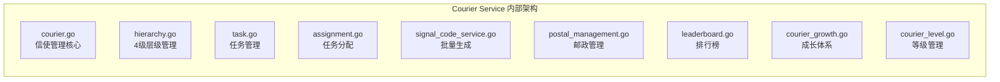

**主要功能**：
- 4级信使层级管理（L1楼宇→L2片区→L3校区→L4城市）
- 智能任务分配算法
- 实时位置追踪
- 绩效考核与晋升
- 批量OP码生成（L3/L4权限）

#### 写作服务 (Write Service - Python FastAPI:8001)
**技术栈**: Python 3.9+ / FastAPI / SQLAlchemy  
**主要模块**：
- 信件编写与草稿管理
- 博物馆投稿系统
- 广场公开信功能
- 批量操作处理
- 数据分析引擎
- RBAC权限管理

#### 管理服务 (Admin Service - Java Spring Boot:8003)
**技术栈**: Java 17 / Spring Boot 3 / Vue.js  
**主要功能**：
- 用户管理
- 信使审核
- 内容审核
- 系统配置
- 数据统计
- 日志管理

#### OCR服务 (OCR Service - Python:8004)
**主要模块**：
- `ocr_engine.py` - OCR核心引擎
- `image_processor.py` - 图像预处理
- `text_validator.py` - 文本验证
- `batch_processor.py` - 批量处理
- `cache_service.py` - 结果缓存

#### 网关服务 (Gateway Service - Go:8000)
**主要功能**：
- 请求路由
- 负载均衡
- 认证鉴权
- 限流熔断
- 服务发现
- 监控统计

### 服务调用关系

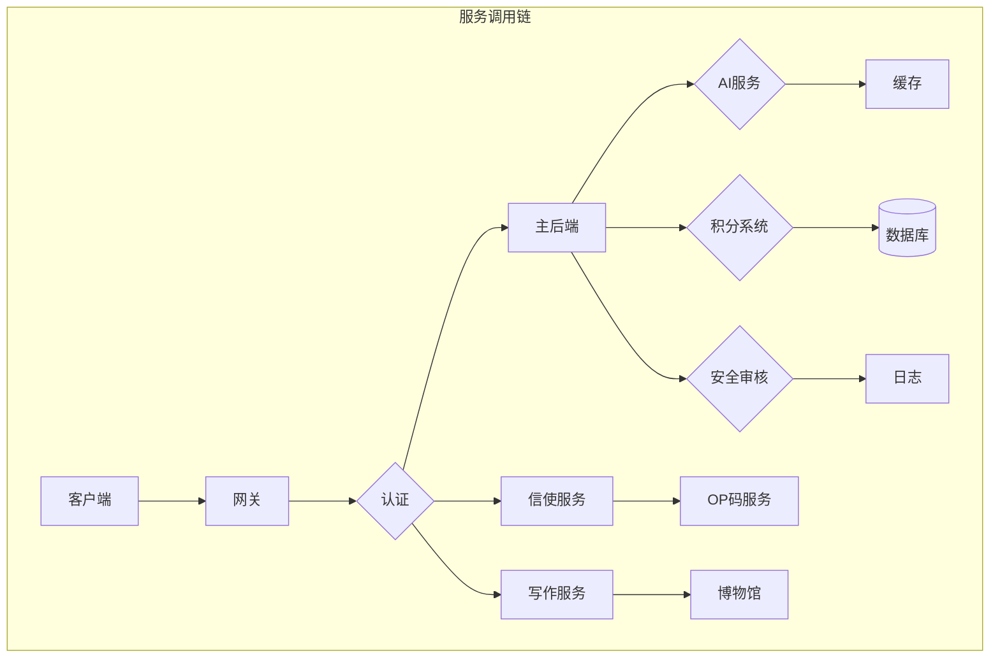

---

## 💾 数据架构

### 数据库设计 (PostgreSQL 15)

**核心实体关系图**:
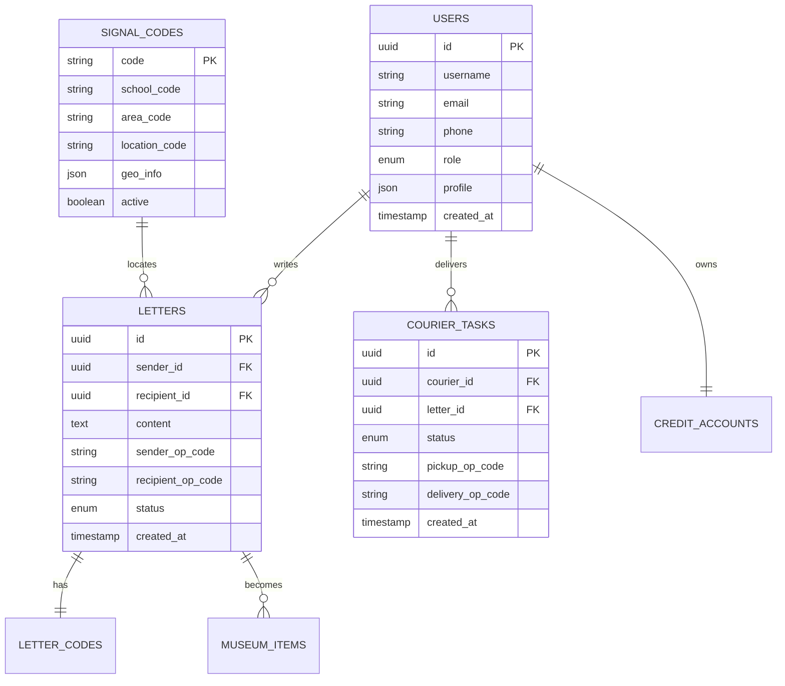

**关键设计决策**:

1. **OP码编码系统**
   ```sql
   -- 6位编码格式: AABBCC
   -- AA: 学校代码 (PK=北大, QH=清华)
   -- BB: 区域代码 (5F=5号楼, 3D=3号食堂)  
   -- CC: 位置代码 (3D=303室, 1A=1区A座)
   
   CREATE TABLE signal_codes (
       code VARCHAR(6) PRIMARY KEY,
       school_code VARCHAR(2) NOT NULL,
       area_code VARCHAR(2) NOT NULL,
       location_code VARCHAR(2) NOT NULL,
       full_address TEXT,
       privacy_level INTEGER DEFAULT 1,
       geo_coordinates JSONB,
       created_at TIMESTAMP DEFAULT NOW()
   );
   ```

2. **4级信使层级系统**
   ```sql
   CREATE TABLE users (
       id UUID PRIMARY KEY,
       courier_level INTEGER DEFAULT 0,
       managed_op_code_prefix VARCHAR(4),
       parent_courier_id UUID REFERENCES users(id),
       region_code VARCHAR(10),
       performance_score DECIMAL(3,2) DEFAULT 0.00
   );
   ```

3. **信用系统 (24张表)**
   ```sql
   -- 信用账户
   CREATE TABLE credit_accounts (
       user_id UUID PRIMARY KEY,
       total_credits BIGINT DEFAULT 0,
       available_credits BIGINT DEFAULT 0,
       frozen_credits BIGINT DEFAULT 0
   );
   
   -- 信用交易记录
   CREATE TABLE credit_transactions (
       id UUID PRIMARY KEY,
       user_id UUID NOT NULL,
       transaction_type VARCHAR(50),
       amount BIGINT NOT NULL,
       description TEXT,
       created_at TIMESTAMP DEFAULT NOW()
   );
   
   -- ... 其他22张信用系统相关表
   ```

### 缓存策略 (Redis)

**缓存分层设计**:
```redis
# 1. 会话缓存
session:user:${userId}     # 用户会话信息
ttl: 24小时

# 2. 数据缓存  
letters:recent:${userId}   # 用户最近信件
courier:tasks:${courierId} # 信使任务缓存
ttl: 30分钟

# 3. 计数器缓存
stats:daily:letters        # 日信件统计
stats:courier:performance  # 信使性能统计
ttl: 1小时

# 4. 配置缓存
config:op_codes           # OP码配置
config:system            # 系统配置
ttl: 4小时
```

---

## 🔄 业务流程架构

### 信件全生命周期流程

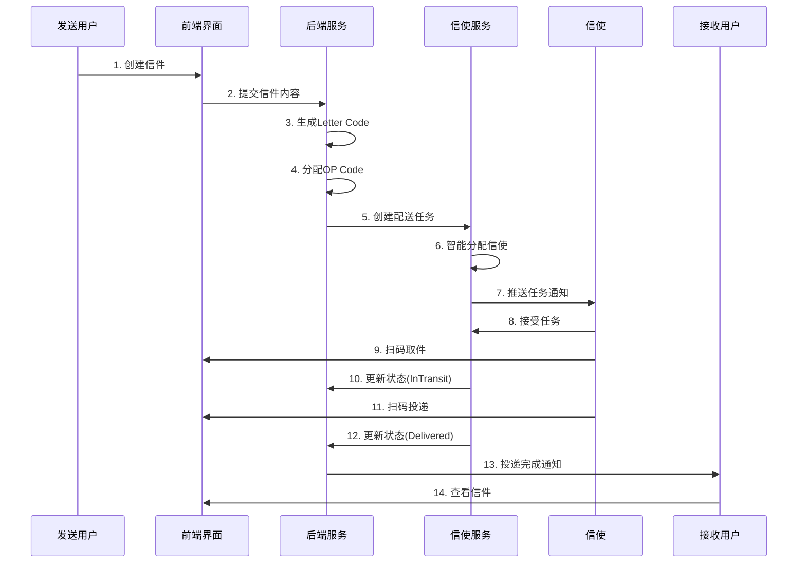

### 4级信使管理流程

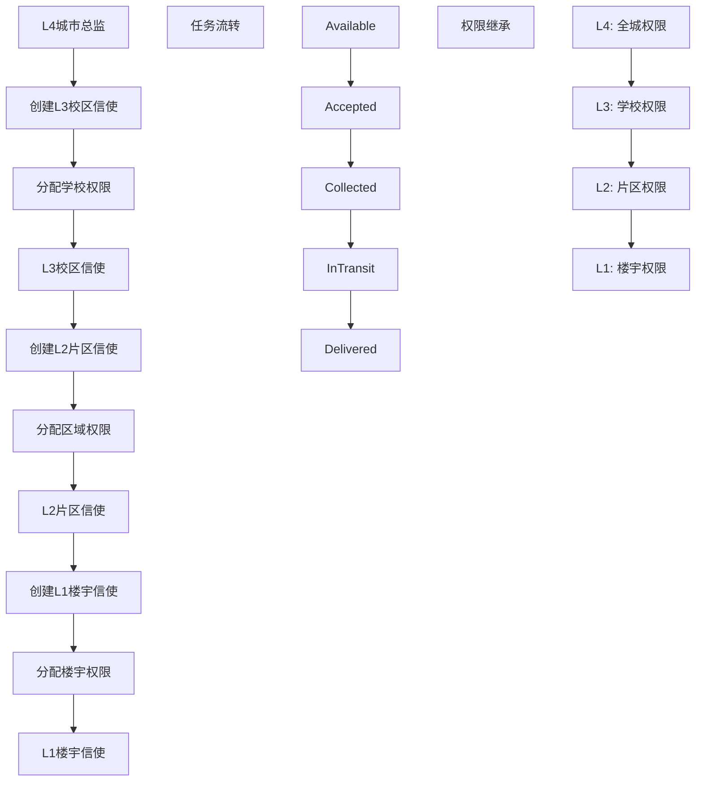

### OP码地理定位系统

**编码规则**:
```
格式: AABBCC (6位大写字母数字)

示例解析:
PK5F3D = 北京大学5号楼303室
├── PK: 北京大学 (Peking University)
├── 5F: 5号楼 (Building 5, Floor)  
└── 3D: 303室 (Room 303, Door)

QH2G1A = 清华大学2号门1区A座
├── QH: 清华大学 (Qinghua University)
├── 2G: 2号门 (Gate 2)
└── 1A: 1区A座 (Area 1, Building A)
```

**隐私保护机制**:
- **完整显示**: PK5F3D (管理员/高级信使)
- **部分隐私**: PK5F** (普通用户)
- **公开信息**: PK**** (访客)

---

## 🔐 安全架构

### 认证授权体系

**7级权限模型**:
```typescript
enum UserRole {
    SUPER_ADMIN = "super_admin",     // 超级管理员
    ADMIN = "admin",                 // 系统管理员  
    COORDINATOR = "coordinator",     // L4城市协调员
    SENIOR_COURIER = "senior_courier", // L3高级信使
    COURIER = "courier",             // L2普通信使
    BUILDING_COURIER = "building_courier", // L1楼宇信使
    STUDENT = "student"              // 普通学生
}
```

**权限继承关系**:
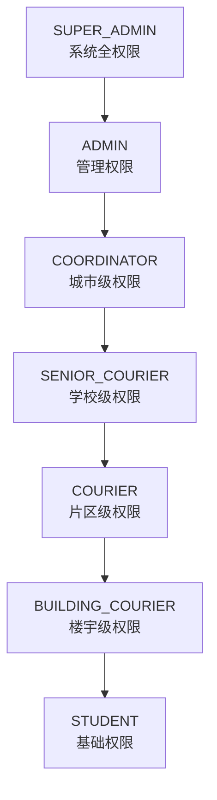

### JWT Token 安全策略

```typescript
// Token结构
interface JWTPayload {
    user_id: string;
    username: string;
    role: UserRole;
    courier_level?: number;
    managed_prefix?: string;
    exp: number;
    iat: number;
}

// 安全特性
- 非对称加密签名
- 自动续期机制  
- 权限动态验证
- 异常登录检测
```

### API安全防护

**多层防护机制**:
1. **网关层**: 速率限制、IP白名单
2. **应用层**: JWT验证、权限检查
3. **数据层**: SQL注入防护、敏感数据加密
4. **传输层**: HTTPS强制、证书验证

**安全中间件链**:
```go
// Gin中间件栈
router.Use(
    middleware.CORS(),           // 跨域处理
    middleware.RateLimit(),      // 速率限制
    middleware.JWTAuth(),        // JWT验证
    middleware.RoleCheck(),      // 权限检查
    middleware.SecurityHeaders(), // 安全头设置
    middleware.RequestTracing(), // 请求追踪
)
```

---

## 🌐 实时通信架构

### WebSocket Hub 设计

```go
// WebSocket连接管理
type Hub struct {
    clients    map[*Client]bool      // 活跃客户端
    broadcast  chan []byte           // 广播频道
    register   chan *Client          // 注册频道  
    unregister chan *Client          // 注销频道
    rooms      map[string][]*Client  // 房间管理
}

// 客户端分类
type ClientType int
const (
    USER_CLIENT    ClientType = iota  // 普通用户
    COURIER_CLIENT                    // 信使客户端
    ADMIN_CLIENT                      // 管理员客户端
)
```

**消息类型定义**:
```typescript
interface WebSocketMessage {
    type: MessageType;
    payload: any;
    timestamp: number;
    sender_id?: string;
    room_id?: string;
}

enum MessageType {
    // 任务相关
    TASK_ASSIGNED = "task_assigned",
    TASK_UPDATED = "task_updated", 
    TASK_COMPLETED = "task_completed",
    
    // 位置相关
    LOCATION_UPDATE = "location_update",
    DELIVERY_STATUS = "delivery_status",
    
    // 系统通知
    SYSTEM_NOTIFICATION = "system_notification",
    USER_NOTIFICATION = "user_notification",
    
    // 实时通信
    CHAT_MESSAGE = "chat_message",
    PRESENCE_UPDATE = "presence_update"
}
```

### 实时功能场景

1. **信使任务实时推送**
   - 任务分配通知
   - 状态变更同步
   - 紧急任务优先推送

2. **配送状态实时追踪**
   - GPS位置更新
   - 配送状态变更
   - 预计到达时间

3. **系统通知实时推送**
   - 信件到达通知
   - 信用变更通知
   - 系统公告推送

---

## 📊 监控与运维架构

### 监控体系设计

**监控数据流**:
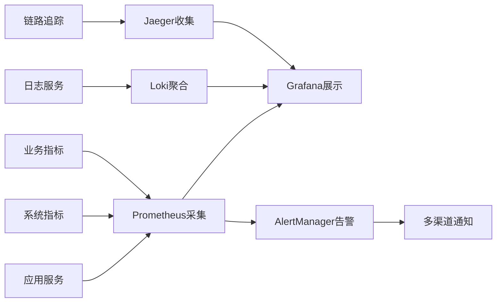

**关键监控指标**:

1. **系统指标 (USE模型)**
   - CPU使用率、内存使用率
   - 磁盘I/O、网络延迟
   - 服务可用性、响应时间

2. **业务指标 (RED模型)**
   - 请求量 (Rate)
   - 错误率 (Errors) 
   - 响应时间 (Duration)

3. **自定义业务指标**
   ```prometheus
   # 信件相关指标
   openpenpal_letters_created_total
   openpenpal_letters_delivered_total
   openpenpal_delivery_time_seconds
   
   # 信使相关指标  
   openpenpal_courier_active_total
   openpenpal_courier_tasks_pending
   openpenpal_courier_performance_score
   
   # 系统健康指标
   openpenpal_websocket_connections
   openpenpal_database_connections
   openpenpal_cache_hit_ratio
   ```

### 告警策略

**告警级别**:
- 🔴 **Critical**: 影响核心功能，需立即处理
- 🟡 **Warning**: 性能下降，需要关注
- 🔵 **Info**: 信息性通知，记录备案

**告警规则示例**:
```yaml
groups:
  - name: openpenpal.rules
    rules:
      # 服务可用性告警
      - alert: ServiceDown
        expr: up{job=~"openpenpal-.*"} == 0
        for: 1m
        labels:
          severity: critical
        annotations:
          summary: "{{ $labels.job }} service is down"
          
      # 响应时间告警
      - alert: HighResponseTime
        expr: histogram_quantile(0.95, rate(http_request_duration_seconds_bucket[5m])) > 1
        for: 2m
        labels:
          severity: warning
        annotations:
          summary: "High response time detected"
          
      # 信使任务积压告警
      - alert: CourierTaskBacklog
        expr: openpenpal_courier_tasks_pending > 50
        for: 5m
        labels:
          severity: warning
        annotations:
          summary: "Courier task backlog detected"
```

---

## 📊 服务规模统计

### 代码规模
- **总服务数量**: 60+ 个
- **总代码行数**: 50,000+ 行
- **主要编程语言**: Go (70%), Python (20%), Java (10%)

### 服务分布
| 类别 | 数量 | 占比 |
|-----|------|-----|
| 核心业务服务 | 10 | 17% |
| AI服务 | 7 | 12% |
| 积分系统 | 5 | 8% |
| 安全审核 | 6 | 10% |
| 基础设施 | 15 | 25% |
| 微服务 | 5 | 8% |
| 其他服务 | 12 | 20% |

### 技术栈分布
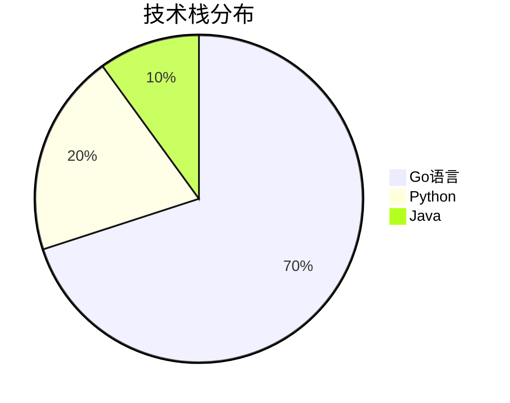

---

## 🚀 部署架构

### 容器化部署方案

**Docker Compose 服务编排**:
```yaml
version: '3.8'
services:
  # 数据层
  postgres:
    image: postgres:15-alpine
    environment:
      POSTGRES_DB: openpenpal
      POSTGRES_USER: postgres
      POSTGRES_PASSWORD: ${POSTGRES_PASSWORD}
    volumes:
      - postgres_data:/var/lib/postgresql/data
    ports:
      - "5432:5432"
    healthcheck:
      test: ["CMD-SHELL", "pg_isready -U postgres"]
      interval: 30s
      timeout: 10s
      retries: 5

  redis:
    image: redis:7-alpine
    command: redis-server --appendonly yes
    volumes:
      - redis_data:/data
    ports:
      - "6379:6379"
    healthcheck:
      test: ["CMD", "redis-cli", "ping"]
      interval: 30s
      timeout: 10s
      retries: 3

  # 应用层
  frontend:
    build: 
      context: ./frontend
      dockerfile: Dockerfile
    ports:
      - "3000:3000"
    environment:
      - NODE_ENV=production
      - NEXT_PUBLIC_API_URL=${API_URL}
    depends_on:
      - gateway

  backend:
    build:
      context: ./backend  
      dockerfile: Dockerfile
    ports:
      - "8080:8080"
    environment:
      - DATABASE_URL=${DATABASE_URL}
      - REDIS_URL=${REDIS_URL}
      - JWT_SECRET=${JWT_SECRET}
    depends_on:
      postgres:
        condition: service_healthy
      redis:
        condition: service_healthy

  courier-service:
    build:
      context: ./services/courier-service
      dockerfile: Dockerfile
    ports:
      - "8002:8002"
    environment:
      - DATABASE_URL=${DATABASE_URL}
      - REDIS_URL=${REDIS_URL}
    depends_on:
      - postgres
      - redis

  # 监控层
  prometheus:
    image: prom/prometheus:latest
    ports:
      - "9090:9090"
    volumes:
      - ./monitoring/prometheus.yml:/etc/prometheus/prometheus.yml
      - prometheus_data:/prometheus

  grafana:
    image: grafana/grafana:latest
    ports:
      - "3001:3000"
    environment:
      - GF_SECURITY_ADMIN_PASSWORD=${GRAFANA_PASSWORD}
    volumes:
      - grafana_data:/var/lib/grafana
      - ./monitoring/grafana:/etc/grafana/provisioning

volumes:
  postgres_data:
  redis_data:
  prometheus_data:
  grafana_data:
```

### 环境管理策略

**环境隔离**:
```bash
# 开发环境
./scripts/deployment/local-dev.sh

# 测试环境  
docker-compose -f docker-compose.test.yml up -d

# 生产环境
docker-compose -f docker-compose.prod.yml up -d
```

**配置管理**:
```bash
# 环境变量模板
.env.example          # 配置模板
.env.development      # 开发环境
.env.test            # 测试环境  
.env.production      # 生产环境

# 配置验证
./scripts/deployment/validate-env.js
```

### 自动化部署流程

**CI/CD Pipeline**:


**GitHub Actions 工作流**:
```yaml
name: OpenPenPal CI/CD

on:
  push:
    branches: [main, develop]
  pull_request:
    branches: [main]

jobs:
  test:
    runs-on: ubuntu-latest
    steps:
      - uses: actions/checkout@v3
      
      - name: Setup Node.js
        uses: actions/setup-node@v3
        with:
          node-version: '18'
          
      - name: Setup Go
        uses: actions/setup-go@v3  
        with:
          go-version: '1.21'
          
      - name: Run tests
        run: |
          # Frontend tests
          cd frontend && npm ci && npm run test
          
          # Backend tests
          cd backend && go test ./... -race
          
          # Integration tests
          ./scripts/test-apis.sh

  security-scan:
    runs-on: ubuntu-latest
    steps:
      - uses: actions/checkout@v3
      
      - name: Security Scan
        run: |
          ./scripts/deployment/security-scan.sh

  build-and-deploy:
    needs: [test, security-scan]
    runs-on: ubuntu-latest
    if: github.ref == 'refs/heads/main'
    steps:
      - uses: actions/checkout@v3
      
      - name: Build and Push Docker Images
        run: |
          ./scripts/deployment/build-verify.sh --docker
          
      - name: Deploy to Production
        run: |
          ./scripts/deployment/deploy-production.sh
```

---

## 📈 性能优化架构

### 数据库优化策略

**索引设计**:
```sql
-- 用户查询优化
CREATE INDEX idx_users_email ON users(email);
CREATE INDEX idx_users_role_status ON users(role, status);

-- 信件查询优化  
CREATE INDEX idx_letters_sender_created ON letters(sender_id, created_at DESC);
CREATE INDEX idx_letters_recipient_status ON letters(recipient_id, status);
CREATE INDEX idx_letters_op_codes ON letters(sender_op_code, recipient_op_code);

-- 信使任务优化
CREATE INDEX idx_courier_tasks_status_created ON courier_tasks(status, created_at);
CREATE INDEX idx_courier_tasks_courier_status ON courier_tasks(courier_id, status);

-- OP码查询优化
CREATE INDEX idx_signal_codes_school_area ON signal_codes(school_code, area_code);
CREATE INDEX idx_signal_codes_prefix ON signal_codes(code varchar_pattern_ops);
```

**查询优化**:
```sql
-- 分页查询优化
SELECT * FROM letters 
WHERE sender_id = $1 
  AND created_at < $2
ORDER BY created_at DESC
LIMIT 20;

-- 信使任务聚合查询优化  
SELECT 
    courier_id,
    COUNT(*) as total_tasks,
    COUNT(CASE WHEN status = 'completed' THEN 1 END) as completed_tasks,
    AVG(completion_time_minutes) as avg_completion_time
FROM courier_tasks 
WHERE created_at >= NOW() - INTERVAL '30 days'
GROUP BY courier_id
ORDER BY completed_tasks DESC;
```

### 缓存优化策略

**多级缓存架构**:
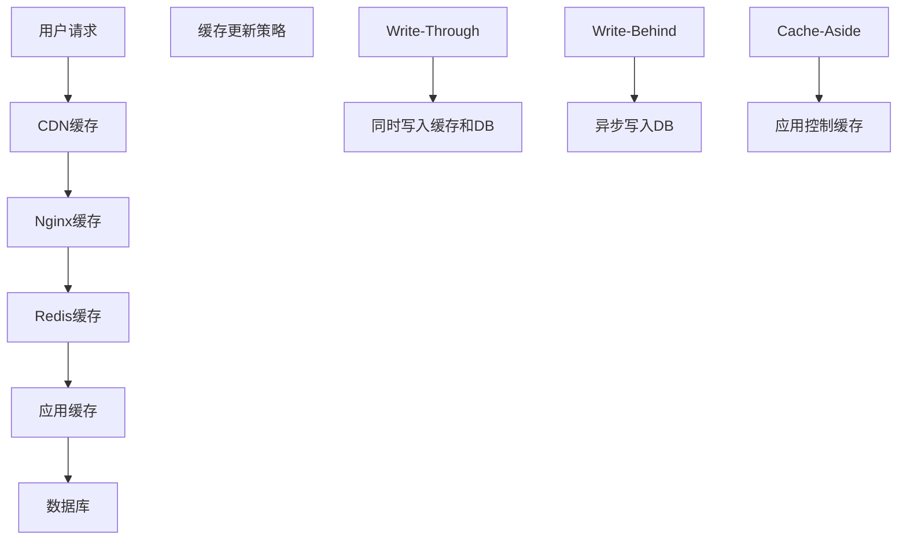

**Redis缓存策略**:
```typescript
// 缓存键设计
interface CacheKeys {
    // 用户相关
    USER_PROFILE: `user:profile:${userId}`;
    USER_LETTERS: `user:letters:${userId}:page:${page}`;
    USER_PERMISSIONS: `user:permissions:${userId}`;
    
    // 信使相关
    COURIER_TASKS: `courier:tasks:${courierId}:${status}`;
    COURIER_STATS: `courier:stats:${courierId}:${date}`;
    
    // OP码相关
    OP_CODE_INFO: `opcode:${opCode}`;
    OP_CODE_SEARCH: `opcode:search:${prefix}`;
    
    // 系统配置
    SYSTEM_CONFIG: `config:system`;
    SCHOOL_CONFIG: `config:school:${schoolCode}`;
}

// 缓存TTL策略
const CACHE_TTL = {
    USER_PROFILE: 1 * 60 * 60,      // 1小时
    USER_LETTERS: 10 * 60,          // 10分钟
    COURIER_TASKS: 5 * 60,          // 5分钟
    OP_CODE_INFO: 24 * 60 * 60,     // 24小时
    SYSTEM_CONFIG: 4 * 60 * 60,     // 4小时
} as const;
```

### API性能优化

**响应时间优化**:
- **数据库连接池**: 最大100连接，空闲时保持20连接
- **查询优化**: 索引覆盖查询，避免N+1问题
- **数据分页**: 游标分页，避免OFFSET性能问题
- **异步处理**: 耗时操作异步执行，立即返回

**并发处理优化**:
```go
// 并发安全的服务实现
type LetterService struct {
    db    *gorm.DB
    redis *redis.Client
    mu    sync.RWMutex
    cache sync.Map
}

// 批量操作优化
func (s *LetterService) BatchCreateLetters(letters []Letter) error {
    // 使用事务批量插入
    return s.db.Transaction(func(tx *gorm.DB) error {
        return tx.CreateInBatches(letters, 100).Error
    })
}

// 并发查询优化
func (s *LetterService) GetUserLettersParallel(userID string) (*UserLetters, error) {
    var wg sync.WaitGroup
    var sent, received []Letter
    var sentErr, receivedErr error
    
    // 并发查询发送和接收的信件
    wg.Add(2)
    go func() {
        defer wg.Done()
        sent, sentErr = s.GetSentLetters(userID)
    }()
    go func() {
        defer wg.Done()
        received, receivedErr = s.GetReceivedLetters(userID)
    }()
    
    wg.Wait()
    
    if sentErr != nil || receivedErr != nil {
        return nil, fmt.Errorf("query error")
    }
    
    return &UserLetters{Sent: sent, Received: received}, nil
}
```

---

## 🔮 扩展架构设计

### 微服务扩展策略

**服务拆分原则**:
1. **按业务边界拆分**: 用户、信件、信使、支付等
2. **按数据模型拆分**: 避免跨服务数据依赖
3. **按团队边界拆分**: 便于团队独立开发维护
4. **按性能需求拆分**: 高并发服务独立部署

**新增服务规划**:
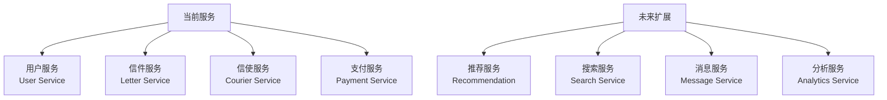

### 数据库扩展策略

**分库分表方案**:
```sql
-- 按用户ID分表 (letters表)
CREATE TABLE letters_0 (LIKE letters INCLUDING ALL);
CREATE TABLE letters_1 (LIKE letters INCLUDING ALL);
-- ... 
CREATE TABLE letters_15 (LIKE letters INCLUDING ALL);

-- 分表路由规则
function getTableSuffix(userId: string): number {
    return parseInt(userId.slice(-2), 16) % 16;
}

-- 按时间分表 (courier_tasks表)  
CREATE TABLE courier_tasks_202501 (LIKE courier_tasks INCLUDING ALL);
CREATE TABLE courier_tasks_202502 (LIKE courier_tasks INCLUDING ALL);
-- 按月分表，便于历史数据清理
```

**读写分离架构**:
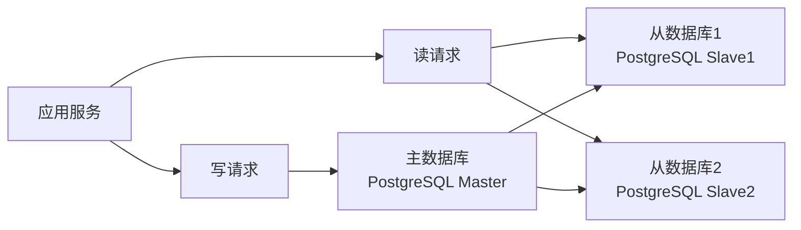

### 国际化扩展

**多语言支持**:
```typescript
// i18n配置
interface I18nConfig {
    locales: ['zh-CN', 'zh-TW', 'en-US', 'ja-JP'];
    defaultLocale: 'zh-CN';
    namespaces: ['common', 'auth', 'letter', 'courier'];
}

// 多时区支持
interface TimezoneConfig {
    default: 'Asia/Shanghai';
    supported: [
        'Asia/Shanghai',    // 中国标准时间
        'Asia/Taipei',      // 台北时间  
        'Asia/Tokyo',       // 日本标准时间
        'America/New_York', // 美国东部时间
    ];
}
```

**多区域部署**:
```yaml
# 区域化部署配置
regions:
  cn-north:
    database: postgres-beijing
    redis: redis-beijing
    cdn: cloudflare-asia
    
  us-west:
    database: postgres-oregon
    redis: redis-oregon  
    cdn: cloudflare-americas
    
  eu-west:
    database: postgres-ireland
    redis: redis-ireland
    cdn: cloudflare-europe
```

---

## 📊 业务指标与KPI

### 核心业务指标

**用户增长指标**:
- DAU (日活跃用户数)
- MAU (月活跃用户数)
- 用户注册转化率
- 用户留存率 (1日、7日、30日)

**信件业务指标**:
- 日信件创建数量
- 信件投递成功率
- 平均投递时长
- 信件互动率 (回复率)

**信使运营指标**:
- 活跃信使数量
- 信使任务完成率
- 平均任务处理时长
- 信使评分分布

**技术性能指标**:
- API平均响应时间
- 系统可用性 (SLA 99.9%)
- 错误率 (< 0.1%)
- 数据库查询性能

### 监控大屏设计

```typescript
// Grafana仪表板配置
interface DashboardConfig {
    // 业务概览
    businessOverview: {
        panels: [
            'daily_active_users',
            'letter_creation_trend',
            'delivery_success_rate',
            'courier_performance'
        ];
        refreshInterval: '30s';
    };
    
    // 技术指标
    technicalMetrics: {
        panels: [
            'api_response_time',
            'error_rate',  
            'database_performance',
            'cache_hit_rate'
        ];
        refreshInterval: '10s';
    };
    
    // 告警面板
    alertsPanel: {
        panels: [
            'active_alerts',
            'recent_incidents',
            'sla_status'
        ];
        refreshInterval: '5s';
    };
}
```

---

## 🎯 项目发展路线图

### Phase 1: 核心功能 ✅ (已完成)
- 基础信件收发功能
- 4级信使配送体系
- OP码地理定位系统
- Web端用户界面
- 管理后台系统

### Phase 2: 增强功能 🔄 (进行中)
- 信用积分系统完善
- AI内容审核集成
- 实时通信优化
- 性能监控体系
- 安全防护加强

### Phase 3: 扩展功能 📋 (规划中)
- 移动端APP开发
- 小程序版本
- 社交功能扩展
- 个性化推荐
- 数据分析平台

### Phase 4: 商业化 🚀 (未来规划)
- 广告投放系统
- 付费增值服务  
- 企业版本开发
- 开放API平台
- 国际化扩展

---

## 📞 支持与联系

### 技术支持
- **文档**: `/docs/` 目录下完整技术文档
- **API文档**: 集成Swagger UI自动生成
- **故障排查**: `/scripts/deployment/` 诊断脚本
- **性能测试**: `/scripts/deployment/performance-testing.sh`

### 开发团队联系
- **架构师**: architecture@openpenpal.com
- **后端团队**: backend@openpenpal.com  
- **前端团队**: frontend@openpenpal.com
- **运维团队**: devops@openpenpal.com

### 紧急联系
- **系统故障**: emergency@openpenpal.com
- **安全事件**: security@openpenpal.com
- **数据问题**: data@openpenpal.com

---

## 📄 文档变更记录

| 版本 | 日期 | 变更内容 | 作者 |
|------|------|----------|------|
| v2.0 | 2025-08-21 | 完整架构文档重构，新增微服务详述 | Architecture Team |
| v1.5 | 2025-08-15 | 新增信用系统架构，OP码系统详述 | Backend Team |
| v1.2 | 2025-08-10 | 完善信使系统架构，添加实时通信 | Full Stack Team |
| v1.0 | 2025-08-01 | 初版架构文档 | Architecture Team |

---

**文档维护**: 本文档由 OpenPenPal Architecture Team 维护，每月更新一次，重大架构变更时及时更新。

**反馈渠道**: 如有文档问题或建议，请提交 Issue 到项目仓库或发送邮件至 docs@openpenpal.com。

---

*© 2025 OpenPenPal Team. All rights reserved.*