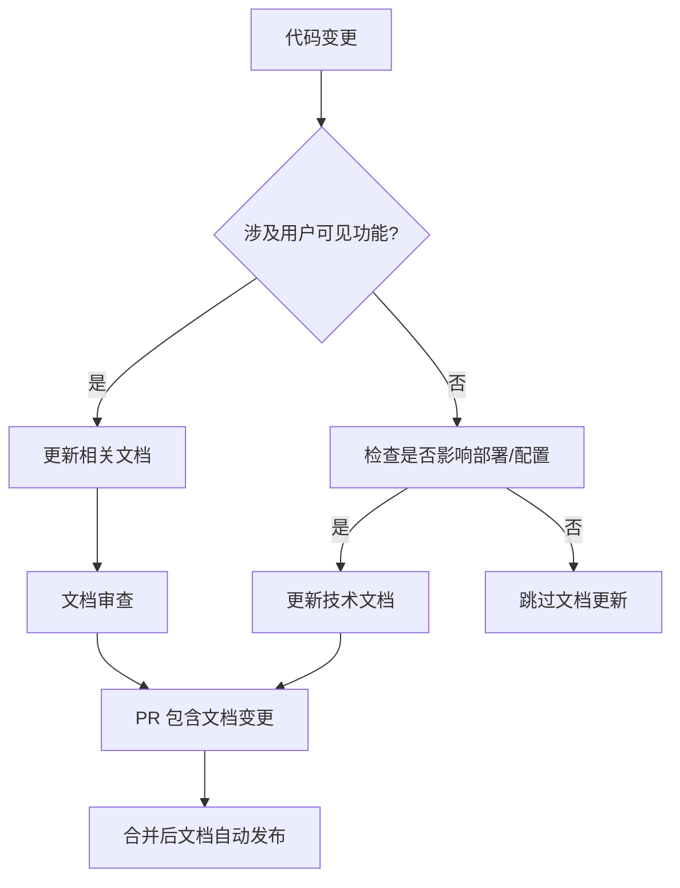

# 📚 文档维护管理计划

## 🎯 文档版本同步机制

### 📋 文档更新检查清单

#### 代码变更时必须检查的文档

| 变更类型 | 需要更新的文档 | 检查责任人 |
|----------|----------------|------------|
| 🚀 新功能添加 | README.md, API文档, 用户指南 | 功能开发者 |
| 🔧 API 接口变更 | API文档, 集成指南, 测试文档 | 后端开发者 |
| 🎨 UI/UX 变更 | 用户指南, 截图, 操作流程 | 前端开发者 |
| ⚙️ 配置变更 | 部署指南, 环境配置文档 | 运维负责人 |
| 🐛 Bug 修复 | 故障排查文档, FAQ | Bug 修复者 |
| 📱 新页面/路由 | 功能导航, 路由文档 | 相关开发者 |

#### 🔄 文档同步工作流



### 🛠️ 自动化检查工具

#### 文档链接检查脚本
```bash
#!/bin/bash
# scripts/check-doc-links.sh
# 检查文档中的链接有效性

echo "🔍 检查文档链接有效性..."

# 检查内部链接
find docs/ -name "*.md" -exec grep -l "\[.*\](\./" {} \; | while read file; do
    echo "检查文件: $file"
    grep -n "\[.*\](\./" "$file" | while read line; do
        link=$(echo "$line" | sed -n 's/.*(\.\([^)]*\)).*/\1/p')
        if [ -n "$link" ] && [ ! -f ".$link" ]; then
            echo "❌ 无效链接: $link in $file"
        fi
    done
done

echo "✅ 链接检查完成"
```

#### 文档同步检查脚本
```bash
#!/bin/bash
# scripts/check-doc-sync.sh
# 检查文档与代码的同步状态

echo "🔄 检查文档同步状态..."

# 检查端口信息一致性
API_PORT=$(grep -r "PORT.*8000" --include="*.js" --include="*.ts" --include="*.go" . | wc -l)
DOC_PORT=$(grep -r "8000" --include="*.md" docs/ | wc -l)

if [ "$API_PORT" -gt 0 ] && [ "$DOC_PORT" -eq 0 ]; then
    echo "⚠️ 代码中使用端口8000，但文档中未提及"
fi

# 检查新增路由是否在文档中
ROUTES=$(grep -r "path.*:" frontend/src/app/ | grep -o "'/[^']*'" | sort -u)
echo "$ROUTES" | while read route; do
    if ! grep -r "$route" --include="*.md" docs/ >/dev/null; then
        echo "⚠️ 新路由 $route 未在文档中说明"
    fi
done

echo "✅ 同步检查完成"
```

### 📅 定期维护计划

#### 每周检查 (每周一)
- [ ] 运行链接有效性检查
- [ ] 检查新增功能的文档覆盖
- [ ] 验证测试账号信息准确性
- [ ] 更新项目状态和进度

#### 每月检查 (每月1号)
- [ ] 全面的文档同步检查
- [ ] 清理过时的文档内容
- [ ] 更新截图和演示内容
- [ ] 检查文档结构合理性

#### 季度检查 (每季度初)
- [ ] 重新评估文档架构
- [ ] 用户反馈收集和处理
- [ ] 文档质量评分
- [ ] 制定下季度改进计划

### 🎯 文档质量指标

#### 量化指标
- **链接有效率**: > 95%
- **文档覆盖率**: 新功能 100% 文档覆盖
- **更新及时性**: 代码变更后 24 小时内更新文档
- **用户满意度**: 文档反馈评分 > 4.0/5.0

#### 质量检查工具
```yaml
# .github/workflows/docs-check.yml
name: Documentation Quality Check

on:
  push:
    branches: [ main, develop ]
  pull_request:
    branches: [ main ]

jobs:
  docs-check:
    runs-on: ubuntu-latest
    steps:
      - uses: actions/checkout@v4
      
      - name: Check broken links
        run: ./scripts/check-doc-links.sh
        
      - name: Check doc sync
        run: ./scripts/check-doc-sync.sh
        
      - name: Validate markdown
        uses: articulate/actions-markdownlint@v1
        with:
          config: .markdownlint.json
          files: 'docs/**/*.md'
```

## 📝 文档标准化规范

### 🏗️ 文档结构模板

#### README 模板
```markdown
# 服务/模块名称

## 📋 概述
[简短描述功能和作用]

## 🚀 快速开始
[3-5步启动说明]

## 📡 API 接口
[主要接口说明]

## 🔧 配置说明
[配置参数和环境变量]

## 🧪 测试
[测试方法和示例]

## ❓ 常见问题
[FAQ]

## 🔗 相关链接
[相关文档链接]
```

#### API 文档模板
```markdown
# API 接口名称

## 接口信息
- **路径**: `/api/xxx`
- **方法**: `POST`
- **认证**: 需要 JWT Token

## 请求参数
| 参数名 | 类型 | 必填 | 说明 |
|--------|------|------|------|
| xxx | string | 是 | 描述 |

## 响应格式
```json
{
  "code": 200,
  "message": "success", 
  "data": {}
}
```

## 示例代码
[请求示例]

## 错误代码
| 错误码 | 说明 |
|--------|------|
| 400 | 参数错误 |
```

### 📏 文档编写规范

#### 格式规范
- 使用 UTF-8 编码
- 行尾使用 LF (Unix 格式)
- 中英文之间加空格
- 使用相对路径引用
- 图片存放在 `docs/images/` 目录

#### 内容规范
- 标题使用动词形式 (如"配置Redis"而非"Redis配置")
- 步骤说明要具体可操作
- 代码示例要完整可运行
- 截图要清晰且及时更新

### 🔄 变更管理流程

#### PR 文档检查清单
```markdown
## 📚 文档变更检查

- [ ] 已更新相关的 README.md
- [ ] 已更新 API 文档 (如有接口变更)
- [ ] 已更新用户指南 (如有功能变更)
- [ ] 已更新配置文档 (如有配置变更)
- [ ] 已验证文档链接有效性
- [ ] 已更新版本号和时间戳

## 📋 影响范围说明
- 影响的文档: [列出具体文件]
- 变更原因: [说明变更原因]
- 用户影响: [是否影响用户使用]
```

#### 文档审查流程
1. **开发者自查**: 代码变更时同步更新文档
2. **同行评审**: PR 时检查文档完整性
3. **文档负责人审查**: 每周集中审查文档质量
4. **用户反馈收集**: 定期收集用户文档使用反馈

## 🎯 改进目标

### 短期目标 (1个月内)
- [ ] 完成所有文档的链接检查和修复
- [ ] 建立自动化文档检查流程
- [ ] 制定并执行文档更新规范

### 中期目标 (3个月内)
- [ ] 实现文档与代码的完全同步
- [ ] 建立用户反馈收集机制
- [ ] 完成文档质量评估体系

### 长期目标 (6个月内)
- [ ] 建立交互式文档系统
- [ ] 实现文档自动生成
- [ ] 达到文档质量行业最佳实践水平

---

**📊 文档维护负责人**: 项目团队轮值
**📅 更新频率**: 每次代码变更时更新，每周统一检查
**📈 质量目标**: 95% 链接有效率，100% 功能文档覆盖率