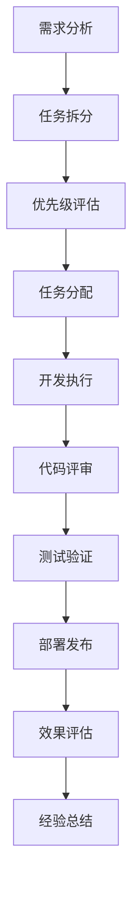
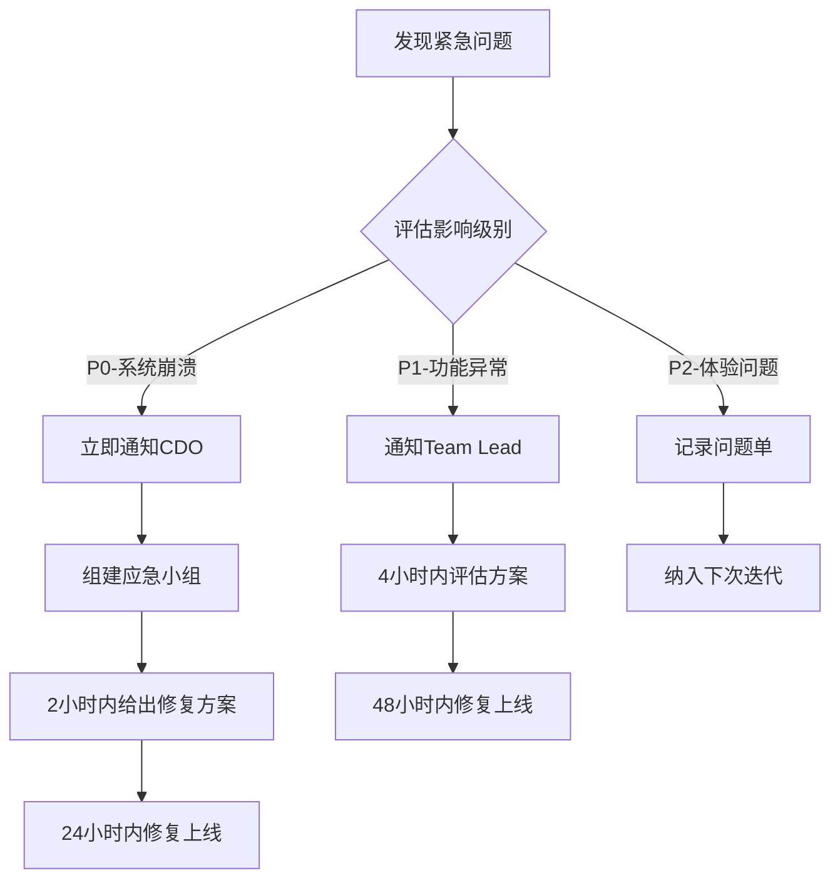

# OpenPenPal 项目管理体系

## 目录
- [一、项目管理理念](#一项目管理理念)
- [二、角色定义与职责](#二角色定义与职责)
- [三、任务管理流程](#三任务管理流程)
- [四、进度跟踪机制](#四进度跟踪机制)
- [五、质量保证体系](#五质量保证体系)
- [六、风险管理](#六风险管理)

---

## 一、项目管理理念

### 1.1 核心理念
**"慢而精致的开发节奏，快而准确的迭代响应"**

OpenPenPal作为慢社交平台，项目管理也秉承"慢"的哲学：
- **慢思考**：每个决策都经过充分讨论和验证
- **慢开发**：质量优于速度，不急于求成
- **快响应**：用户反馈和紧急问题快速响应
- **快迭代**：小步快跑，持续改进

### 1.2 管理原则
1. **透明公开**：所有信息对团队成员透明
2. **数据驱动**：基于数据和指标做决策
3. **持续改进**：定期回顾和优化流程
4. **人文关怀**：关注团队成员的成长和幸福感

---

## 二、角色定义与职责

### 2.1 核心管理角色

#### 🎯 Chief Development Officer (CDO) - 首席开发官
**姓名**: 待任命
**核心职责**:
- 统一管理开发任务和进度
- 制定技术决策和架构方向
- 协调各团队间的协作
- 确保SOTA原则和Ultrathink模式的执行

**具体职能**:
```markdown
### 战略层职能
- 制定长期技术路线图
- 评估技术选型和架构决策
- 管理技术债务优先级
- 推动SOTA标准实施

### 执行层职能  
- 分配开发任务给各Team Lead
- 监控项目整体进度
- 协调跨团队依赖关系
- 主持技术评审会议

### 文化层职能
- 推广Ultrathink思维模式
- 培养团队技术能力
- 维护代码质量标准
- 建设学习型组织
```

#### 🏗️ Technical Architecture Lead (TAL) - 技术架构负责人
**姓名**: 待任命
**核心职责**:
- 负责系统架构设计和演进
- 制定技术标准和最佳实践
- 指导复杂技术问题解决
- 推动SOTA技术改进

#### 📋 Product Owner (PO) - 产品负责人
**姓名**: 待任命
**核心职责**:
- 管理产品需求和优先级
- 与用户和运营团队沟通
- 制定功能发布计划
- 确保交付符合PRD要求

### 2.2 开发团队角色

#### 👥 Team Lead (各技术栈负责人)

**Backend Team Lead - 后端团队负责人**
- 管理：任务A、C、F、I、K组
- 职责：微服务架构、数据库设计、API开发
- 汇报：CDO

**Frontend Team Lead - 前端团队负责人**  
- 管理：任务D组
- 职责：用户界面、交互体验、移动端适配
- 汇报：CDO

**Full-Stack Team Lead - 全栈团队负责人**
- 管理：任务B、G、H、J组
- 职责：端到端功能实现、系统集成
- 汇报：CDO

**AI Team Lead - AI团队负责人**
- 管理：任务E组
- 职责：算法开发、模型训练、智能匹配
- 汇报：CDO

#### 🧑‍💻 Senior Developer - 高级开发工程师
- 技术专精，能独立解决复杂问题
- 指导初级开发者
- 参与技术决策讨论
- 负责核心模块开发

#### 🧑‍💻 Developer - 开发工程师
- 按分配完成开发任务
- 参与代码评审
- 编写单元测试
- 配合团队协作

### 2.3 支持角色

#### 🔧 DevOps Engineer - 运维工程师
- CI/CD流水线维护
- 容器化和部署自动化
- 监控和告警系统
- 性能优化支持

#### 🧪 QA Engineer - 测试工程师  
- 制定测试计划
- 执行功能和性能测试
- 自动化测试框架
- 质量报告生成

#### 🎨 UI/UX Designer - 设计师
- 用户界面设计
- 交互体验优化  
- 设计系统维护
- 用户体验研究

---

## 三、任务管理流程

### 3.1 任务生命周期



### 3.2 任务管理工具栈

#### 主要工具
- **GitHub Issues**: 任务创建和跟踪
- **GitHub Projects**: 看板管理和进度可视化
- **GitHub Milestones**: 里程碑管理
- **Claude.md**: 任务执行记录和知识沉淀

#### 任务标签体系
```yaml
# 任务类型
type/feature     # 新功能开发
type/bugfix      # 问题修复  
type/enhancement # 功能增强
type/refactor    # 代码重构
type/docs        # 文档更新
type/sota        # SOTA优化

# 优先级
priority/P0      # 紧急阻塞
priority/P1      # 高优先级
priority/P2      # 中优先级  
priority/P3      # 低优先级

# 复杂度
complexity/S     # 简单 (< 1天)
complexity/M     # 中等 (1-3天)
complexity/L     # 复杂 (3-7天)
complexity/XL    # 极复杂 (> 1周)

# 技术栈
stack/backend    # 后端相关
stack/frontend   # 前端相关
stack/ai         # AI相关
stack/devops     # 运维相关

# 状态
status/todo      # 待开始
status/progress  # 开发中
status/review    # 评审中
status/testing   # 测试中
status/done      # 已完成
```

### 3.3 任务创建模板

#### Feature Task模板
```markdown
## 🎯 任务概述
**任务ID**: Task-A1
**任务名称**: 条码唯一性校验机制实现
**所属阶段**: MVP补充开发
**预计工时**: 5人日

## 📋 需求描述
根据PRD 2.4节条码系统要求，实现条码的唯一性校验和绑定锁定机制

### 用户故事
作为信件发送者，我希望每个条码都是唯一的，这样我的信件就不会被其他人冒用或重复使用。

### 验收标准
- [ ] 条码生成时检查全局唯一性
- [ ] 首次扫码后锁定绑定信息
- [ ] 重复使用条码时给出明确错误提示
- [ ] 条码状态转换记录审计日志
- [ ] 支持条码批量校验API

## 🏗️ 技术设计
### API设计
```yaml
POST /api/v1/barcode/validate
GET /api/v1/barcode/{code}/status
PUT /api/v1/barcode/{code}/bind
```

### 数据库设计
```sql
CREATE TABLE barcode_records (
    id UUID PRIMARY KEY,
    code VARCHAR(8) UNIQUE NOT NULL,
    status VARCHAR(20) NOT NULL,
    bound_letter_id UUID,
    created_at TIMESTAMP,
    updated_at TIMESTAMP
);
```

## 🔗 依赖关系
- **前置任务**: 无
- **后续任务**: Task-C1 (扫码投递API增强)
- **并行任务**: Task-B1 (信封模板管理)

## 🧪 测试计划
- 单元测试：条码生成和校验逻辑
- 集成测试：与数据库交互
- 压力测试：大量条码并发校验
- 安全测试：条码伪造和重放攻击

## 📊 成功指标
- 条码唯一性保证率: 100%
- API响应时间: < 100ms
- 单元测试覆盖率: > 95%

## 🔄 Ultrathink思考
### 长期影响
- 这个实现是否支持未来扩展到其他类型的唯一标识？
- 在高并发场景下，唯一性检查是否会成为性能瓶颈？
- 用户对条码重复使用的错误提示是否友好？

### 人文关怀
- 用户忘记条码是否已使用时，如何提供温和的提醒？
- 条码系统是否增加了用户的认知负担？
```

### 3.4 任务分配策略

#### 分配原则
1. **能力匹配**：任务复杂度与开发者技能水平匹配
2. **负载均衡**：避免单个开发者任务过载
3. **技能发展**：为初级开发者安排成长性任务
4. **领域专精**：相同领域任务分配给专精开发者

#### 分配矩阵
```yaml
Task Group A (条码系统增强):
  Lead: Backend Senior Developer
  Members: 
    - Backend Developer (2人)
  Reviewer: Technical Architecture Lead
  
Task Group B (信封系统开发):
  Lead: Full-Stack Senior Developer  
  Members:
    - Full-Stack Developer (1人)
    - Frontend Developer (1人)
  Reviewer: Product Owner

Task Group E (AI核心功能):
  Lead: AI Team Lead
  Members:
    - AI Engineer (1人)
  Reviewer: CDO
```

---

## 四、进度跟踪机制

### 4.1 多层级进度监控

#### 日常进度跟踪
**每日站会** (Daily Standup)
- 时间：每天上午9:30，15分钟
- 参与者：各Team Lead + CDO
- 格式：
  ```
  昨天完成：[具体任务]
  今天计划：[具体任务]  
  遇到阻塞：[问题描述和需要的帮助]
  ```

#### 周度进度评估
**每周回顾会** (Weekly Review)
- 时间：每周五下午3:00-4:00
- 参与者：全体开发团队
- 议程：
  1. 本周任务完成情况回顾
  2. 遇到的技术难题讨论
  3. 下周任务规划调整
  4. SOTA改进建议收集

#### 阶段里程碑检查
**里程碑评审会** (Milestone Review)
- 时间：每个里程碑结束前1周
- 参与者：CDO + TAL + PO + Team Leads
- 输出：
  - 里程碑达成度评估报告
  - 风险识别和缓解计划
  - 下阶段优先级调整建议

### 4.2 进度可视化仪表板

#### GitHub Projects看板
```
📋 OpenPenPal Development Board

🔄 Backlog (需求池)
├── Task-A1: 条码唯一性校验 [P1][Backend]
├── Task-B1: 信封模板管理 [P1][Full-Stack]
└── Task-E1: AI笔友匹配 [P2][AI]

🏃‍♂️ In Progress (开发中)  
├── Task-A2: 条码防伪算法 [P1][Backend] @developer-a
├── Task-D1: 扫码界面优化 [P2][Frontend] @developer-b
└── Task-C1: 物流追踪API [P1][Backend] @developer-c

👀 In Review (评审中)
├── Task-A1: 条码唯一性校验 [P1][Backend] 
└── Task-F1: 延迟队列系统 [P2][Backend]

✅ Done (已完成)
├── Task-K1: 单元测试覆盖率提升
├── Task-D2: 投递状态可视化
└── Task-C2: 物流路径记录
```

#### 进度指标仪表板
```markdown
## OpenPenPal 开发进度仪表板

### 📊 整体进度
- **第一阶段 (MVP补充)**: 75% ████████████▓▓▓▓ 
- **第二阶段 (AI慢社交)**: 20% ████▓▓▓▓▓▓▓▓▓▓▓▓
- **第三阶段 (社区策展)**: 0%  ▓▓▓▓▓▓▓▓▓▓▓▓▓▓▓▓

### 🎯 本周关键指标
- 任务完成率: 85% (17/20)
- 代码提交数: 156 commits
- 测试覆盖率: 82%
- 代码评审通过率: 95%

### ⚠️ 风险提醒
- AI匹配算法开发进度滞后2天
- 条码系统测试发现性能问题需优化
- 前端团队人手不足，建议增加1人

### 🏆 本周亮点
- 条码唯一性校验功能提前完成
- 信封模板系统获得产品团队好评
- 团队代码质量评分达到A级
```

### 4.3 智能进度预警

#### 预警规则引擎
```yaml
# 任务级预警
task_warnings:
  - rule: "任务开发时间超过预估50%"
    action: "自动通知Team Lead和CDO"
    
  - rule: "任务卡在Review状态超过2天"  
    action: "提醒Reviewer并升级给CDO"
    
  - rule: "P0任务未按时开始"
    action: "立即通知CDO和相关Team Lead"

# 项目级预警    
project_warnings:
  - rule: "里程碑延期风险超过20%"
    action: "触发里程碑风险评估会议"
    
  - rule: "团队整体任务完成率低于80%"
    action: "启动团队效能分析流程"
    
  - rule: "技术债务积累超过阈值"
    action: "安排专门的重构冲刺"
```

---

## 五、质量保证体系

### 5.1 多级质量门禁

#### Level 1: 开发者自检
- 代码符合团队规范
- 单元测试覆盖率≥80%
- 本地构建和测试通过
- 自我Code Review完成

#### Level 2: 同级评审
- 至少1名同级开发者Review
- 功能逻辑正确性验证
- 代码可读性和维护性检查
- 安全性基础检查

#### Level 3: 高级评审
- Team Lead或Senior Developer评审
- 架构设计合理性评估
- 性能影响分析
- 与整体系统兼容性检查

#### Level 4: 跨团队评审
- 涉及多团队的功能必须跨团队评审
- TAL参与架构相关评审
- CDO参与核心功能评审

### 5.2 自动化质量检查

#### CI/CD流水线质量门禁
```yaml
# .github/workflows/quality-gate.yml
name: Quality Gate

on: [push, pull_request]

jobs:
  quality-check:
    runs-on: ubuntu-latest
    steps:
      # 代码风格检查
      - name: Code Style Check
        run: |
          golangci-lint run
          eslint src/
          
      # 单元测试
      - name: Unit Tests
        run: |
          go test -v -race -coverprofile=coverage.out ./...
          npm test -- --coverage
          
      # 集成测试  
      - name: Integration Tests
        run: |
          docker-compose -f docker-compose.test.yml up -d
          go test -v -tags=integration ./...
          
      # 安全扫描
      - name: Security Scan
        run: |
          gosec ./...
          npm audit
          
      # 性能测试
      - name: Performance Tests
        run: |
          go test -bench=. -benchmem ./...
          
      # 质量门禁检查
      - name: Quality Gate
        run: |
          # 测试覆盖率必须≥80%
          go tool cover -func=coverage.out | grep total | awk '{print $3}' | grep -E "8[0-9]\.|9[0-9]\.|100.0%"
          
          # 代码复杂度检查
          gocyclo -over 10 .
          
          # 技术债务检查
          sonar-scanner
```

### 5.3 质量指标监控

#### 代码质量指标
```markdown
## 代码质量周报

### 📊 质量趋势
- 测试覆盖率: 82% ↗️ (+3% vs 上周)
- 代码复杂度: 3.2 ↘️ (-0.1 vs 上周)  
- 重复代码率: 4.1% ↘️ (-0.8% vs 上周)
- 技术债务: 2.3h ↗️ (+0.5h vs 上周)

### 🏆 质量排行榜  
1. Backend Team: A+ (95分)
2. AI Team: A (92分)  
3. Frontend Team: B+ (88分)
4. Full-Stack Team: B+ (87分)

### ⚠️ 需要关注的问题
- courier-service模块测试覆盖率偏低(65%)
- write-service存在循环依赖问题
- 前端组件复用率有待提升

### 🎯 下周改进目标
- 提升courier-service测试覆盖率至80%
- 重构write-service依赖关系
- 建立前端组件库基础架构
```

---

## 六、风险管理

### 6.1 风险识别矩阵

| 风险类型 | 具体风险 | 概率 | 影响 | 风险等级 | 负责人 |
|----------|----------|------|------|----------|--------|
| 技术风险 | AI匹配算法效果不达标 | 中 | 高 | 高 | AI Team Lead |
| 进度风险 | 核心开发人员离职 | 低 | 极高 | 高 | CDO |
| 质量风险 | 条码系统安全漏洞 | 低 | 高 | 中 | Backend Team Lead |
| 外部风险 | 第三方服务不稳定 | 中 | 中 | 中 | DevOps Engineer |
| 需求风险 | PRD理解偏差 | 中 | 高 | 高 | Product Owner |

### 6.2 风险缓解策略

#### 技术风险缓解
```markdown
### AI匹配算法效果风险
**缓解措施**:
1. 建立多套备选算法方案
2. 预留人工审核和调优机制  
3. 与外部AI专家建立咨询关系
4. 设立算法效果最低可接受标准

**预警指标**:
- 匹配满意度 < 60%
- 用户投诉率 > 10%
- 算法准确率 < 70%
```

#### 进度风险缓解
```markdown
### 人员流失风险
**缓解措施**:
1. 建立完善的知识文档体系
2. 关键模块至少2人熟悉
3. 定期进行技术分享和知识传承
4. 建立人才储备和快速招聘机制

**预警指标**:
- 团队满意度调研 < 80%
- 关键岗位单点依赖
- 加班时长持续超标
```

### 6.3 应急响应机制

#### 紧急问题响应流程


#### 应急响应团队
- **应急指挥官**: CDO
- **技术专家**: TAL + 相关Team Lead  
- **运维支持**: DevOps Engineer
- **沟通协调**: Product Owner
- **决策支持**: 高级工程师团队

---

## 七、项目管理工具与自动化

### 7.1 项目管理自动化

#### GitHub Actions自动化工作流
```yaml
# .github/workflows/project-management.yml
name: Project Management Automation

on:
  issues:
    types: [opened, closed, labeled]
  pull_request:
    types: [opened, closed, merged]

jobs:
  task-management:
    runs-on: ubuntu-latest
    steps:
      # 自动任务分配
      - name: Auto Task Assignment
        if: github.event.action == 'opened'
        run: |
          # 根据标签自动分配给对应Team Lead
          case "${{ github.event.issue.labels }}" in
            *"stack/backend"*) echo "backend-team-lead" ;;
            *"stack/frontend"*) echo "frontend-team-lead" ;;
            *"stack/ai"*) echo "ai-team-lead" ;;
          esac
          
      # 进度自动更新
      - name: Progress Update
        if: github.event.action == 'closed'
        run: |
          # 更新GitHub Projects看板
          # 发送进度通知
          # 更新里程碑进度
          
      # 质量门禁检查
      - name: Quality Gate Check
        if: github.event_name == 'pull_request'
        run: |
          # 检查PR是否符合质量标准
          # 自动添加质量标签
          # 通知相关评审人员
```

### 7.2 度量和分析

#### 开发效能指标
```markdown
## 开发效能仪表板

### 🚀 交付效率
- 平均任务完成时间: 3.2天
- 平均PR合并时间: 8小时  
- 代码评审周期: 4小时
- 部署频率: 每周2次

### 📈 质量指标
- 生产bug率: 0.3/kloc
- 测试覆盖率: 82%
- 技术债务比例: 8%
- 代码重复率: 4%

### 👥 团队协作
- 跨团队协作次数: 15次/周
- 知识分享会议: 2次/月
- Code Review参与率: 95%
- 团队满意度: 4.2/5.0
```

---

## 八、总结与展望

### 8.1 项目管理体系价值

OpenPenPal项目管理体系的核心价值在于：

1. **统一性**：CDO角色确保了开发任务和进度的统一管理
2. **可视性**：多层级的进度跟踪让每个人都清楚项目状态
3. **质量性**：多级质量门禁确保交付质量
4. **敏捷性**：快速响应变化和问题的能力
5. **人文性**：关注团队成员成长和幸福感

### 8.2 持续优化方向

1. **智能化**：引入更多AI辅助的项目管理工具
2. **数据化**：建立更完善的度量体系和预测模型
3. **自动化**：减少重复性的管理工作
4. **人性化**：更加关注团队成员的个人发展需求

### 8.3 成功标准

项目管理体系的成功将通过以下指标衡量：

- **按时交付率** ≥ 90%
- **质量达标率** ≥ 95%  
- **团队满意度** ≥ 4.0/5.0
- **技术债务比例** ≤ 10%
- **知识传承效率** ≥ 80%

---

**这套项目管理体系是OpenPenPal项目成功的重要保障，它将帮助我们在追求技术卓越的同时，保持人文关怀的项目理念，最终交付一个真正有温度的慢社交平台。**