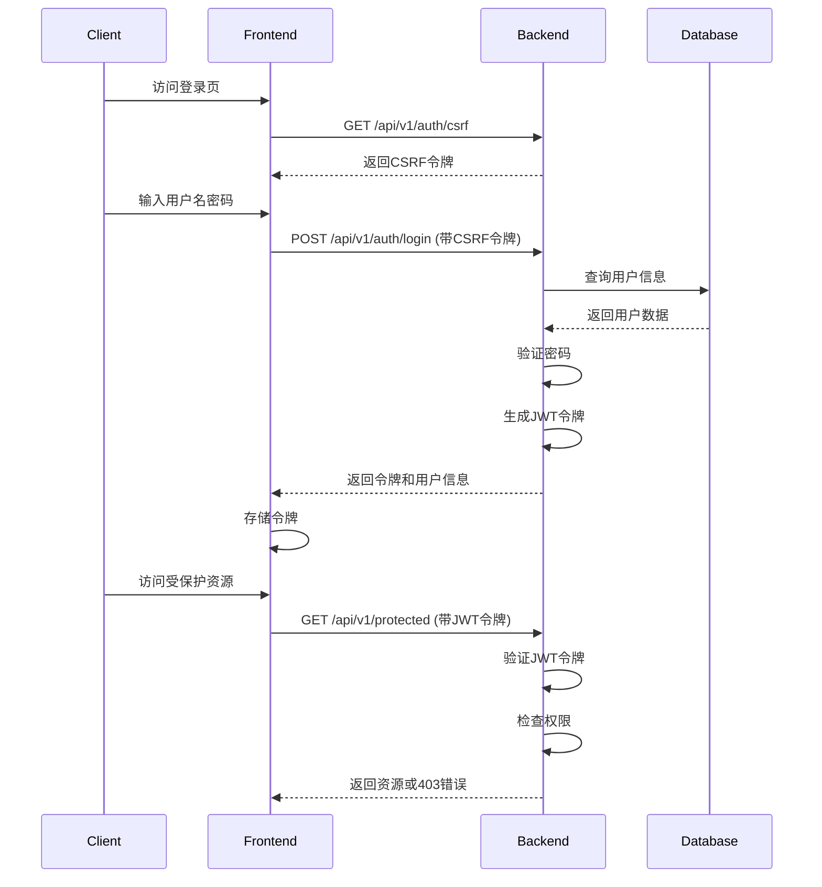

# OpenPenPal 用户登录及权限流程分析报告

> 生成时间: 2025-08-09
> 分析范围: 数据库用户、登录流程、权限系统

## 📊 总览

系统实现了完整的用户认证和权限管理系统，包括：
- JWT令牌认证
- CSRF保护
- 角色权限体系（RBAC）
- 4级信使权限系统

## 🗃️ 数据库用户表结构

### users 表
```sql
Column          Type                    Description
id              varchar(36)             用户ID (UUID)
username        varchar(50)             用户名 (唯一)
email           varchar(100)            邮箱 (唯一)
password_hash   varchar(255)            密码哈希
nickname        varchar(50)             昵称
avatar          varchar(500)            头像URL
role            varchar(20)             角色
school_code     varchar(20)             学校代码
is_active       boolean                 是否激活
last_login_at   timestamp               最后登录时间
created_at      timestamp               创建时间
updated_at      timestamp               更新时间
deleted_at      timestamp               删除时间
```

### 现有测试用户
| 用户名 | 角色 | 邮箱 | 状态 |
|--------|------|------|------|
| admin | super_admin | admin@openpenpal.com | 激活 |
| alice | user | alice@openpenpal.com | 激活 |
| courier_level1 | courier_level1 | courier1@openpenpal.com | 激活 |
| courier_level2 | courier_level2 | courier2@openpenpal.com | 激活 |
| courier_level3 | courier_level3 | courier3@openpenpal.com | 激活 |
| courier_level4 | courier_level4 | courier4@openpenpal.com | 激活 |

## 🔐 完整登录流程

### 1. 获取CSRF令牌
```
GET /api/v1/auth/csrf
```
- 无需认证
- 返回CSRF令牌用于后续请求

### 2. 用户登录
```
POST /api/v1/auth/login
Headers:
  X-CSRF-Token: <csrf_token>
Body:
  {
    "username": "admin",
    "password": "admin123"
  }
```

### 3. 登录响应
```json
{
  "success": true,
  "message": "登录成功",
  "data": {
    "token": "eyJhbGciOiJIUzI1NiIs...",
    "expires_at": "2025-08-10T14:45:00Z",
    "user": {
      "id": "uuid",
      "username": "admin",
      "email": "admin@openpenpal.com",
      "role": "super_admin",
      "nickname": "管理员",
      "school_code": "ADMIN",
      "is_active": true,
      "courierInfo": null  // 信使角色才有
    }
  }
}
```

### 4. 认证后请求
```
GET /api/v1/protected/resource
Headers:
  Authorization: Bearer <jwt_token>
```

## 🛡️ 权限系统实现

### 角色层级
```go
RoleHierarchy = map[UserRole]int{
    RoleUser:               1,  // 普通用户
    RoleCourier:            2,  // 普通信使
    RoleSeniorCourier:      3,  // 高级信使
    RoleCourierCoordinator: 4,  // 信使协调员
    RoleSchoolAdmin:        5,  // 学校管理员
    RolePlatformAdmin:      6,  // 平台管理员
    RoleSuperAdmin:         7,  // 超级管理员
    
    // 分级信使系统映射
    RoleCourierLevel1: 2,  // 楼栋信使
    RoleCourierLevel2: 3,  // 片区信使
    RoleCourierLevel3: 4,  // 校级信使
    RoleCourierLevel4: 5,  // 城市总代
}
```

### 权限检查方式

#### 1. 中间件认证
```go
// AuthMiddleware - 验证JWT令牌
router.Use(middleware.AuthMiddleware(config, db))
```

#### 2. 角色中间件
```go
// RoleMiddleware - 检查用户角色
adminRoutes.Use(middleware.RoleMiddleware("super_admin"))
```

#### 3. 权限中间件
```go
// PermissionMiddleware - 检查具体权限
courierRoutes.Use(middleware.PermissionMiddleware(models.PermissionDeliverLetter))
```

## 📋 各角色权限配置

### 1. 普通用户 (user)
- 写信 (write_letter)
- 读信 (read_letter)
- 管理个人资料 (manage_profile)

### 2. 信使角色 (courier_level1-4)
继承用户权限，额外拥有：
- 投递信件 (deliver_letter)
- 扫码 (scan_code)
- 查看任务 (view_tasks)
- Level 3+ 可查看报告 (view_reports)
- Level 4 可管理信使 (manage_couriers)

### 3. 管理员角色
- **super_admin**: 全部权限
- **platform_admin**: 平台管理权限
- **school_admin**: 学校管理权限

## 🔄 完整请求流程



## 🚨 安全特性

1. **密码安全**
   - 使用bcrypt加密存储
   - 最小长度8位要求

2. **CSRF保护**
   - 所有状态改变操作需要CSRF令牌
   - 令牌通过专门端点获取

3. **JWT令牌**
   - 24小时过期时间
   - 包含用户ID和角色信息
   - 支持令牌刷新

4. **权限验证**
   - 多层级权限检查
   - 基于角色的访问控制
   - 细粒度权限管理

## 📱 前端集成

前端通过以下方式集成：

1. **AuthContext** - 管理用户状态
2. **apiClient** - 自动处理令牌
3. **TokenManager** - 令牌存储和刷新
4. **权限守卫** - 路由级别权限控制

## ✅ 测试建议

1. 使用提供的测试账号进行登录测试
2. 验证不同角色的权限访问
3. 测试令牌过期和刷新机制
4. 检查CSRF保护是否生效

## 🔧 常见问题

1. **登录失败**: 检查用户名密码是否正确
2. **权限不足**: 确认用户角色和所需权限
3. **令牌过期**: 使用刷新端点获取新令牌
4. **CSRF错误**: 确保请求包含有效CSRF令牌