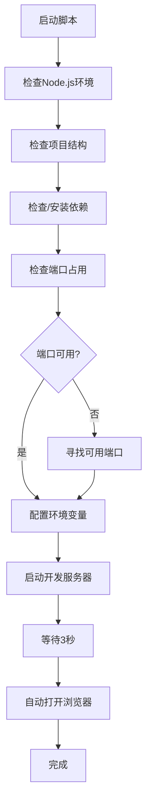

# OpenPenPal 启动脚本系统

## 📁 文件结构

```
openpenpal/
├── scripts/
│   ├── check-port.js          # 端口检查工具
│   ├── launcher.js            # 智能启动器（核心）
│   └── README.md              # 本文档
├── start.sh                   # macOS/Linux启动脚本
├── start.bat                  # Windows启动脚本
├── test-launch.js             # 启动脚本测试工具
├── 启动指南.md                 # 用户启动指南
└── docs/
    └── 启动脚本使用指南.md      # 详细使用文档
```

## 🎯 设计目标

创建一套完整的启动脚本系统，解决以下问题：

✅ **自动环境检查** - 检查Node.js、项目结构、依赖
✅ **智能端口管理** - 检查端口占用，自动寻找可用端口  
✅ **跨平台支持** - 支持Windows、macOS、Linux
✅ **自动打开浏览器** - 启动后自动打开项目页面
✅ **错误诊断** - 详细的错误信息和解决建议
✅ **终端集成** - 将命令行检查结果集成到JS中

## 🚀 核心组件

### 1. 端口检查工具 (`check-port.js`)
- 检查指定端口是否被占用
- 显示占用进程信息
- 自动寻找可用端口
- 支持JSON输出格式

```bash
# 使用示例
node scripts/check-port.js 3000
npm run check-port
```

### 2. 智能启动器 (`launcher.js`)
- 6步完整启动检查流程
- 自动安装依赖
- 智能包管理器检测
- 自动打开浏览器
- 详细日志和错误诊断

```bash
# 使用示例
node scripts/launcher.js
npm run launch
npm run quick-start
```

### 3. 系统脚本 (`start.sh` / `start.bat`)
- 原生shell/批处理脚本
- 彩色输出和进度提示
- 跨平台兼容
- 错误处理和用户提示

```bash
# 使用示例
./start.sh          # macOS/Linux
start.bat           # Windows
```

## 🔧 技术实现

### 端口检查算法
```javascript
// 使用net模块检查端口
function checkPortInUse(port) {
  return new Promise((resolve) => {
    const server = net.createServer();
    server.listen(port, () => {
      server.close(() => resolve(false)); // 可用
    });
    server.on('error', () => resolve(true)); // 被占用
  });
}
```

### 进程信息获取
```javascript
// macOS/Linux: 使用lsof
const result = execSync(`lsof -ti:${port}`);

// Windows: 使用netstat
const result = execSync(`netstat -ano | findstr :${port}`);
```

### 跨平台浏览器打开
```javascript
const platform = os.platform();
const commands = {
  'darwin': `open "${url}"`,      // macOS
  'win32': `start "" "${url}"`,   // Windows
  'default': `xdg-open "${url}"`  // Linux
};
```

## 📊 启动流程图



## 🛠️ 扩展功能

### 调试模式
```bash
# 启用详细日志
DEBUG=true npm run launch
npm run dev:debug
```

### 健康检查
```bash
# 全面检查项目状态
npm run health-check

# 测试启动脚本
node test-launch.js
```

### 自定义配置
可以通过环境变量自定义行为：
```bash
PORT=3001 npm run launch          # 指定端口
NO_BROWSER=true npm run launch    # 不自动打开浏览器
DEBUG=true npm run launch         # 启用调试模式
```

## 🐛 错误处理机制

### 错误分类
1. **环境错误** - Node.js未安装、版本不兼容
2. **依赖错误** - npm安装失败、包损坏
3. **端口错误** - 无可用端口、权限问题
4. **配置错误** - 环境变量、文件权限
5. **启动错误** - 代码语法错误、模块缺失

### 自动修复
- 自动安装缺失依赖
- 自动寻找可用端口
- 自动创建配置文件
- 自动修复文件权限

### 错误报告
```javascript
const report = {
  success: false,
  checks: [...],      // 检查结果
  errors: [...],      // 错误列表
  warnings: [...],    // 警告列表
  port: 3001,        // 使用端口
  url: "http://...",  // 访问地址
  summary: {         // 汇总信息
    totalChecks: 6,
    successfulChecks: 4,
    warnings: 1,
    errors: 1
  }
};
```

## 📈 性能优化

### 并发检查
- 并行执行独立检查项
- 异步处理耗时操作
- 缓存检查结果

### 启动优化
- 智能包管理器选择（pnpm > yarn > npm）
- 增量依赖安装
- 预热缓存策略

### 用户体验
- 实时进度显示
- 彩色日志输出
- 清晰的错误提示
- 自动打开浏览器

## 🔮 未来计划

### v1.1 增强功能
- [ ] 项目模板选择
- [ ] 自动代码格式化
- [ ] Git钩子设置
- [ ] Docker支持

### v1.2 高级功能  
- [ ] 多服务启动（前端+后端+数据库）
- [ ] 性能监控集成
- [ ] 自动测试运行
- [ ] CI/CD集成

### v1.3 团队协作
- [ ] 团队配置同步
- [ ] 环境一致性检查
- [ ] 依赖版本管理
- [ ] 开发环境快照

---

## 📞 技术支持

遇到问题？查看以下资源：

- 📖 [启动脚本使用指南](../docs/启动脚本使用指南.md)
- 🔧 [故障排除](../docs/启动脚本使用指南.md#故障排除)
- 🧪 运行测试：`node test-launch.js`
- 🏥 健康检查：`npm run health-check`

---

*让启动变得简单，让开发更加专注！* 🚀