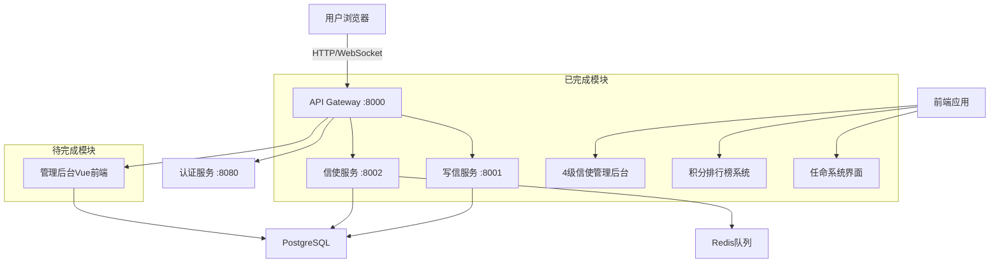

# OpenPenPal 集成测试手册
## 跨系统功能集成验证指南

> 目标: 验证各Agent开发的模块之间的集成完整性  
> 重点: API对接、数据流转、权限协作、实时通信  
> 更新时间: 2025-07-21

---

## 📊 系统集成架构概览

### 当前系统组成 (基于Agent完成情况)


### 🎯 集成测试重点关注
1. **API网关统一路由** (Agent #3 新增)
2. **4级信使管理后台** (Agent #1 核心实现) 
3. **积分系统数据流** (Agent #1 + Agent #3)
4. **任命系统权限协作** (Agent #1 + Agent #4)
5. **WebSocket实时事件** (跨所有服务)

---

## 🔥 CRITICAL集成测试场景

### 场景1: 完整信件投递流程集成测试

#### 1.1 端到端流程测试
```javascript
// 文件: integration_letter_flow.spec.js
describe('完整信件投递流程集成', () => {
  
  test('INT-001: 从写信到投递的完整数据流', async () => {
    // === 第一阶段: 用户写信 (Agent #2) ===
    await loginAs('regular_user');
    
    // 1. 创建信件
    const letterResponse = await apiCall('POST', '/api/letters', {
      title: '集成测试信件',
      content: '这是一封集成测试信件',
      receiver_hint: '北京大学图书馆',
      priority: 'normal'
    });
    
    expect(letterResponse.code).toBe(0);
    expect(letterResponse.data.letter_id).toMatch(/^OP[A-Z0-9]{10}$/);
    
    const letterId = letterResponse.data.letter_id;
    
    // 2. 验证信件状态初始化
    const letterDetail = await apiCall('GET', `/api/letters/${letterId}`);
    expect(letterDetail.data.status).toBe('draft');
    
    // === 第二阶段: 任务自动创建 (Agent #2 → Agent #3) ===
    
    // 3. 确认信件生成，触发任务创建
    await apiCall('PUT', `/api/letters/${letterId}/status`, {
      status: 'generated'
    });
    
    // 等待任务队列处理
    await waitForCondition(async () => {
      const tasks = await apiCall('GET', '/api/courier/tasks', {
        letter_id: letterId
      });
      return tasks.data.tasks.length > 0;
    }, 5000);
    
    // 4. 验证任务自动创建
    const tasks = await apiCall('GET', '/api/courier/tasks', {
      letter_id: letterId
    });
    
    expect(tasks.data.tasks).toHaveLength(1);
    expect(tasks.data.tasks[0].letter_id).toBe(letterId);
    expect(tasks.data.tasks[0].status).toBe('available');
    
    const taskId = tasks.data.tasks[0].task_id;
    
    // === 第三阶段: 信使接受任务 (Agent #3) ===
    
    await loginAs('active_courier');
    
    // 5. 信使接受任务
    const acceptResponse = await apiCall('PUT', `/api/courier/tasks/${taskId}/accept`, {
      estimated_time: '2小时',
      note: '准备开始投递'
    });
    
    expect(acceptResponse.code).toBe(0);
    expect(acceptResponse.data.task_id).toBe(taskId);
    
    // 6. 验证任务状态更新
    const updatedTask = await apiCall('GET', `/api/courier/tasks/${taskId}`);
    expect(updatedTask.data.status).toBe('accepted');
    expect(updatedTask.data.courier_id).toBeDefined();
    
    // === 第四阶段: 扫码投递流程 (Agent #3) ===
    
    // 7. 扫码收取信件
    const collectResponse = await apiCall('POST', `/api/courier/scan/${letterId}`, {
      action: 'collected',
      location: '北京大学宿舍楼下',
      note: '已从发件人处收取'
    });
    
    expect(collectResponse.code).toBe(0);
    expect(collectResponse.data.new_status).toBe('collected');
    
    // 8. 验证信件状态同步更新 (Agent #3 → Agent #2)
    await waitForCondition(async () => {
      const letter = await apiCall('GET', `/api/letters/${letterId}`);
      return letter.data.status === 'collected';
    }, 3000);
    
    // 9. 扫码投递信件
    const deliverResponse = await apiCall('POST', `/api/courier/scan/${letterId}`, {
      action: 'delivered',
      location: '北京大学图书馆前台',
      note: '已成功投递'
    });
    
    expect(deliverResponse.code).toBe(0);
    expect(deliverResponse.data.new_status).toBe('delivered');
    
    // === 第五阶段: 积分系统更新 (Agent #3) ===
    
    // 10. 验证信使积分更新
    await waitForCondition(async () => {
      const courierStats = await apiCall('GET', '/api/courier/stats');
      return courierStats.data.total_tasks > 0;
    }, 3000);
    
    const courierStats = await apiCall('GET', '/api/courier/stats');
    expect(courierStats.data.completed_tasks).toBeGreaterThan(0);
    
    // === 第六阶段: WebSocket事件验证 (所有服务) ===
    
    // 11. 验证WebSocket事件推送
    const wsEvents = await getRecordedWebSocketEvents();
    const statusEvents = wsEvents.filter(e => e.type === 'LETTER_STATUS_UPDATE');
    
    expect(statusEvents.length).toBeGreaterThanOrEqual(3); // draft->generated, collected, delivered
    expect(statusEvents.some(e => e.data.status === 'collected')).toBeTruthy();
    expect(statusEvents.some(e => e.data.status === 'delivered')).toBeTruthy();
  });
});
```

### 场景2: 4级信使管理后台集成测试

#### 2.1 前端后台数据集成验证
```javascript
describe('4级信使管理后台集成', () => {
  
  test('INT-002: 城市管理后台数据完整加载', async () => {
    await loginAs('level4_courier_city', { level: 4 });
    await page.goto('/courier/city-manage');
    
    // 1. 验证页面基本加载
    expect(await page.textContent('h1')).toContain('城市信使管理中心');
    
    // 2. 验证统计数据API调用
    await page.waitForResponse(response => 
      response.url().includes('/api/courier/stats/city') && response.status() === 200
    );
    
    // 3. 验证三级信使列表API调用
    await page.waitForResponse(response => 
      response.url().includes('/api/courier/subordinates') && response.status() === 200
    );
    
    // 4. 验证统计卡片数据显示
    const totalSchools = await page.textContent('[data-testid="total-schools"]');
    expect(totalSchools).toMatch(/\d+/);
    
    const activeCouriers = await page.textContent('[data-testid="active-couriers"]');
    expect(activeCouriers).toMatch(/\d+/);
    
    // 5. 验证三级信使列表渲染
    const schoolCourierCards = await page.locator('.school-courier-card').count();
    expect(schoolCourierCards).toBeGreaterThan(0);
    
    // 6. 测试任命新三级信使功能集成
    await page.click('[data-testid="appoint-school-courier"]');
    
    // 验证候选用户API调用
    await page.waitForResponse(response => 
      response.url().includes('/api/admin/courier-candidates') && response.status() === 200
    );
    
    expect(await page.isVisible('.appointment-dialog')).toBeTruthy();
  });
  
  test('INT-003: 层级权限API验证', async () => {
    // 测试四级信使权限API
    await loginAs('level4_courier_city', { level: 4 });
    
    // 验证可以获取下级信使列表
    const subordinates = await apiCall('GET', '/api/courier/subordinates');
    expect(subordinates.code).toBe(0);
    expect(Array.isArray(subordinates.data.couriers)).toBeTruthy();
    
    // 验证可以访问城市级统计
    const cityStats = await apiCall('GET', '/api/courier/stats/city');
    expect(cityStats.code).toBe(0);
    expect(cityStats.data.total_schools).toBeDefined();
    
    // 测试三级信使权限限制
    await loginAs('level3_courier_school', { level: 3 });
    
    // 应该无法访问城市级统计
    const restrictedResponse = await apiCall('GET', '/api/courier/stats/city');
    expect(restrictedResponse.code).toBe(403); // 权限不足
  });
});
```

### 场景3: 积分排行榜系统集成测试

#### 3.1 前端积分页面与后端API集成
```javascript
describe('积分排行榜系统集成', () => {
  
  test('INT-004: 积分页面多维度排行榜集成', async () => {
    await loginAs('active_courier');
    await page.goto('/courier/points');
    
    // 1. 验证个人积分信息加载
    await page.waitForResponse(response => 
      response.url().includes('/api/courier/points') && response.status() === 200
    );
    
    const currentPoints = await page.textContent('.current-points');
    expect(currentPoints).toMatch(/\d+\s*积分/);
    
    // 2. 测试学校排行榜API集成
    await page.selectOption('[data-testid="ranking-scope"]', 'school');
    await page.waitForResponse(response => 
      response.url().includes('/api/courier/leaderboard/school') && response.status() === 200
    );
    
    const schoolRankings = await page.locator('.ranking-card').count();
    expect(schoolRankings).toBeGreaterThan(0);
    
    // 3. 测试全国排行榜API集成
    await page.selectOption('[data-testid="ranking-scope"]', 'national');
    await page.waitForResponse(response => 
      response.url().includes('/api/courier/leaderboard/national') && response.status() === 200
    );
    
    const nationalRankings = await page.locator('.ranking-card').count();
    expect(nationalRankings).toBeGreaterThan(0);
    
    // 4. 测试积分历史API集成
    await page.click('[data-tab="history"]');
    await page.waitForResponse(response => 
      response.url().includes('/api/courier/points-history') && response.status() === 200
    );
    
    const historyItems = await page.locator('.points-history-item').count();
    expect(historyItems).toBeGreaterThanOrEqual(0);
  });
  
  test('INT-005: 积分系统实时更新集成', async () => {
    await loginAs('active_courier');
    
    // 1. 记录当前积分
    const initialStats = await apiCall('GET', '/api/courier/stats');
    const initialPoints = initialStats.data.total_points || 0;
    
    // 2. 完成一个投递任务
    const letterId = 'TEST_LETTER_' + Date.now();
    
    // 模拟任务完成
    await apiCall('POST', `/api/courier/scan/${letterId}`, {
      action: 'delivered',
      location: '测试地点',
      note: '集成测试投递'
    });
    
    // 3. 等待积分系统更新
    await waitForCondition(async () => {
      const stats = await apiCall('GET', '/api/courier/stats');
      return stats.data.total_points > initialPoints;
    }, 5000);
    
    // 4. 验证积分更新
    const updatedStats = await apiCall('GET', '/api/courier/stats');
    expect(updatedStats.data.total_points).toBeGreaterThan(initialPoints);
    
    // 5. 验证积分历史记录创建
    const pointsHistory = await apiCall('GET', '/api/courier/points-history');
    const latestRecord = pointsHistory.data.history[0];
    expect(latestRecord.action).toContain('投递完成');
    expect(latestRecord.points).toBeGreaterThan(0);
  });
});
```

### 场景4: 任命系统集成测试

#### 4.1 前端任命界面与后端API集成
```javascript
describe('任命系统集成测试', () => {
  
  test('INT-006: 任命流程完整集成', async () => {
    await loginAs('school_admin');
    await page.goto('/admin/appointment');
    
    // 1. 验证用户列表加载
    await page.waitForResponse(response => 
      response.url().includes('/api/admin/users') && response.status() === 200
    );
    
    const userCards = await page.locator('.user-card').count();
    expect(userCards).toBeGreaterThan(0);
    
    // 2. 选择用户进行任命
    const firstUser = page.locator('.user-card').first();
    const userId = await firstUser.getAttribute('data-user-id');
    
    await page.click(`[data-user-id="${userId}"] [data-testid="appoint-button"]`);
    
    // 3. 验证可任命角色API调用
    await page.waitForResponse(response => 
      response.url().includes('/api/admin/appointable-roles') && response.status() === 200
    );
    
    // 4. 填写任命表单
    await page.selectOption('[data-testid="new-role-select"]', 'courier');
    await page.fill('[data-testid="reason-textarea"]', '集成测试任命理由');
    
    // 5. 提交任命申请
    await page.click('[data-testid="submit-appointment"]');
    
    // 验证任命API调用
    await page.waitForResponse(response => 
      response.url().includes('/api/admin/appoint') && 
      response.request().method() === 'POST' &&
      response.status() === 200
    );
    
    // 6. 验证任命记录创建
    await page.click('[data-tab="records"]');
    await page.waitForResponse(response => 
      response.url().includes('/api/admin/appointment-records') && response.status() === 200
    );
    
    const records = await page.locator('.appointment-record').count();
    expect(records).toBeGreaterThan(0);
    
    // 7. 验证最新记录信息
    const latestRecord = page.locator('.appointment-record').first();
    expect(await latestRecord.textContent()).toContain(userId);
    expect(await latestRecord.textContent()).toContain('courier');
    expect(await latestRecord.textContent()).toContain('集成测试任命理由');
  });
  
  test('INT-007: 任命权限验证集成', async () => {
    // 测试学校管理员权限范围
    await loginAs('school_admin');
    
    // 1. 获取可任命角色列表
    const appointableRoles = await apiCall('GET', '/api/admin/appointable-roles');
    expect(appointableRoles.code).toBe(0);
    
    const roles = appointableRoles.data.roles;
    expect(roles).toContain('courier');
    expect(roles).toContain('senior_courier');
    expect(roles).not.toContain('platform_admin'); // 权限限制
    
    // 2. 测试跨权限任命失败
    const appointResponse = await apiCall('POST', '/api/admin/appoint', {
      user_id: 'test_user_001',
      new_role: 'platform_admin', // 超出权限范围
      reason: '测试跨权限任命'
    });
    
    expect(appointResponse.code).toBe(403); // 应该被拒绝
  });
});
```

---

## ⚡ API网关集成测试

### 场景5: API Gateway统一路由测试

#### 5.1 网关路由和认证集成
```javascript
describe('API Gateway集成测试', () => {
  
  test('INT-008: 网关统一路由功能', async () => {
    // 测试通过网关访问各个服务
    const services = [
      { path: '/api/auth/login', expectedService: 'auth-service' },
      { path: '/api/letters', expectedService: 'write-service' },  
      { path: '/api/courier/tasks', expectedService: 'courier-service' },
      { path: '/api/admin/users', expectedService: 'admin-service' }
    ];
    
    for (const service of services) {
      const response = await fetch(`http://localhost:8000${service.path}`, {
        headers: { Authorization: `Bearer ${validToken}` }
      });
      
      // 验证请求被正确路由
      expect(response.status).not.toBe(404); // 路由存在
      
      // 验证响应头包含服务信息
      const responseHeaders = response.headers;
      expect(responseHeaders.get('x-service-name')).toBe(service.expectedService);
    }
  });
  
  test('INT-009: 网关认证中间件集成', async () => {
    // 1. 测试无token访问被拒绝
    const noTokenResponse = await fetch('http://localhost:8000/api/courier/tasks');
    expect(noTokenResponse.status).toBe(401);
    
    // 2. 测试有效token通过认证
    const validTokenResponse = await fetch('http://localhost:8000/api/courier/tasks', {
      headers: { Authorization: `Bearer ${validToken}` }
    });
    expect(validTokenResponse.status).toBe(200);
    
    // 3. 测试无效token被拒绝
    const invalidTokenResponse = await fetch('http://localhost:8000/api/courier/tasks', {
      headers: { Authorization: 'Bearer invalid_token' }
    });
    expect(invalidTokenResponse.status).toBe(401);
  });
  
  test('INT-010: 网关限流功能集成', async () => {
    const requests = [];
    
    // 发送大量并发请求测试限流
    for (let i = 0; i < 200; i++) {
      requests.push(
        fetch('http://localhost:8000/api/letters', {
          headers: { Authorization: `Bearer ${validToken}` }
        })
      );
    }
    
    const responses = await Promise.all(requests);
    const rateLimitedResponses = responses.filter(r => r.status === 429);
    
    // 应该有部分请求被限流
    expect(rateLimitedResponses.length).toBeGreaterThan(0);
  });
});
```

---

## 📱 WebSocket实时通信集成测试

### 场景6: WebSocket事件系统集成

#### 6.1 跨服务实时事件测试
```javascript
describe('WebSocket实时通信集成', () => {
  
  test('INT-011: 信件状态更新事件传播', async () => {
    const wsClient = new WebSocketTestClient('ws://localhost:8000/ws');
    await wsClient.connect();
    await wsClient.authenticate(validToken);
    
    const receivedEvents = [];
    wsClient.onMessage((event) => {
      if (event.type === 'LETTER_STATUS_UPDATE') {
        receivedEvents.push(event);
      }
    });
    
    // 触发信件状态更新
    const letterId = 'TEST_WS_' + Date.now();
    await apiCall('POST', '/api/letters', {
      title: 'WebSocket测试信件',
      content: '测试WebSocket事件传播'
    });
    
    // 等待WebSocket事件
    await waitForCondition(() => receivedEvents.length > 0, 5000);
    
    expect(receivedEvents.length).toBeGreaterThan(0);
    expect(receivedEvents[0].data.letter_id).toBe(letterId);
    expect(receivedEvents[0].data.status).toBe('draft');
    
    await wsClient.disconnect();
  });
  
  test('INT-012: 任务分配实时通知集成', async () => {
    const courierWSClient = new WebSocketTestClient('ws://localhost:8000/ws');
    await courierWSClient.connect();
    await courierWSClient.authenticate(courierToken);
    
    const taskNotifications = [];
    courierWSClient.onMessage((event) => {
      if (event.type === 'COURIER_TASK_ASSIGNMENT') {
        taskNotifications.push(event);
      }
    });
    
    // 创建新任务触发自动分配
    const taskResponse = await apiCall('POST', '/api/courier/tasks', {
      letter_id: 'TEST_TASK_' + Date.now(),
      pickup_location: '北京大学',
      delivery_location: '清华大学'
    });
    
    // 等待任务通知
    await waitForCondition(() => taskNotifications.length > 0, 5000);
    
    expect(taskNotifications.length).toBeGreaterThan(0);
    expect(taskNotifications[0].data.task_id).toBeDefined();
    expect(taskNotifications[0].data.type).toBe('new_task_available');
    
    await courierWSClient.disconnect();
  });
});
```

---

## 🔐 权限系统跨模块集成测试

### 场景7: 权限协作验证

#### 7.1 跨服务权限一致性测试
```javascript
describe('权限系统跨模块集成', () => {
  
  test('INT-013: 权限信息跨服务一致性', async () => {
    await loginAs('school_admin');
    
    // 1. 从认证服务获取权限信息
    const authInfo = await apiCall('GET', '/api/auth/me');
    expect(authInfo.data.role).toBe('school_admin');
    
    // 2. 从管理后台服务验证权限
    const adminPermissions = await apiCall('GET', '/api/admin/permissions');
    expect(adminPermissions.code).toBe(0);
    expect(adminPermissions.data.permissions).toContain('manage_users');
    
    // 3. 从信使服务验证权限边界
    const courierManagement = await apiCall('GET', '/api/courier/admin/applications');
    expect(courierManagement.code).toBe(0); // 学校管理员可以查看信使申请
    
    // 4. 验证跨权限访问被阻止
    const platformAdmin = await apiCall('GET', '/api/admin/system-config');
    expect(platformAdmin.code).toBe(403); // 学校管理员无法访问系统配置
  });
  
  test('INT-014: JWT token跨服务传递验证', async () => {
    const token = await getValidJWTToken('active_courier');
    
    // 验证token在各个服务中都有效
    const services = [
      'http://localhost:8001/api/letters',
      'http://localhost:8002/api/courier/stats',
      'http://localhost:8003/api/admin/health'
    ];
    
    for (const serviceUrl of services) {
      const response = await fetch(serviceUrl, {
        headers: { Authorization: `Bearer ${token}` }
      });
      
      // token应该在所有服务中都被正确识别
      expect(response.status).not.toBe(401);
    }
  });
});
```

---

## 🚀 集成测试自动化脚本

### 集成测试执行脚本
```bash
#!/bin/bash
# 文件: run_integration_tests.sh

echo "🔗 OpenPenPal 集成测试开始..."

# 1. 启动完整测试环境
echo "📋 启动测试环境..."
docker-compose -f docker-compose.integration.yml up -d

# 等待所有服务启动
echo "⏳ 等待服务启动..."
./scripts/wait-for-services.sh

# 2. 初始化集成测试数据
echo "🗄️ 初始化集成测试数据..."
node scripts/init-integration-test-data.js

# 3. 执行集成测试套件
echo "🔥 执行CRITICAL集成测试..."

# 3.1 端到端流程集成测试
echo "  📮 测试完整信件投递流程..."
npx playwright test integration_letter_flow.spec.js --reporter=json > reports/letter_flow_integration.json

# 3.2 4级信使管理后台集成测试
echo "  👑 测试4级信使管理后台..."
npx playwright test integration_courier_management.spec.js --reporter=json > reports/courier_management_integration.json

# 3.3 积分系统集成测试
echo "  🏆 测试积分排行榜系统..."
npx playwright test integration_points_system.spec.js --reporter=json > reports/points_system_integration.json

# 3.4 任命系统集成测试
echo "  ⚔️ 测试任命系统集成..."
npx playwright test integration_appointment_system.spec.js --reporter=json > reports/appointment_system_integration.json

# 3.5 API网关集成测试
echo "  🌐 测试API网关集成..."
npm run test:integration:gateway > reports/gateway_integration.json

# 3.6 WebSocket实时通信测试
echo "  📡 测试WebSocket实时通信..."
npm run test:integration:websocket > reports/websocket_integration.json

# 3.7 权限系统集成测试
echo "  🔐 测试权限系统集成..."
npm run test:integration:permissions > reports/permissions_integration.json

# 4. 性能集成测试
echo "⚡ 执行性能集成测试..."
npm run test:integration:performance > reports/performance_integration.json

# 5. 生成集成测试报告
echo "📊 生成集成测试报告..."
node scripts/generate-integration-report.js

# 6. 清理测试环境
echo "🧹 清理测试环境..."
docker-compose -f docker-compose.integration.yml down

echo "✅ 集成测试完成!"
echo "📋 查看报告: ./reports/integration-test-report.html" 
echo "📊 集成成功率: $(cat reports/integration-success-rate.txt)"
```

### 服务等待脚本
```bash
#!/bin/bash
# 文件: scripts/wait-for-services.sh

services=(
  "http://localhost:8000/health"  # API Gateway
  "http://localhost:8001/health"  # Write Service  
  "http://localhost:8002/health"  # Courier Service
  "http://localhost:8003/health"  # Admin Service
)

echo "等待服务启动..."

for service in "${services[@]}"; do
  echo "检查服务: $service"
  
  for i in {1..30}; do
    if curl -f "$service" > /dev/null 2>&1; then
      echo "✅ $service 已启动"
      break
    else
      echo "⏳ 等待 $service 启动... ($i/30)"
      sleep 2
    fi
    
    if [ $i -eq 30 ]; then
      echo "❌ $service 启动超时"
      exit 1
    fi
  done
done

echo "✅ 所有服务已启动完成"
```

---

## 📋 集成测试检查清单

### 🔥 CRITICAL优先级集成测试
- [ ] **INT-001**: 完整信件投递流程端到端测试
- [ ] **INT-002**: 城市管理后台数据完整加载
- [ ] **INT-003**: 层级权限API验证
- [ ] **INT-008**: API Gateway统一路由功能
- [ ] **INT-013**: 权限信息跨服务一致性

### 🚀 HIGH优先级集成测试  
- [ ] **INT-004**: 积分页面多维度排行榜集成
- [ ] **INT-006**: 任命流程完整集成
- [ ] **INT-009**: 网关认证中间件集成
- [ ] **INT-011**: WebSocket事件传播测试
- [ ] **INT-014**: JWT token跨服务传递验证

### 🔄 MEDIUM优先级集成测试
- [ ] **INT-005**: 积分系统实时更新集成
- [ ] **INT-007**: 任命权限验证集成  
- [ ] **INT-010**: 网关限流功能集成
- [ ] **INT-012**: 任务分配实时通知集成
- [ ] **数据一致性**: 跨服务数据同步验证

---

## 📊 集成测试成功标准

### 核心指标要求
- **端到端流程成功率**: ≥95%
- **API响应时间**: ≤500ms (P95)
- **WebSocket事件延迟**: ≤100ms
- **跨服务认证成功率**: 100%
- **数据一致性**: 100%

### 问题分类处理
- **CRITICAL**: 阻塞发布，必须立即修复
- **HIGH**: 影响核心功能，需要优先修复
- **MEDIUM**: 影响用户体验，计划修复
- **LOW**: 优化建议，后续迭代处理

---

**集成测试总结**: 本手册涵盖了OpenPenPal系统各模块间的关键集成点，重点验证已实现的4级信使管理后台、积分系统、任命系统等核心功能的跨服务协作。通过系统化的集成测试，确保整个系统作为一个整体能够正常运行。

🎯 **目标集成成功率**: ≥95% (核心流程100%成功)